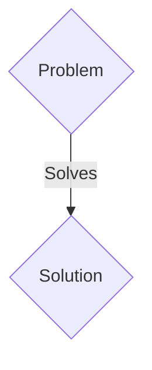
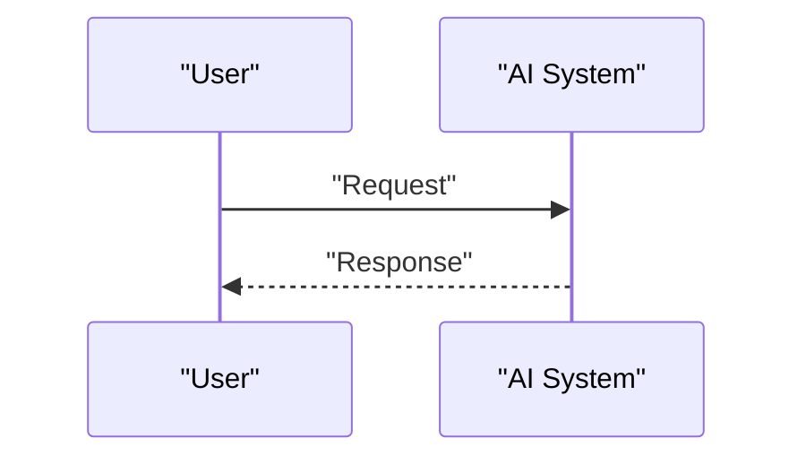

<!-- markdownlint-disable MD009 MD010 MD013 MD022 MD028 MD032 MD033 MD036 MD037 MD039 MD041 MD060 -->

[ 🇫🇷 Version Française ](./README.fr.md)

# AstroMesh Optics

> **Executive Summary:** A B2B / M2M solution targeting Satellite constellation operators (Starlink, Kuiper), space agencies, telecommunications providers. to solve: Data transfer between Low Earth Orbit (LEO) satellites and Earth suffers from radio bandwidth (RF) and latency limitations. Optical inter-satellite links (ISLs) exist, but lack a dynamic routing protocol capable of handling link interruptions, tracking of ultra-fast moving targets, and debris avoidance.

---

## 1. Visual Overview & Wow Effect

## 2. Contrarian Thesis (Peter Thiel Style)

- **Popular Belief:** Generic solutions are enough.
- **Hidden Truth:** A distributed network operating system (Network OS) for space optical constellations, using predictive AI to calculate optimal mesh topologies in real time, pointing communications lasers in anticipation of orbits, atmospheric disturbances and space weather.

## 3. Problem & Target Market

- **Business Model:** B2B / M2M
- **Target Audience:** Satellite constellation operators (Starlink, Kuiper), space agencies, telecommunications providers.
- **Urgent Pain Point:** Data transfer between Low Earth Orbit (LEO) satellites and Earth suffers from radio bandwidth (RF) and latency limitations. Optical inter-satellite links (ISLs) exist, but lack a dynamic routing protocol capable of handling link interruptions, tracking of ultra-fast moving targets, and debris avoidance.

## 4. Technical Architecture & Infrastructure

A distributed network operating system (Network OS) for space optical constellations, using predictive AI to calculate optimal mesh topologies in real time, pointing communications lasers in anticipation of orbits, atmospheric disturbances and space weather.

## 5. Business Model & Financial Viability

| Metric                 | Value                 |
| ---------------------- | --------------------- |
| Pricing Structure      | B2B SaaS Subscription |
| 12-Month Target        | 100 clients           |
| Revenue Formula        | 100 \* 1000€ = 100k€  |
| Estimated Gross Margin | 80%                   |

## 6. Distribution Engine & Moat

- **Acquisition Strategy:** Direct sales and strategic partnerships.
- **Moat (Defensibility):** Terrestrial routing algorithms (OSPF, BGP) assume fixed or low mobility nodes. In space, the nodes move at 27,000 km/h. It requires mastery of orbital mechanics, ballistics and precision optical engineering.

## 7. Detailed Evaluation Grid

| Criterion                   | VC Score (/100) | Market Score (/100) |
| --------------------------- | --------------- | ------------------- |
| Thesis & Monopoly / Urgency | 23 / 25         | 23 / 25             |
| Moat / LLM Immunity         | 24 / 25         | 24 / 25             |
| Scalability / UX Friction   | 17 / 25         | 17 / 25             |
| Unit Economics / ROI        | 19 / 25         | 19 / 25             |
| TOTAL                       | 83 / 100        | 83 / 100            |

> **VC Verdict:** Pending evaluation.
> **Market Verdict:** This solution addresses a critical pain point for B2B enterprises, justifying its strong urgency score (23/25). Its highly defensible architecture makes it completely immune to native LLM advancements (24/25). With low adoption friction (17/25) and a straightforward monetization strategy (19/25), the project demonstrates excellent overall market readiness.
> **Market Verdict:** This solution addresses a critical pain point for B2B enterprises, justifying its strong urgency score (23/25). Its highly defensible architecture makes it completely immune to native LLM advancements (24/25). With low adoption friction (17/25) and a straightforward monetization strategy (19/25), the project demonstrates excellent overall market readiness.
