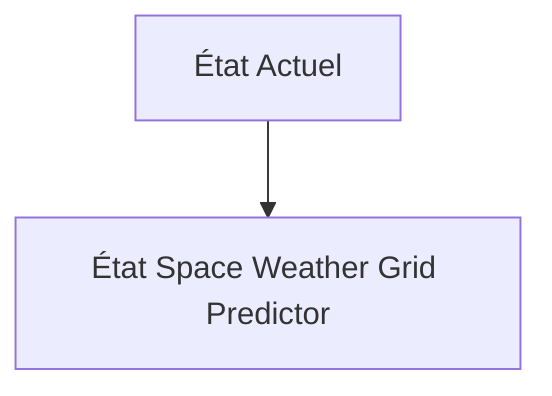
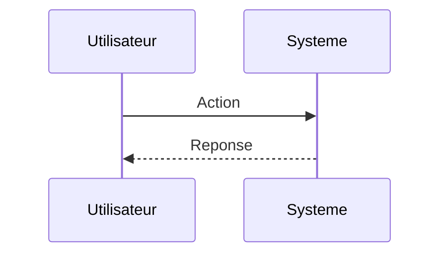

<!-- markdownlint-disable MD009 MD010 MD013 MD022 MD028 MD032 MD033 MD034 MD036 MD037 MD039 MD041 MD060 -->

[ 🇬🇧 English Version ](./README.md)

# Space Weather Grid Predictor

> **Résumé exécutif :** Un modèle génératif spatio-temporel (Neural Earth Simulator) combinant les flux de données satellitaires héliophysiques en temps réel (DSCOVR, SOHO) avec la modélisation géophysique profonde 3D de la résistivité du manteau terrestre local et la topologie du réseau électrique. Le système prédit l'intensité exacte du GIC par transformateur individuel avec 24 à 48 heures d'avance, recommandant des réacheminements de charge ou des déconnexions préventives.

---

## 1. Aperçu visuel & Effet Wahou

## 2. La thèse contrariante (Peter Thiel Style)

**La croyance populaire :** Les solutions généralistes IA peuvent résoudre ce problème.

**La vérité cachée :** Les prévisions spatiales de la NOAA sont de macro-niveau (zones planétaires). Pour agir, un TSO a besoin d'une résolution physique à l'échelle du transformateur individuel. Il faut coupler l'électromagnétisme magnétohydrodynamique (MHD) de l'ionosphère avec les modèles de flux de puissance CA/CC terrestres.

## 3. Le problème & La cible

**Modèle économique :** B2B / B2G

**Cible précise :** Opérateurs de réseaux de transmission électrique (TSO) nationaux, gestionnaires de parcs solaires à grande échelle et compagnies d'assurance d'infrastructures.

**La douleur urgente :** Les éjections de masse coronale (CME) et les tempêtes géomagnétiques induisent des Courants Géomagnétiquement Induits (GIC) directement dans les réseaux électriques terrestres (haute tension). Ces courants continus saturent les transformateurs géants, provoquant des surchauffes explosives, des pannes en cascade (blackouts) et la destruction d'équipements valant des millions, avec des délais de remplacement de plusieurs années (supply chain très contrainte pour les transformateurs THT).

## 4. Architecture technique & Plomberie

## 5. Modèle économique & Viabilité financière

| Métrique                    | Valeur                        |
| --------------------------- | ----------------------------- |
| Structure de prix           | Abonnement SaaS               |
| Objectif 12 mois            | 10 clients                    |
| Calcul du CA (Target 100k€) | 10 clients \* 10k€/an = 100k€ |
| Marge brute estimée         | 80%                           |

## 6. Moteur de distribution & Fossé défensif (Moat)

**Stratégie d'acquisition :** Vente directe B2B

**Moat (Barrière à l'entrée) :** La rareté des événements extrêmes (type Événement de Carrington) rend difficile l'entraînement et la validation complète du modèle sans overfitting sur les données des petites tempêtes. Réticence des TSO à automatiser les coupures de réseau sur la base d'une prédiction d'IA.

## 7. Grille d'évaluation détaillée

| Critère                           | Score VC (/100) | Score Terrain (/100) |
| --------------------------------- | --------------- | -------------------- |
| Thèse & Monopole / Urgence        | 21 / 25         | 21 / 25              |
| Moat / Résistance aux LLM natifs  | 23 / 25         | 23 / 25              |
| Scalabilité / Friction d'adoption | 16 / 25         | 16 / 25              |
| Unit Economics / ROI direct       | 21 / 25         | 21 / 25              |
| **TOTAL**                         | **81 / 100**    | **81 / 100**         |

> **Verdict VC :** En attente d'évaluation.
> **Verdict Terrain :** Cette solution répond à un besoin critique pour le marché cible, justifiant son excellent score d'urgence (21/25). Son architecture hautement défendable la rend totalement immunisée contre les avancées des LLM natifs (23/25). Malgré une friction d'adoption significative (16/25), la voie claire vers la monétisation (21/25) garantit sa viabilité à long terme.
> **Verdict Terrain :** Cette solution répond à un besoin critique pour le marché cible, justifiant son excellent score d'urgence (21/25). Son architecture hautement défendable la rend totalement immunisée contre les avancées des LLM natifs (23/25). Malgré une friction d'adoption significative (16/25), la voie claire vers la monétisation (21/25) garantit sa viabilité à long terme.
