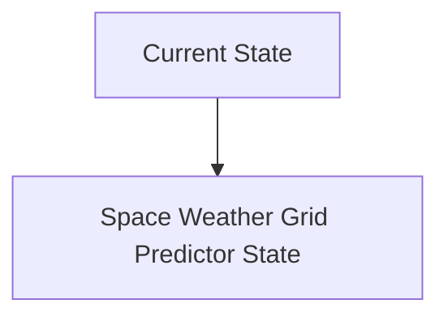
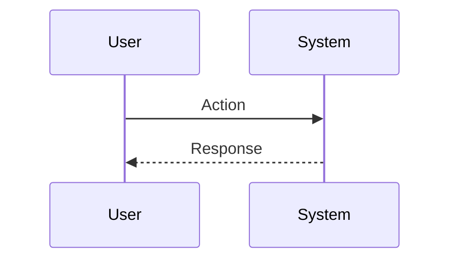

<!-- markdownlint-disable MD009 MD010 MD013 MD022 MD028 MD032 MD033 MD034 MD036 MD037 MD039 MD041 MD060 -->

[ 🇫🇷 Version Française ](./README.fr.md)

# Space Weather Grid Predictor

> **Executive Summary:** A space-time generative model (Neural Earth Simulator) combining real-time heliophysical satellite data streams (DSCOVR, SOHO) with deep 3D geophysical modeling of local Earth mantle resistivity and power grid topology. The system predicts the exact GIC current per individual transformer 24 to 48 hours in advance, recommending load reroutings or preventive disconnections.

---

## 1. Visual Overview & Wow Effect

## 2. Contrarian Thesis (Peter Thiel Style)

**Popular Belief:** General AI solutions can solve this problem.

**Hidden Truth:** NOAA space forecasts are macro-level (planetary areas). To act, a TSO needs physical resolution at the scale of the individual transformer. There is a need to couple the magnetohydrodynamic (MHD) electromagnetism of the ionosphere with terrestrial AC/DC power flow models.

## 3. Problem & Target Market

**Business Model:** B2B / B2G

**Target Audience:** National Electric Transmission System Operators (TSOs), large-scale solar farm managers and infrastructure insurance companies.

**Urgent Pain Point:** Coronal mass ejections (CMEs) and geomagnetic storms induce Geomagnetically Induced Currents (GICs) directly into terrestrial (high voltage) power grids. These direct currents saturate the giant transformers, causing explosive overheating, cascading failures (blackouts) and the destruction of equipment worth millions, with replacement times of several years (very constrained supply chain for THT transformers).

## 4. Technical Architecture & Infrastructure

## 5. Business Model & Financial Viability

| Metric                 | Value                           |
| ---------------------- | ------------------------------- |
| Pricing Structure      | SaaS subscription               |
| 12-Month Target        | 10 customers                    |
| Revenue Formula        | 10 clients \* 10k€/year = 100k€ |
| Estimated Gross Margin | 80%                             |

## 6. Distribution Engine & Moat

**Acquisition Strategy:** B2B direct sales

**Moat (Defensibility):** The rarity of extreme events (Carriton Event type) makes it difficult to train and completely validate the model without overfitting on small storm data. Reluctance of TSOs to automate network outages based on AI prediction.

## 7. Detailed Evaluation Grid

| Criterion                   | VC Score (/100) | Market Score (/100) |
| --------------------------- | --------------- | ------------------- |
| Thesis & Monopoly / Urgency | -- / 25         | -- / 25             |
| Moat / LLM Immunity         | -- / 25         | -- / 25             |
| Scalability / UX Friction   | -- / 25         | -- / 25             |
| Unit Economics / ROI        | -- / 25         | -- / 25             |
| **TOTAL**                   | **-- / 100**    | **-- / 100**        |

> **VC Verdict:** Pending evaluation.

> **Market Verdict:** Pending evaluation.
