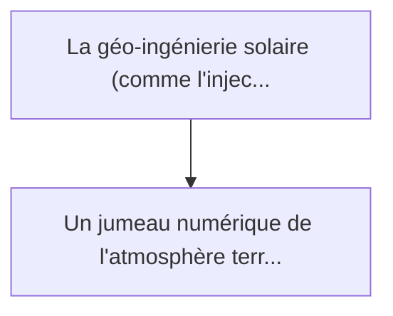
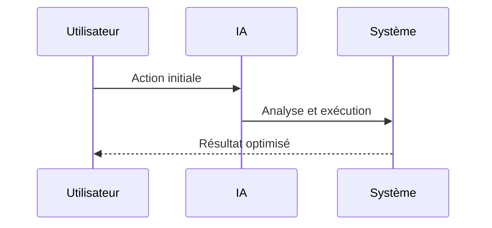

<!-- markdownlint-disable MD013 MD028 MD033 MD039 MD041 -->

[🇬🇧 English Version](./README.md)

# Stratospheric Aerosol Sim

> **Résumé exécutif :** Un jumeau numérique de l'atmosphère terrestre à ultra-haute résolution (Exascale Earth Model). Il combine la thermodynamique des fluides et des mod...

---

## 1. Aperçu visuel & Effet Wahou

## 2. La thèse contrariante (Peter Thiel Style)

La croyance populaire : Les solutions génériques peuvent résoudre cela.
La vérité cachée : Les modèles climatiques globaux (GCM) actuels ont une résolution trop faible (centaines de km) et demandent des mois de calcul. Un simple modèle de machine learning n'a pas les contraintes physiques (conservation de la masse et de l'énergie) nécessaires pour ne pas délirer sur des projections à long terme.

## 3. Le problème & La cible

Modèle économique : B2G / B2B
Cible précise : Gouvernements, agences environnementales de l'ONU, consortiums de réassurance climatique
La douleur urgente : La géo-ingénierie solaire (comme l'injection d'aérosols stratosphériques pour refroidir la Terre) est envisagée par certains états, mais les effets secondaires (perturbation des moussons, destruction de la couche d'ozone) sont inconnus à l'échelle locale. Agir à l'aveugle risque de provoquer des guerres climatiques.

## 4. Architecture technique & Plomberie

## 5. Modèle économique & Viabilité financière

| Métrique                    | Valeur             |
| --------------------------- | ------------------ |
| Structure de prix           | Prix sur mesure    |
| Objectif 12 mois            | 100 clients        |
| Calcul du CA (Target 100k€) | 100 \* 1000 = 100k |
| Marge brute estimée         | 80%                |

## 6. Moteur de distribution & Fossé défensif (Moat)

Stratégie d'acquisition : Vente B2B directe
Moat (Barrière à l'entrée) : Les modèles climatiques globaux (GCM) actuels ont une résolution trop faible (centaines de km) et demandent des mois de calcul. Un simple modèle de machine learning n'a pas les contraintes physiques (conservation de la masse et de l'énergie) nécessaires pour ne pas délirer sur des projections à long terme.

## 7. Grille d'évaluation détaillée

| Critère                           | Score VC (/100) | Score Terrain (/100) |
| --------------------------------- | --------------- | -------------------- |
| Thèse & Monopole / Urgence        | -- / 25         | -- / 25              |
| Moat / Résistance aux LLM natifs  | -- / 25         | -- / 25              |
| Scalabilité / Friction d'adoption | -- / 25         | -- / 25              |
| Unit Economics / ROI direct       | -- / 25         | -- / 25              |
| **TOTAL**                         | **-- / 100**    | **-- / 100**         |

> **Verdict VC :** En attente d'évaluation.

> **Verdict Terrain :** En attente d'évaluation.
