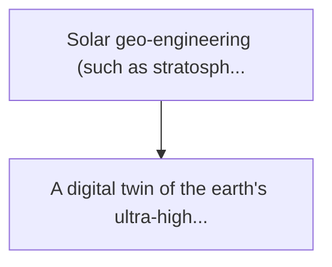
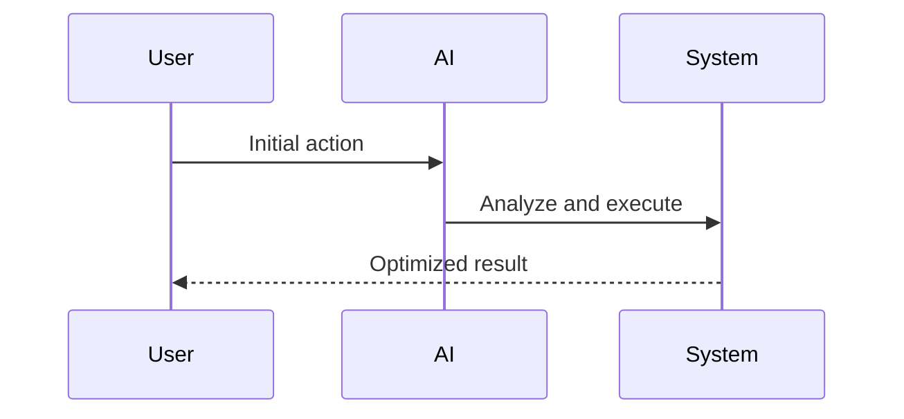

<!-- markdownlint-disable MD013 MD028 MD033 MD039 MD041 -->

[ 🇫🇷 Version Française ](./README.fr.md)

# Stratospheric aerosol sim

> **Executive Summary:** A digital twin of the earth's ultra-high resolution atmosphere (exascale earth model). it combines the thermodynamics of fluids and mod...

---

## 1. Visual Overview & Wow Effect

## 2. Contrarian Thesis (Peter Thiel Style)

Popular Belief: Generic solutions can solve this.
Hidden Truth: Current global climate models (gcms) have too low resolution (100 km) and require months of calculation. a simple machine learning model does not have the physical constraints (conservation of mass and energy) necessary to avoid delusion on long-term projections.

## 3. Problem & Target Market

Business Model: B2G / B2B
Target Audience: Governments, un environmental agencies, climate reinsurance consortia
Urgent Pain Point: Solar geo-engineering (such as stratospheric aerosol injection to cool the earth) is considered by some states, but side effects (mould disturbance, destruction of the ozone layer) are unknown locally. blinding risks causing climate wars.

## 4. Technical Architecture & Infrastructure

## 5. Business Model & Financial Viability

| Metric                 | Value              |
| ---------------------- | ------------------ |
| Pricing Structure      | Custom Pricing     |
| 12-Month Target        | 100 customers      |
| Revenue Formula        | 100 \* 1000 = 100k |
| Estimated Gross Margin | 80%                |

## 6. Distribution Engine & Moat

Acquisition Strategy: Direct B2B Sales
Moat (Defensibility): Current global climate models (gcms) have too low resolution (100 km) and require months of calculation. a simple machine learning model does not have the physical constraints (conservation of mass and energy) necessary to avoid delusion on long-term projections.

## 7. Detailed Evaluation Grid

| Criterion                   | VC Score (/100) | Market Score (/100) |
| --------------------------- | --------------- | ------------------- |
| Thesis & Monopoly / Urgency | -- / 25         | 19 / 25             |
| Moat / LLM Immunity         | -- / 25         | 25 / 25             |
| Scalability / UX Friction   | -- / 25         | 17 / 25             |
| Unit Economics / ROI        | -- / 25         | 18 / 25             |
| **TOTAL**                   | **-- / 100**    | **79 / 100**        |

> **VC Verdict:** Pending evaluation.

> **Market Verdict:** Climate intervention and geoengineering are becoming urgent topics, requiring ultra-high-resolution simulations before any real-world action. Exascale thermodynamic simulations are far beyond the capabilities of text or image-based LLMs. The adoption is limited by the extreme computational resources required and a niche market of global agencies.
