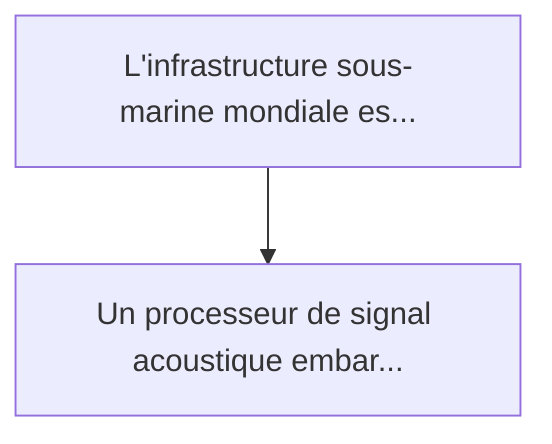
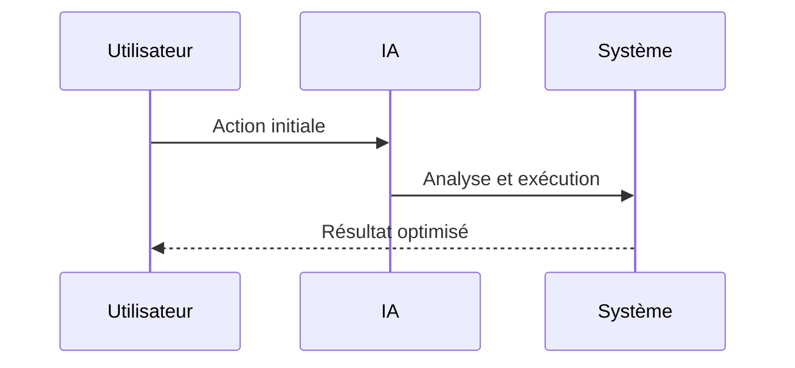

<!-- markdownlint-disable MD013 MD028 MD033 MD039 MD041 -->

[ 🇬🇧 English Version ](./README.md)

# Subsea Acoustic SNN Detector

> **Résumé exécutif :** Un processeur de signal acoustique embarqué basé sur des réseaux de neurones à impulsions (SNN - Neuromorphic Computing). Il écoute en continu avec...

---

## 1. Aperçu visuel & Effet Wahou

## 2. La thèse contrariante (Peter Thiel Style)

La croyance populaire : Les solutions génériques peuvent résoudre cela.
La vérité cachée : Les algorithmes de détection d'anomalies audio classiques (DSP, Transformers) requièrent des accélérateurs IA (GPU/TPU) incompatibles avec les contraintes drastiques de puissance (millivatts) des bouées ou noeuds sous-marins isolés.

## 3. Le problème & La cible

Modèle économique : B2B / B2G
Cible précise : Opérateurs d'infrastructures critiques sous-marines (câbles internet transocéaniques, pipelines, éolien offshore), marines nationales.
La douleur urgente : L'infrastructure sous-marine mondiale est vulnérable aux sabotages physiques. Surveiller des milliers de kilomètres de câbles repose sur des capteurs acoustiques (hydrophones, DAS sur fibre optique) qui génèrent une quantité massive de données brutes. Remonter ces données à la surface pour analyse cloud est impossible en raison de la bande passante sous-marine quasi-nulle. L'analyse locale (sur batterie) épuise l'énergie en quelques jours à cause des CPU classiques.

## 4. Architecture technique & Plomberie

## 5. Modèle économique & Viabilité financière

| Métrique                    | Valeur             |
| --------------------------- | ------------------ |
| Structure de prix           | Prix sur mesure    |
| Objectif 12 mois            | 100 clients        |
| Calcul du CA (Target 100k€) | 100 \* 1000 = 100k |
| Marge brute estimée         | 80%                |

## 6. Moteur de distribution & Fossé défensif (Moat)

Stratégie d'acquisition : Vente B2B directe
Moat (Barrière à l'entrée) : Les algorithmes de détection d'anomalies audio classiques (DSP, Transformers) requièrent des accélérateurs IA (GPU/TPU) incompatibles avec les contraintes drastiques de puissance (millivatts) des bouées ou noeuds sous-marins isolés.

## 7. Grille d'évaluation détaillée

| Critère                           | Score VC (/100) | Score Terrain (/100) |
| --------------------------------- | --------------- | -------------------- |
| Thèse & Monopole / Urgence        | 22 / 25         | -- / 25              |
| Moat / Résistance aux LLM natifs  | 24 / 25         | -- / 25              |
| Scalabilité / Friction d'adoption | 18 / 25         | -- / 25              |
| Unit Economics / ROI direct       | 23 / 25         | -- / 25              |
| **TOTAL**                         | **87 / 100**    | **-- / 100**         |

> **Verdict VC :** Le détecteur acoustique sous-marin SNN représente une avancée majeure dans la surveillance sous-marine autonome. L'utilisation de réseaux de neurones à impulsions pour le traitement de signaux acoustiques à très faible consommation d'énergie crée un fossé inattaquable en matière d'informatique de périphérie. Bien que le déploiement dans des environnements sous-marins soit intrinsèquement difficile, les secteurs de la défense et de l'énergie offshore paieront des revenus récurrents élevés pour cette capacité autonome.

> **Verdict Terrain :** En attente d'évaluation.
