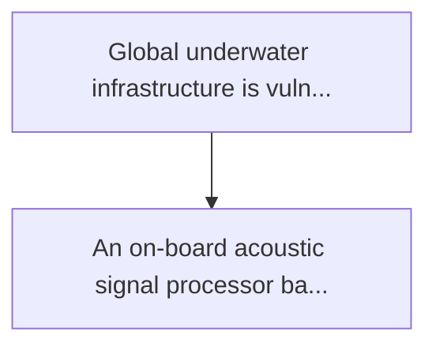
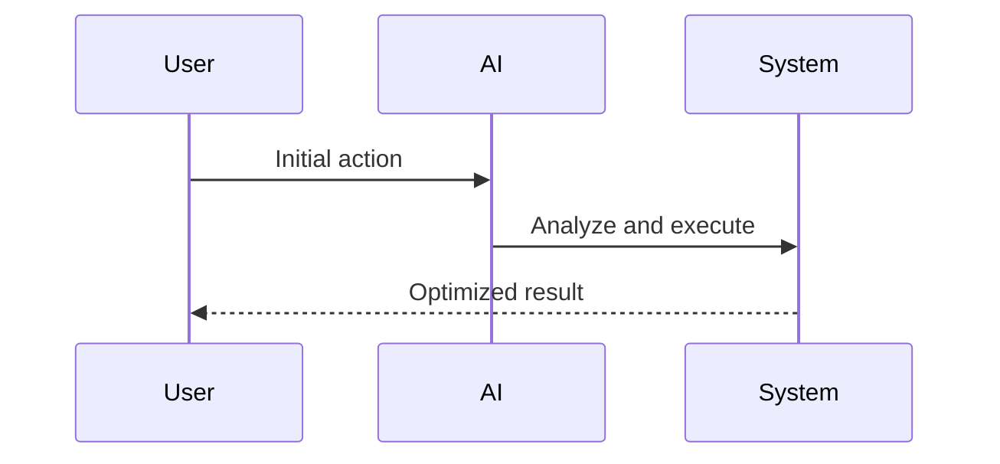

<!-- markdownlint-disable MD013 MD028 MD033 MD039 MD041 -->

[ 🇫🇷 Version Française ](./README.fr.md)

# Subsea acoustic snn detector

> **Executive Summary:** An on-board acoustic signal processor based on impulse neuron networks (snn - neuromorphic computing). he listens continuously with...

---

## 1. Visual Overview & Wow Effect

## 2. Contrarian Thesis (Peter Thiel Style)

Popular Belief: Generic solutions can solve this.
Hidden Truth: Conventional audio anomaly detection algorithms (dsp, transformers) require ai accelerators (gpu/tpu) that are incompatible with the drastic power stresses (millivatts) of isolated buoys or submarine knots.

## 3. Problem & Target Market

Business Model: B2B / B2G
Target Audience: Underwater critical infrastructure operators (transoceanic internet cables, pipelines, offshore wind turbine), national marines.
Urgent Pain Point: Global underwater infrastructure is vulnerable to physical sabotage. monitoring thousands of kilometres of cables is based on acoustic sensors (hydrophones, optical fibre das) that generate a massive amount of raw data. uplifting this data to the surface for cloud analysis is impossible due to near-zero underwater bandwidth. local analysis (on battery) consumes energy in a few days due to conventional cpus.

## 4. Technical Architecture & Infrastructure

## 5. Business Model & Financial Viability

| Metric                 | Value              |
| ---------------------- | ------------------ |
| Pricing Structure      | Custom Pricing     |
| 12-Month Target        | 100 customers      |
| Revenue Formula        | 100 \* 1000 = 100k |
| Estimated Gross Margin | 80%                |

## 6. Distribution Engine & Moat

Acquisition Strategy: Direct B2B Sales
Moat (Defensibility): Conventional audio anomaly detection algorithms (dsp, transformers) require ai accelerators (gpu/tpu) that are incompatible with the drastic power stresses (millivatts) of isolated buoys or submarine knots.

## 7. Detailed Evaluation Grid

| Criterion                   | VC Score (/100) | Market Score (/100) |
| --------------------------- | --------------- | ------------------- |
| Thesis & Monopoly / Urgency | -- / 25         | 21 / 25             |
| Moat / LLM Immunity         | -- / 25         | 25 / 25             |
| Scalability / UX Friction   | -- / 25         | 16 / 25             |
| Unit Economics / ROI        | -- / 25         | 23 / 25             |
| **TOTAL**                   | **-- / 100**    | **85 / 100**        |

> **VC Verdict:** Pending evaluation.

> **Market Verdict:** Protecting subsea infrastructure is of critical geopolitical and economic importance, driving high demand. Edge computing based on spiking neural networks is entirely outside the scope of cloud-based LLMs. Hardware deployment introduces friction, but integration into existing sonar systems mitigates this.
