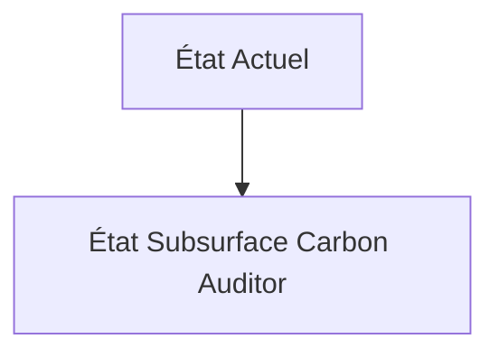
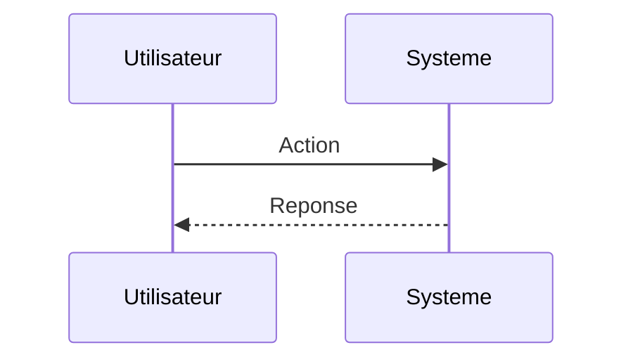

<!-- markdownlint-disable MD009 MD010 MD013 MD022 MD028 MD032 MD033 MD034 MD036 MD037 MD039 MD041 MD060 -->

[ 🇬🇧 English Version ](./README.md)

# Subsurface Carbon Auditor

> **Résumé exécutif :** Une plateforme de jumeaux géophysiques (Geophysical World Models) couplant des réseaux de capteurs sismiques distribués (géophones) et l'analyse gravimétrique haute précision. Elle utilise l'inversion sismique (Full Waveform Inversion) accélérée par GPU/IA pour "scanner" le sous-sol en 4D, quantifiant le volume exact de panaches de CO2 et détectant les micro-fuites potentielles, rendant le stockage géologique incontestablement auditable.

---

## 1. Aperçu visuel & Effet Wahou

## 2. La thèse contrariante (Peter Thiel Style)

**La croyance populaire :** Les solutions généralistes IA peuvent résoudre ce problème.

**La vérité cachée :** La modélisation de la dynamique des fluides poreux (écoulement multiphasique) dans des roches hétérogènes est un défi de physique computationnelle lourd, nécessitant de traiter des pétaoctets de données sismiques brutes. Aucune interface SaaS web classique ou modèle d'IA textuelle ne peut traiter ce signal physique massif sans une architecture de calcul haute performance (HPC) dédiée à la géophysique.

## 3. Le problème & La cible

**Modèle économique :** B2B

**Cible précise :** Opérateurs de capture et stockage de carbone (CCS), acteurs de l'industrie lourde (ciment, acier), fonds d'investissement ESG, certificateurs carbone.

**La douleur urgente :** L'industrie de la séquestration géologique du carbone (enfouir le CO2 sous terre) est entachée d'incertitudes quantitatives. Une fois injecté dans des réservoirs salins ou géologiques profonds, il est extrêmement difficile de prouver (auditabilité) que le carbone reste bien confiné, ne fuit pas, et se minéralise comme prévu au fil du temps. Sans cette preuve indiscutable, les crédits carbone générés perdent leur valeur (greenwashing).

## 4. Architecture technique & Plomberie

## 5. Modèle économique & Viabilité financière

| Métrique                    | Valeur                        |
| --------------------------- | ----------------------------- |
| Structure de prix           | Abonnement SaaS               |
| Objectif 12 mois            | 10 clients                    |
| Calcul du CA (Target 100k€) | 10 clients \* 10k€/an = 100k€ |
| Marge brute estimée         | 80%                           |

## 6. Moteur de distribution & Fossé défensif (Moat)

**Stratégie d'acquisition :** Vente directe B2B

**Moat (Barrière à l'entrée) :** Coût très élevé du déploiement des capteurs géophysiques sur le terrain (capex), incertitude réglementaire concernant les standards de monitoring du CCS, acceptabilité sociale des projets d'enfouissement massif.

## 7. Grille d'évaluation détaillée

| Critère                           | Score VC (/100) | Score Terrain (/100) |
| --------------------------------- | --------------- | -------------------- |
| Thèse & Monopole / Urgence        | -- / 25         | -- / 25              |
| Moat / Résistance aux LLM natifs  | -- / 25         | -- / 25              |
| Scalabilité / Friction d'adoption | -- / 25         | -- / 25              |
| Unit Economics / ROI direct       | -- / 25         | -- / 25              |
| **TOTAL**                         | **-- / 100**    | **-- / 100**         |

> **Verdict VC :** En attente d'évaluation.

> **Verdict Terrain :** En attente d'évaluation.
