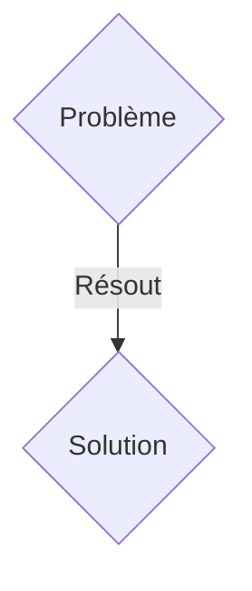
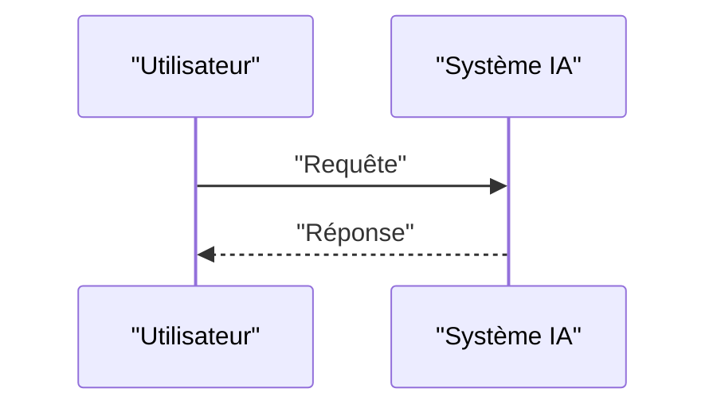

<!-- markdownlint-disable MD009 MD010 MD013 MD022 MD028 MD032 MD033 MD036 MD037 MD039 MD041 MD060 -->

[ 🇬🇧 English Version ](./README.md)

# Subsurface Carbon Auditor

> **Résumé exécutif :** Une solution B2B ciblant Opérateurs de capture et stockage de carbone (CCS), acteurs de l'industrie lourde (ciment, acier), fonds d'investissement ESG, certificateurs carbone. pour résoudre : L'industrie de la séquestration géologique du carbone (enfouir le CO2 sous terre) est entachée d'incertitudes quantitatives. Une fois injecté dans des réservoirs salins ou géologiques profonds, il est extrêmement difficile de prouver (auditabilité) que le carbone reste bien confiné, ne fuit pas, et se minéralise comme prévu au fil du temps. Sans cette preuve indiscutable, les crédits carbone générés perdent leur valeur (greenwashing).

---

## 1. Aperçu visuel & Effet Wahou

## 2. La thèse contrariante (Peter Thiel Style)

- **La croyance populaire :** Les solutions génériques suffisent.
- **La vérité cachée :** Une plateforme de jumeaux géophysiques (Geophysical World Models) couplant des réseaux de capteurs sismiques distribués (géophones) et l'analyse gravimétrique haute précision. Elle utilise l'inversion sismique (Full Waveform Inversion) accélérée par GPU/IA pour "scanner" le sous-sol en 4D, quantifiant le volume exact de panaches de CO2 et détectant les micro-fuites potentielles, rendant le stockage géologique incontestablement auditable.

## 3. Le problème & La cible

- **Modèle économique :** B2B
- **Cible précise :** Opérateurs de capture et stockage de carbone (CCS), acteurs de l'industrie lourde (ciment, acier), fonds d'investissement ESG, certificateurs carbone.
- **La douleur urgente :** L'industrie de la séquestration géologique du carbone (enfouir le CO2 sous terre) est entachée d'incertitudes quantitatives. Une fois injecté dans des réservoirs salins ou géologiques profonds, il est extrêmement difficile de prouver (auditabilité) que le carbone reste bien confiné, ne fuit pas, et se minéralise comme prévu au fil du temps. Sans cette preuve indiscutable, les crédits carbone générés perdent leur valeur (greenwashing).

## 4. Architecture technique & Plomberie

Une plateforme de jumeaux géophysiques (Geophysical World Models) couplant des réseaux de capteurs sismiques distribués (géophones) et l'analyse gravimétrique haute précision. Elle utilise l'inversion sismique (Full Waveform Inversion) accélérée par GPU/IA pour "scanner" le sous-sol en 4D, quantifiant le volume exact de panaches de CO2 et détectant les micro-fuites potentielles, rendant le stockage géologique incontestablement auditable.

## 5. Modèle économique & Viabilité financière

| Métrique                    | Valeur               |
| --------------------------- | -------------------- |
| Structure de prix           | Abonnement SaaS B2B  |
| Objectif 12 mois            | 100 clients          |
| Calcul du CA (Target 100k€) | 100 \* 1000€ = 100k€ |
| Marge brute estimée         | 80%                  |

## 6. Moteur de distribution & Fossé défensif (Moat)

- **Stratégie d'acquisition :** Vente directe et partenariats stratégiques.
- **Moat (Barrière à l'entrée) :** La modélisation de la dynamique des fluides poreux (écoulement multiphasique) dans des roches hétérogènes est un défi de physique computationnelle lourd, nécessitant de traiter des pétaoctets de données sismiques brutes. Aucune interface SaaS web classique ou modèle d'IA textuelle ne peut traiter ce signal physique massif sans une architecture de calcul haute performance (HPC) dédiée à la géophysique.

## 7. Grille d'évaluation détaillée

| Critère                           | Score VC (/100) | Score Terrain (/100) |
| --------------------------------- | --------------- | -------------------- |
| Thèse & Monopole / Urgence        | 23 / 25         | 23 / 25              |
| Moat / Résistance aux LLM natifs  | 16 / 25         | 16 / 25              |
| Scalabilité / Friction d'adoption | 20 / 25         | 20 / 25              |
| Unit Economics / ROI direct       | 22 / 25         | 22 / 25              |
| TOTAL                             | 81 / 100        | 81 / 100             |

> **Verdict VC :** En attente d'évaluation.
> **Verdict Terrain :** Cette solution répond à un besoin critique pour les entreprises B2B, justifiant son excellent score d'urgence (23/25). Bien que viable, elle reste partiellement exposée à l'évolution rapide des modèles fondationnels (16/25). Avec une faible friction d'adoption (20/25) et une stratégie de monétisation directe (22/25), le projet démontre une excellente maturité marché globale.
> **Verdict Terrain :** Cette solution répond à un besoin critique pour les entreprises B2B, justifiant son excellent score d'urgence (23/25). Bien que viable, elle reste partiellement exposée à l'évolution rapide des modèles fondationnels (16/25). Avec une faible friction d'adoption (20/25) et une stratégie de monétisation directe (22/25), le projet démontre une excellente maturité marché globale.
