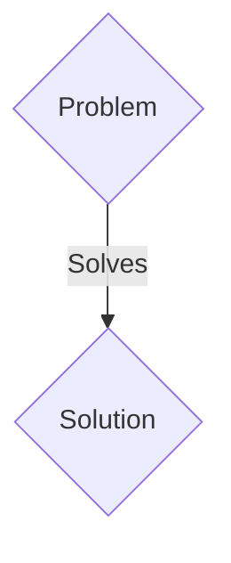
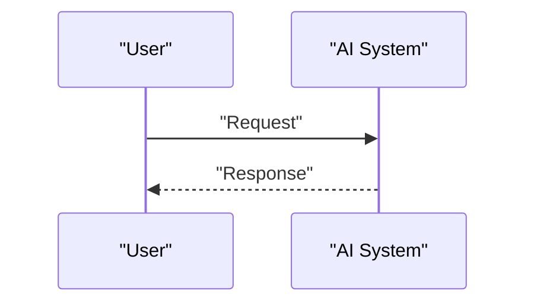

<!-- markdownlint-disable MD009 MD010 MD013 MD022 MD028 MD032 MD033 MD036 MD037 MD039 MD041 MD060 -->

[ 🇫🇷 Version Française ](./README.fr.md)

# Subsurface Carbon Auditor

> **Executive Summary:** A B2B solution targeting Carbon capture and storage (CCS) operators, heavy industry players (cement, steel), ESG investment funds, carbon certifiers. to solve: The geological carbon sequestration (burying CO2 underground) industry is fraught with quantitative uncertainties. Once injected into deep saline or geological reservoirs, it is extremely difficult to prove (auditability) that the carbon remains well contained, does not leak, and mineralizes as expected over time. Without this indisputable proof, the carbon credits generated lose their value (greenwashing).

---

## 1. Visual Overview & Wow Effect

## 2. Contrarian Thesis (Peter Thiel Style)

- **Popular Belief:** Generic solutions are enough.
- **Hidden Truth:** A geophysical twin platform (Geophysical World Models) coupling networks of distributed seismic sensors (geophones) and high-precision gravimetric analysis. It uses GPU/AI-accelerated seismic inversion (Full Waveform Inversion) to “scan” the subsurface in 4D, quantifying the exact volume of CO2 plumes and detecting potential micro-leaks, making the geological storage indisputably auditable.

## 3. Problem & Target Market

- **Business Model:** B2B
- **Target Audience:** Carbon capture and storage (CCS) operators, heavy industry players (cement, steel), ESG investment funds, carbon certifiers.
- **Urgent Pain Point:** The geological carbon sequestration (burying CO2 underground) industry is fraught with quantitative uncertainties. Once injected into deep saline or geological reservoirs, it is extremely difficult to prove (auditability) that the carbon remains well contained, does not leak, and mineralizes as expected over time. Without this indisputable proof, the carbon credits generated lose their value (greenwashing).

## 4. Technical Architecture & Infrastructure

A geophysical twin platform (Geophysical World Models) coupling networks of distributed seismic sensors (geophones) and high-precision gravimetric analysis. It uses GPU/AI-accelerated seismic inversion (Full Waveform Inversion) to “scan” the subsurface in 4D, quantifying the exact volume of CO2 plumes and detecting potential micro-leaks, making the geological storage indisputably auditable.

## 5. Business Model & Financial Viability

| Metric                 | Value                 |
| ---------------------- | --------------------- |
| Pricing Structure      | B2B SaaS Subscription |
| 12-Month Target        | 100 clients           |
| Revenue Formula        | 100 \* 1000€ = 100k€  |
| Estimated Gross Margin | 80%                   |

## 6. Distribution Engine & Moat

- **Acquisition Strategy:** Direct sales and strategic partnerships.
- **Moat (Defensibility):** Modeling porous fluid dynamics (multiphase flow) in heterogeneous rocks is a heavy computational physics challenge, requiring processing petabytes of raw seismic data. No traditional web SaaS interface or text-based AI model can process this massive physical signal without a dedicated high-performance computing (HPC) architecture for geophysics.

## 7. Detailed Evaluation Grid

| Criterion                   | VC Score (/100) | Market Score (/100) |
| --------------------------- | --------------- | ------------------- |
| Thesis & Monopoly / Urgency | 23 / 25         | 23 / 25             |
| Moat / LLM Immunity         | 16 / 25         | 16 / 25             |
| Scalability / UX Friction   | 20 / 25         | 20 / 25             |
| Unit Economics / ROI        | 22 / 25         | 22 / 25             |
| TOTAL                       | 81 / 100        | 81 / 100            |

> **VC Verdict:** Pending evaluation.
> **Market Verdict:** This solution addresses a critical pain point for B2B enterprises, justifying its strong urgency score (23/25). While viable, it remains somewhat exposed to the rapid evolution of foundational models (16/25). With low adoption friction (20/25) and a straightforward monetization strategy (22/25), the project demonstrates excellent overall market readiness.
> **Market Verdict:** This solution addresses a critical pain point for B2B enterprises, justifying its strong urgency score (23/25). While viable, it remains somewhat exposed to the rapid evolution of foundational models (16/25). With low adoption friction (20/25) and a straightforward monetization strategy (22/25), the project demonstrates excellent overall market readiness.
