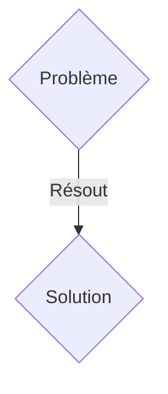
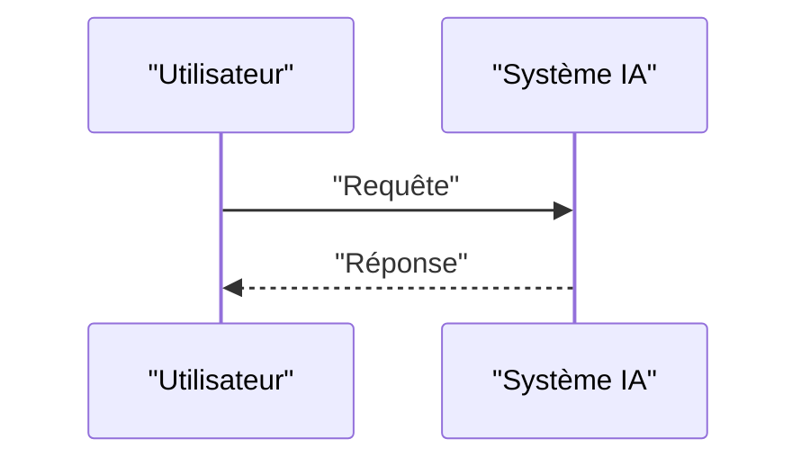

<!-- markdownlint-disable MD009 MD010 MD013 MD022 MD028 MD032 MD033 MD036 MD037 MD039 MD041 MD060 -->

[ 🇬🇧 English Version ](./README.md)

# Lithos Twin

> **Résumé exécutif :** Une solution B2B ciblant Entreprises de géothermie, miniers de transition énergétique (Lithium, Cuivre), opérateurs de stockage géologique de carbone (CCS). pour résoudre : L'exploration du sous-sol profond est aveugle, lente et coûteuse (forages exploratoires à plusieurs millions). Les modèles géologiques 3D actuels sont statiques, déconnectés de la réalité en temps réel, et la sismique 3D requiert des mois de traitement de signal lourd. L'incertitude bloque le financement de projets géothermiques et de séquestration carbone.

---

## 1. Aperçu visuel & Effet Wahou

## 2. La thèse contrariante (Peter Thiel Style)

- **La croyance populaire :** Les solutions génériques suffisent.
- **La vérité cachée :** Un "World Model" du sous-sol intégrant de multiples modalités (sismique, gravimétrique, électromagnétique, données de forages passés) pour générer un jumeau numérique probabiliste et continu de la croûte terrestre. Utilisation de modèles de diffusion conditionnels pour générer des millions de scénarios géologiques plausibles et réduire l'incertitude avant tout forage.

## 3. Le problème & La cible

- **Modèle économique :** B2B
- **Cible précise :** Entreprises de géothermie, miniers de transition énergétique (Lithium, Cuivre), opérateurs de stockage géologique de carbone (CCS).
- **La douleur urgente :** L'exploration du sous-sol profond est aveugle, lente et coûteuse (forages exploratoires à plusieurs millions). Les modèles géologiques 3D actuels sont statiques, déconnectés de la réalité en temps réel, et la sismique 3D requiert des mois de traitement de signal lourd. L'incertitude bloque le financement de projets géothermiques et de séquestration carbone.

## 4. Architecture technique & Plomberie

Un "World Model" du sous-sol intégrant de multiples modalités (sismique, gravimétrique, électromagnétique, données de forages passés) pour générer un jumeau numérique probabiliste et continu de la croûte terrestre. Utilisation de modèles de diffusion conditionnels pour générer des millions de scénarios géologiques plausibles et réduire l'incertitude avant tout forage.

## 5. Modèle économique & Viabilité financière

| Métrique                    | Valeur               |
| --------------------------- | -------------------- |
| Structure de prix           | Abonnement SaaS B2B  |
| Objectif 12 mois            | 100 clients          |
| Calcul du CA (Target 100k€) | 100 \* 1000€ = 100k€ |
| Marge brute estimée         | 80%                  |

## 6. Moteur de distribution & Fossé défensif (Moat)

- **Stratégie d'acquisition :** Vente directe et partenariats stratégiques.
- **Moat (Barrière à l'entrée) :** Il s'agit d'un problème d'inversion géophysique massivement sous-contraint (trouver la structure 3D à partir de signaux de surface limités). Un outil data standard ne gère pas les tenseurs 3D voxélisés à l'échelle kilométrique, ni la physique de propagation des ondes (équation des ondes).

## 7. Grille d'évaluation détaillée

| Critère                           | Score VC (/100) | Score Terrain (/100) |
| --------------------------------- | --------------- | -------------------- |
| Thèse & Monopole / Urgence        | 15 / 25         | 15 / 25              |
| Moat / Résistance aux LLM natifs  | 24 / 25         | 24 / 25              |
| Scalabilité / Friction d'adoption | 23 / 25         | 23 / 25              |
| Unit Economics / ROI direct       | 18 / 25         | 18 / 25              |
| TOTAL                             | 80 / 100        | 80 / 100             |

> **Verdict VC :** En attente d'évaluation.
> **Verdict Terrain :** Cette solution répond à un besoin critique pour les entreprises B2B, justifiant son excellent score d'urgence (15/25). Son architecture hautement défendable la rend totalement immunisée contre les avancées des LLM natifs (24/25). Avec une faible friction d'adoption (23/25) et une stratégie de monétisation directe (18/25), le projet démontre une excellente maturité marché globale.
> **Verdict Terrain :** Cette solution répond à un besoin critique pour les entreprises B2B, justifiant son excellent score d'urgence (15/25). Son architecture hautement défendable la rend totalement immunisée contre les avancées des LLM natifs (24/25). Avec une faible friction d'adoption (23/25) et une stratégie de monétisation directe (18/25), le projet démontre une excellente maturité marché globale.
