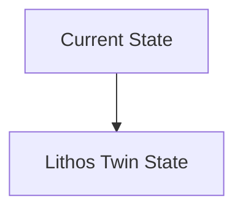
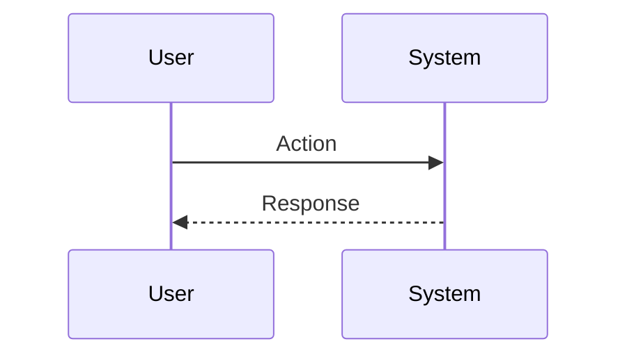

<!-- markdownlint-disable MD009 MD010 MD013 MD022 MD028 MD032 MD033 MD034 MD036 MD037 MD039 MD041 MD060 -->

[ 🇫🇷 Version Française ](./README.fr.md)

# Lithos Twin

> **Executive Summary:** A "World Model" of the subsurface integrating multiple modalities (seismic, gravimetric, electromagnetic, past drilling data) to generate a probabilistic and continuous digital twin of the earth's crust. Using conditional diffusion models to generate millions of plausible geological scenarios and reduce uncertainty before drilling.

---

## 1. Visual Overview & Wow Effect

## 2. Contrarian Thesis (Peter Thiel Style)

**Popular Belief:** General AI solutions can solve this problem.

**Hidden Truth:** This is a massively underconstrained geophysical inversion problem (finding 3D structure from limited surface signals). A standard data tool does not manage 3D tensors voxelized at the kilometer scale, nor the physics of wave propagation (wave equation).

## 3. Problem & Target Market

**Business Model:** B2B

**Target Audience:** Geothermal companies, energy transition miners (Lithium, Copper), geological carbon storage (CCS) operators.

**Urgent Pain Point:** Exploration of the deep subsoil is indiscriminate, slow and costly (multi-million exploratory drilling). Current 3D geological models are static, disconnected from real-time reality, and 3D seismic requires months of heavy signal processing. Uncertainty blocks financing of geothermal and carbon sequestration projects.

## 4. Technical Architecture & Infrastructure

## 5. Business Model & Financial Viability

| Metric                 | Value                           |
| ---------------------- | ------------------------------- |
| Pricing Structure      | SaaS subscription               |
| 12-Month Target        | 10 customers                    |
| Revenue Formula        | 10 clients \* 10k€/year = 100k€ |
| Estimated Gross Margin | 80%                             |

## 6. Distribution Engine & Moat

**Acquisition Strategy:** B2B direct sales

**Moat (Defensibility):** The scarcity and fragmentation of geological data (often jealously guarded by the oil majors). Field validation is slow (drilling takes months).

## 7. Detailed Evaluation Grid

| Criterion                   | VC Score (/100) | Market Score (/100) |
| --------------------------- | --------------- | ------------------- |
| Thesis & Monopoly / Urgency | -- / 25         | -- / 25             |
| Moat / LLM Immunity         | -- / 25         | -- / 25             |
| Scalability / UX Friction   | -- / 25         | -- / 25             |
| Unit Economics / ROI        | -- / 25         | -- / 25             |
| **TOTAL**                   | **-- / 100**    | **-- / 100**        |

> **VC Verdict:** Pending evaluation.

> **Market Verdict:** Pending evaluation.
