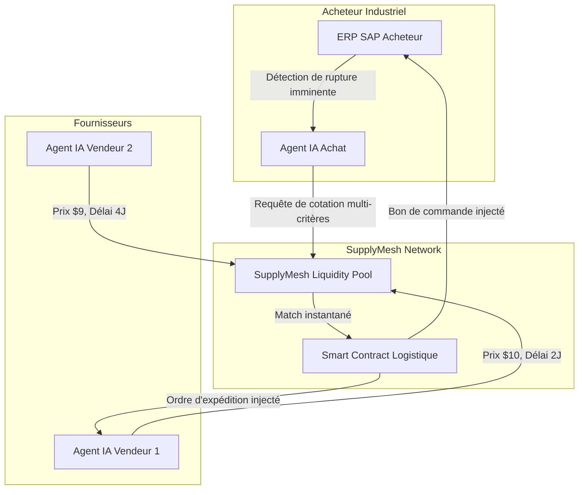
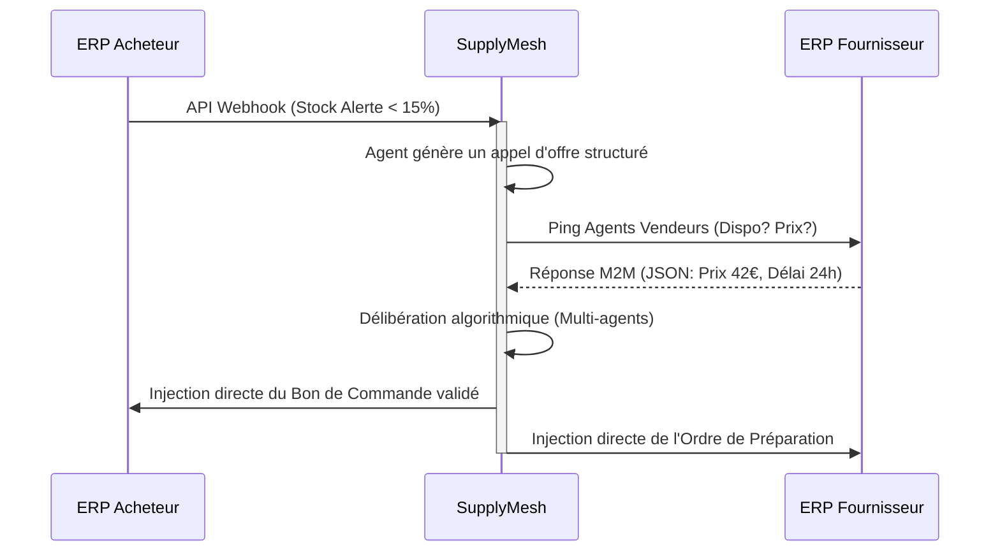

<!-- markdownlint-disable MD013 MD033 MD060 MD039 MD041 MD032 MD010 MD009 MD022 MD036 MD028 MD037 -->

[🇬🇧 English Version](./README.md)

# SupplyMesh AI

> **Résumé exécutif :** Un protocole M2M (Machine-to-Machine) d'approvisionnement où les agents IA des ERP acheteurs négocient et contractent de manière autonome en temps réel avec les ERP fournisseurs. Nous remplaçons les processus d'achats industriels manuels par un marché liquide inter-machines.


---

## 1. Aperçu visuel



## 2. La thèse contrariante (Peter Thiel Style)

**La croyance populaire :** Les entreprises pensent que l'IA dans les achats doit être un copilote (chatbot) aidant un acheteur humain à lire des contrats ou écrire des emails aux fournisseurs.
**La vérité cachée :** 80% des achats industriels récurrents (matières premières, pièces détachées) n'ont aucune valeur ajoutée stratégique humaine. L'avenir n'est pas le "copilote", mais l'absence de pilote. Les machines doivent acheter aux machines via une API financière et logistique unifiée, contournant totalement l'interface utilisateur.

## 3. Le problème & La cible

**Modèle économique :** M2M (Machine to Machine) transactionnel B2B.
**Cible précise :** Les ETI et groupes industriels manufacturiers (CA > 50M€) utilisant des ERP archaïques (SAP, Oracle, Sage) et souffrant de ruptures de chaîne d'approvisionnement.
**La douleur urgente :** La réconciliation manuelle des stocks, des devis PDF et des bons de commande par email coûte en moyenne 45€ de frais administratifs par transaction, et les ruptures de stock arrêtent des lignes de production entières, coûtant des centaines de milliers d'euros par jour d'inactivité.

## 4. Architecture technique & Plomberie

Les LLMs ne sont pas le coeur du produit, ils servent uniquement de "traducteurs" lors du set-up pour mapper les schémas de base de données propriétaires des vieux ERP vers l'ontologie universelle de SupplyMesh.

```python
# Exemple conceptuel : L'Agent acheteur évalue une offre de manière autonome
def evaluate_bid(bid, urgency_score, risk_tolerance):
    # L'IA a préalablement transformé le besoin en vecteur de contraintes
    price_weight = 0.4 if urgency_score > 0.8 else 0.7
    speed_weight = 1.0 - price_weight

    score = (normalized(bid.price) * price_weight) + (normalized(bid.delivery_time) * speed_weight)

    if score > threshold and bid.vendor_reliability > risk_tolerance:
        return execute_m2m_transaction(bid.vendor_id, bid.item_id)
    return None
```



## 5. Modèle économique & Viabilité financière

| Métrique                        | Valeur                                                                               |
| :------------------------------ | :----------------------------------------------------------------------------------- |
| **Structure de prix**           | Abonnement SaaS d'intégration (1 500€/mois) + 0,5% de commission M2M par transaction |
| **Objectif 12 mois**            | Atteindre 100k€ de revenus annuels récurrents/frais                                  |
| **Clients nécessaires**         | 5 industriels actifs faisant transiter chacun 1M€ d'achats via le réseau/an          |
| **Calcul du CA (Target 100k€)** | (5 clients _18 000€ SaaS/an) + (5M€ GMV_ 0,5% de frais) = 90 000 + 25 000 = 115 000€ |
| **Marge brute estimée**         | 92% (Coûts marginaux très faibles post-intégration, peu d'inférence LLM)             |

## 6. Moteur de distribution & Fossé défensif (Moat)

**Stratégie d'acquisition :** Acquisition B2B directe en "land-and-expand". Nous signons l'acheteur industriel. Pour qu'il utilise SupplyMesh, il force ses 20 fournisseurs principaux à installer notre agent API (gratuit pour le fournisseur). Le réseau s'étend organiquement par effet de grappe (Network Effect).
**Moat (Barrière à l'entrée) :**

1. **Coûts de changement (Switching costs) :** Une fois le mapping complexe des ERP legacy réalisé, le client ne débranchera jamais un système qui gère ses flux de manière invisible.
2. **Effet de réseau bilatéral :** Un LLM brut (comme ChatGPT) ne possède pas les accès API authentifiés des deux côtés de la supply chain. Plus de fournisseurs rejoignent, plus la liquidité du marché profite aux acheteurs. OpenAI ne peut pas cloner ce réseau en 24h, car il nécessite des intégrations profondes et non pas seulement de l'intelligence artificielle générative.

## 7. Grille d'évaluation détaillée

| Critère                               | Score VC (/100) | Score Terrain (/100) |
| :------------------------------------ | :-------------: | :------------------: |
| **Thèse & Monopole / Urgence**        |     21 / 25     |       21 / 25        |
| **Moat / Résistance aux LLM natifs**  |     22 / 25     |       20 / 25        |
| **Scalabilité / Friction d'adoption** |     24 / 25     |       14 / 25        |
| **Unit Economics / ROI direct**       |     22 / 25     |       19 / 25        |
| **TOTAL**                             |  **89 / 100**   |     **74 / 100**     |

> **Verdict Terrain :** L'optimisation de la chaîne d'approvisionnement pilotée par l'IA est précieuse, mais l'intégration profonde dans les ERP existants provoque des frictions importantes. La monétisation est claire en fonction des gains d'efficacité. Le principal obstacle est le cycle de vente aux entreprises et la gestion du changement.

> **Verdict VC :** SupplyMesh AI repense l'approvisionnement comme un marché inter-machines automatisé et liquide, directement connecté aux ERP legacy. Les coûts de changement sont immenses une fois le mappage complexe des données réalisé.
