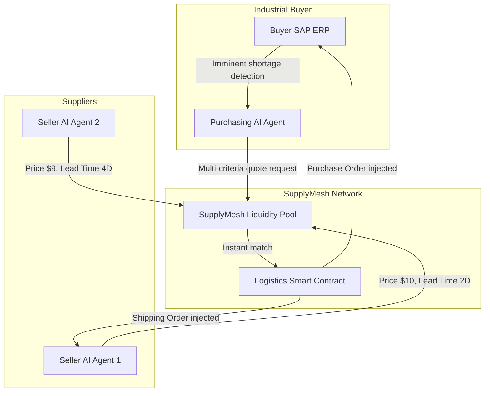
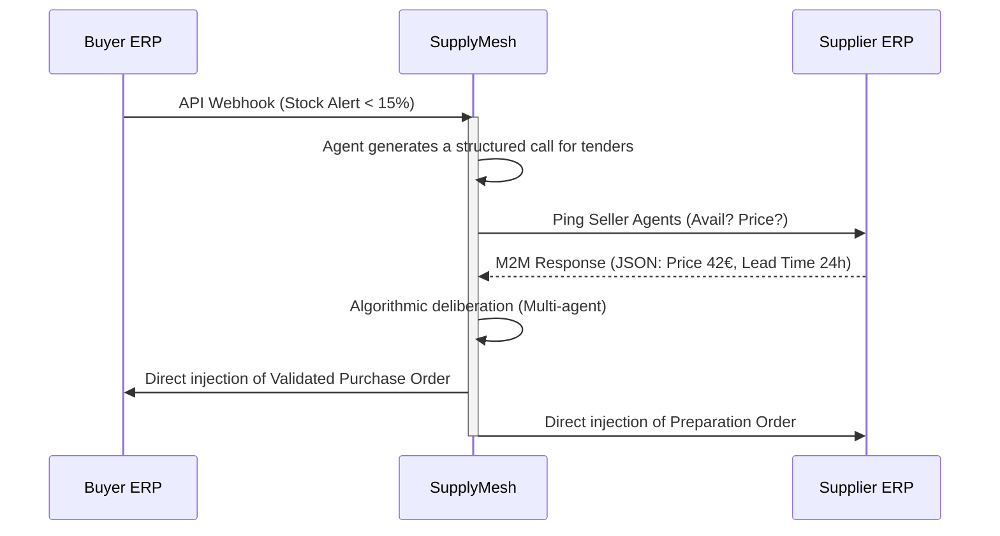

<!-- markdownlint-disable MD013 MD033 MD060 MD039 MD041 MD032 MD010 MD009 MD022 MD036 MD028 MD037 -->

[🇫🇷 Version Française](./README.fr.md)

# SupplyMesh AI

> **Executive Summary:** An M2M (Machine-to-Machine) procurement protocol where the AI agents of buyer ERPs negotiate and contract autonomously in real-time with supplier ERPs. We replace manual industrial purchasing processes with a liquid inter-machine market.


---

## 1. Visual Overview



## 2. The Contrarian Thesis (Peter Thiel Style)

**The Popular Belief:** Companies think that AI in procurement should be a copilot (chatbot) helping a human buyer read contracts or write emails to suppliers.
**The Hidden Truth:** 80% of recurring industrial purchases (raw materials, spare parts) have zero human strategic added value. The future is not the "copilot", but the absence of a pilot. Machines must buy from machines via a unified financial and logistics API, completely bypassing the user interface.

## 3. The Problem & The Target

**Economic Model:** M2M (Machine to Machine) transactional B2B.
**Specific Target:** Mid-Market and industrial manufacturing groups (Revenue > €50M) using archaic ERPs (SAP, Oracle, Sage) and suffering from supply chain disruptions.
**The Urgent Pain:** The manual reconciliation of inventory, PDF quotes, and purchase orders via email costs an average of 45€ in administrative fees per transaction, and stockouts halt entire production lines, costing hundreds of thousands of euros per day of inactivity.

## 4. Technical Architecture & Plumbing

LLMs are not the core of the product; they serve only as "translators" during set-up to map the proprietary database schemas of old ERPs to the universal SupplyMesh ontology.

```python
# Conceptual Example: The buyer agent evaluates an offer autonomously
def evaluate_bid(bid, urgency_score, risk_tolerance):
    # The AI has previously transformed the need into a constraint vector
    price_weight = 0.4 if urgency_score > 0.8 else 0.7
    speed_weight = 1.0 - price_weight

    score = (normalized(bid.price) * price_weight) + (normalized(bid.delivery_time) * speed_weight)

    if score > threshold and bid.vendor_reliability > risk_tolerance:
        return execute_m2m_transaction(bid.vendor_id, bid.item_id)
    return None
```



## 5. Economic Model & Financial Viability

| Metric                                 | Value                                                                               |
| :------------------------------------- | :---------------------------------------------------------------------------------- |
| **Pricing Structure**                  | Integration SaaS Subscription (1,500€/month) + 0.5% M2M commission per transaction  |
| **12-Month Target**                    | Reach 100k€ of annual recurring revenue/fees                                        |
| **Required Clients**                   | 5 active industrial clients each passing 1M€ of purchases via the network/year      |
| **Revenue Calculation (100k€ Target)** | (5 clients _ 18,000€ SaaS/year) + (5M€ GMV _ 0.5% fee) = 90,000 + 25,000 = 115,000€ |
| **Estimated Gross Margin**             | 92% (Very low marginal costs post-integration, minimal LLM inference)               |

## 6. Distribution Engine & Defensive Moat (Moat)

**Acquisition Strategy:** Direct B2B acquisition through "land-and-expand". We sign the industrial buyer. For them to use SupplyMesh, they force their 20 main suppliers to install our API agent (free for the supplier). The network expands organically by cluster effect (Network Effect).
**Moat (Barrier to Entry):**

1. **Switching costs:** Once the complex mapping of legacy ERPs is done, the client will never unplug a system that manages its flows invisibly.
2. **Bilateral network effect:** A raw LLM (like ChatGPT) does not have authenticated API access to both sides of the supply chain. The more suppliers join, the more the market liquidity benefits buyers. OpenAI cannot clone this network in 24 hours because it requires deep integrations and not just generative artificial intelligence.

## 7. Detailed Evaluation Grid

| Criteria                             | VC Score (/100) | Terrain Score (/100) |
| :----------------------------------- | :-------------: | :------------------: |
| **Thesis & Monopoly / Urgency**      |     21 / 25     |       21 / 25        |
| **Moat / Resistance to Native LLMs** |     22 / 25     |       20 / 25        |
| **Scalability / Adoption Friction**  |     24 / 25     |       14 / 25        |
| **Unit Economics / Direct ROI**      |     22 / 25     |       19 / 25        |
| **TOTAL**                            |  **89 / 100**   |     **74 / 100**     |

> **Verdict Terrain :** AI-driven supply chain optimization is valuable, but integrating deeply into existing ERPs causes significant friction. The monetization is clear based on efficiency gains. The main hurdle is the enterprise sales cycle and change management.

> **VC Verdict:** SupplyMesh AI envisions a liquid inter-machine procurement market, entirely bypassing human purchasing delays. The integration friction is incredibly high, but this creates a legendary lock-in effect. It shifts the paradigm from software as a tool to software as a market participant.
