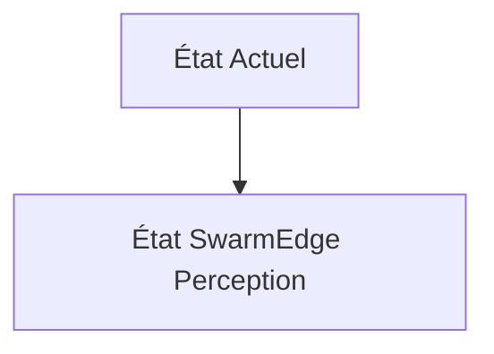
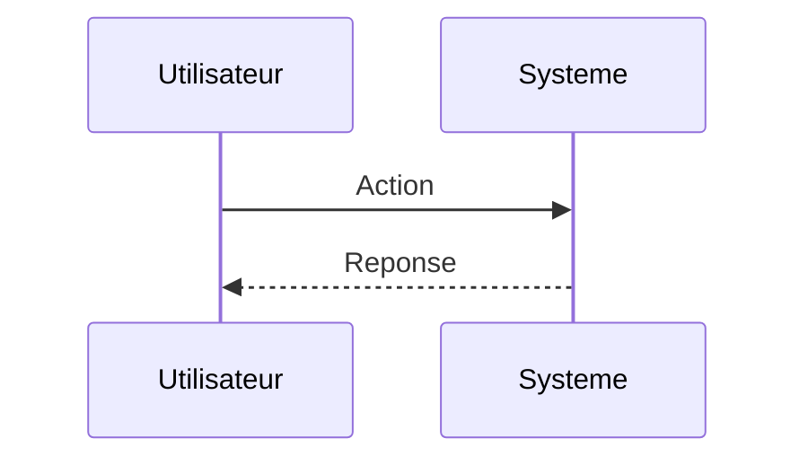

<!-- markdownlint-disable MD009 MD010 MD013 MD022 MD028 MD032 MD033 MD034 MD036 MD037 MD039 MD041 MD060 -->

[ 🇬🇧 English Version ](./README.md)

# SwarmEdge Perception

> **Résumé exécutif :** Un moteur SLAM (Simultaneous Localization and Mapping) collaboratif et purement Edge, fonctionnant sur des puces neuromorphiques ou des NPU basse consommation, permettant à la flotte de partager des tenseurs de perception compressés via un mesh radio peer-to-peer (sans Cloud) pour maintenir une carte 3D unifiée.

---

## 1. Aperçu visuel & Effet Wahou

## 2. La thèse contrariante (Peter Thiel Style)

**La croyance populaire :** Les solutions généralistes IA peuvent résoudre ce problème.

**La vérité cachée :** Impossible d'utiliser une API Cloud : la latence doit être inférieure à 10ms, et la connectivité est par définition non fiable ou inexistante (Denied Environments). La solution doit tenir dans quelques mégaoctets de RAM et consommer moins de 5 Watts.

## 3. Le problème & La cible

**Modèle économique :** B2B / M2M

**Cible précise :** Défense, logistique par drone, agriculture de précision.

**La douleur urgente :** Les flottes de drones ou de robots mobiles (swarms) s'effondrent lorsque le signal GPS est brouillé (GPS spoofing/jamming) ou dans des environnements denses (forêts, entrepôts), car ils dépendent de serveurs centraux pour la coordination et la cartographie.

## 4. Architecture technique & Plomberie

## 5. Modèle économique & Viabilité financière

| Métrique                    | Valeur                        |
| --------------------------- | ----------------------------- |
| Structure de prix           | Abonnement SaaS               |
| Objectif 12 mois            | 10 clients                    |
| Calcul du CA (Target 100k€) | 10 clients \* 10k€/an = 100k€ |
| Marge brute estimée         | 80%                           |

## 6. Moteur de distribution & Fossé défensif (Moat)

**Stratégie d'acquisition :** Vente directe B2B

**Moat (Barrière à l'entrée) :** Forte barrière de l'intégration hardware-software; besoin de développer des protocoles radio résilients; marché dominé par des cycles d'approvisionnement gouvernementaux lents.

## 7. Grille d'évaluation détaillée

| Critère                           | Score VC (/100) | Score Terrain (/100) |
| --------------------------------- | --------------- | -------------------- |
| Thèse & Monopole / Urgence        | -- / 25         | -- / 25              |
| Moat / Résistance aux LLM natifs  | -- / 25         | -- / 25              |
| Scalabilité / Friction d'adoption | -- / 25         | -- / 25              |
| Unit Economics / ROI direct       | -- / 25         | -- / 25              |
| **TOTAL**                         | **-- / 100**    | **-- / 100**         |

> **Verdict VC :** En attente d'évaluation.

> **Verdict Terrain :** En attente d'évaluation.
