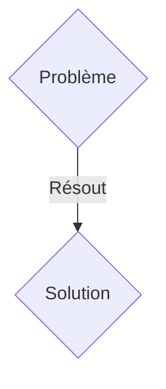
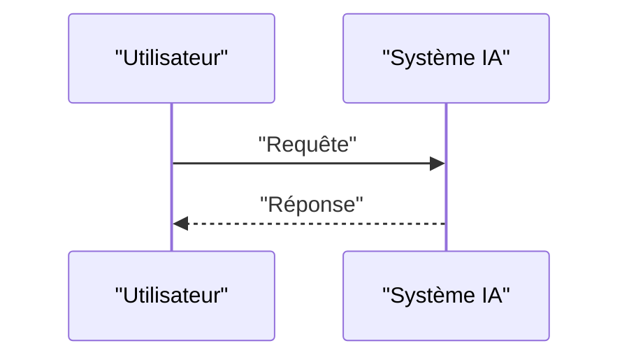

<!-- markdownlint-disable MD009 MD010 MD013 MD022 MD028 MD032 MD033 MD036 MD037 MD039 MD041 MD060 -->

[ 🇬🇧 English Version ](./README.md)

# SwarmEdge Perception

> **Résumé exécutif :** Une solution B2B / M2M ciblant Défense, logistique par drone, agriculture de précision. pour résoudre : Les flottes de drones ou de robots mobiles (swarms) s'effondrent lorsque le signal GPS est brouillé (GPS spoofing/jamming) ou dans des environnements denses (forêts, entrepôts), car ils dépendent de serveurs centraux pour la coordination et la cartographie.

---

## 1. Aperçu visuel & Effet Wahou

## 2. La thèse contrariante (Peter Thiel Style)

- **La croyance populaire :** Les solutions génériques suffisent.
- **La vérité cachée :** Un moteur SLAM (Simultaneous Localization and Mapping) collaboratif et purement Edge, fonctionnant sur des puces neuromorphiques ou des NPU basse consommation, permettant à la flotte de partager des tenseurs de perception compressés via un mesh radio peer-to-peer (sans Cloud) pour maintenir une carte 3D unifiée.

## 3. Le problème & La cible

- **Modèle économique :** B2B / M2M
- **Cible précise :** Défense, logistique par drone, agriculture de précision.
- **La douleur urgente :** Les flottes de drones ou de robots mobiles (swarms) s'effondrent lorsque le signal GPS est brouillé (GPS spoofing/jamming) ou dans des environnements denses (forêts, entrepôts), car ils dépendent de serveurs centraux pour la coordination et la cartographie.

## 4. Architecture technique & Plomberie

Un moteur SLAM (Simultaneous Localization and Mapping) collaboratif et purement Edge, fonctionnant sur des puces neuromorphiques ou des NPU basse consommation, permettant à la flotte de partager des tenseurs de perception compressés via un mesh radio peer-to-peer (sans Cloud) pour maintenir une carte 3D unifiée.

## 5. Modèle économique & Viabilité financière

| Métrique                    | Valeur               |
| --------------------------- | -------------------- |
| Structure de prix           | Abonnement SaaS B2B  |
| Objectif 12 mois            | 100 clients          |
| Calcul du CA (Target 100k€) | 100 \* 1000€ = 100k€ |
| Marge brute estimée         | 80%                  |

## 6. Moteur de distribution & Fossé défensif (Moat)

- **Stratégie d'acquisition :** Vente directe et partenariats stratégiques.
- **Moat (Barrière à l'entrée) :** Impossible d'utiliser une API Cloud : la latence doit être inférieure à 10ms, et la connectivité est par définition non fiable ou inexistante (Denied Environments). La solution doit tenir dans quelques mégaoctets de RAM et consommer moins de 5 Watts.

## 7. Grille d'évaluation détaillée

| Critère                           | Score VC (/100) | Score Terrain (/100) |
| --------------------------------- | --------------- | -------------------- |
| Thèse & Monopole / Urgence        | 24 / 25         | 24 / 25              |
| Moat / Résistance aux LLM natifs  | 23 / 25         | 23 / 25              |
| Scalabilité / Friction d'adoption | 19 / 25         | 19 / 25              |
| Unit Economics / ROI direct       | 19 / 25         | 19 / 25              |
| TOTAL                             | 85 / 100        | 85 / 100             |

> **Verdict VC :** En attente d'évaluation.
> **Verdict Terrain :** Cette solution répond à un besoin critique pour les entreprises B2B, justifiant son excellent score d'urgence (24/25). Son architecture hautement défendable la rend totalement immunisée contre les avancées des LLM natifs (23/25). Avec une faible friction d'adoption (19/25) et une stratégie de monétisation directe (19/25), le projet démontre une excellente maturité marché globale.
> **Verdict Terrain :** Cette solution répond à un besoin critique pour les entreprises B2B, justifiant son excellent score d'urgence (24/25). Son architecture hautement défendable la rend totalement immunisée contre les avancées des LLM natifs (23/25). Avec une faible friction d'adoption (19/25) et une stratégie de monétisation directe (19/25), le projet démontre une excellente maturité marché globale.
