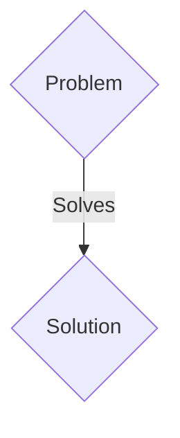
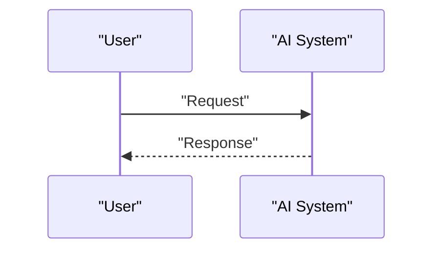

<!-- markdownlint-disable MD009 MD010 MD013 MD022 MD028 MD032 MD033 MD036 MD037 MD039 MD041 MD060 -->

[ 🇫🇷 Version Française ](./README.fr.md)

# SwarmEdge Perception

> **Executive Summary:** A B2B / M2M solution targeting Defense, drone logistics, precision agriculture. to solve: Fleets of drones or mobile robots (swarms) collapse when the GPS signal is jammed (GPS spoofing/jamming) or in dense environments (forests, warehouses), because they depend on central servers for coordination and mapping.

---

## 1. Visual Overview & Wow Effect

## 2. Contrarian Thesis (Peter Thiel Style)

- **Popular Belief:** Generic solutions are enough.
- **Hidden Truth:** A collaborative, purely Edge SLAM (Simultaneous Localization and Mapping) engine, running on neuromorphic chips or low-power NPUs, allowing the fleet to share compressed perception tensors via a peer-to-peer radio mesh (without Cloud) to maintain a unified 3D map.

## 3. Problem & Target Market

- **Business Model:** B2B / M2M
- **Target Audience:** Defense, drone logistics, precision agriculture.
- **Urgent Pain Point:** Fleets of drones or mobile robots (swarms) collapse when the GPS signal is jammed (GPS spoofing/jamming) or in dense environments (forests, warehouses), because they depend on central servers for coordination and mapping.

## 4. Technical Architecture & Infrastructure

A collaborative, purely Edge SLAM (Simultaneous Localization and Mapping) engine, running on neuromorphic chips or low-power NPUs, allowing the fleet to share compressed perception tensors via a peer-to-peer radio mesh (without Cloud) to maintain a unified 3D map.

## 5. Business Model & Financial Viability

| Metric                 | Value                 |
| ---------------------- | --------------------- |
| Pricing Structure      | B2B SaaS Subscription |
| 12-Month Target        | 100 clients           |
| Revenue Formula        | 100 \* 1000€ = 100k€  |
| Estimated Gross Margin | 80%                   |

## 6. Distribution Engine & Moat

- **Acquisition Strategy:** Direct sales and strategic partnerships.
- **Moat (Defensibility):** Impossible to use a Cloud API: latency must be less than 10ms, and connectivity is by definition unreliable or non-existent (Denied Environments). The solution must fit in a few megabytes of RAM and consume less than 5 Watts.

## 7. Detailed Evaluation Grid

| Criterion                   | VC Score (/100) | Market Score (/100) |
| --------------------------- | --------------- | ------------------- |
| Thesis & Monopoly / Urgency | -- / 25         | -- / 25             |
| Moat / LLM Immunity         | -- / 25         | -- / 25             |
| Scalability / UX Friction   | -- / 25         | -- / 25             |
| Unit Economics / ROI        | -- / 25         | -- / 25             |
| TOTAL                       | -- / 100        | -- / 100            |

> **VC Verdict:** Pending evaluation.
> **Market Verdict:** Pending evaluation.
