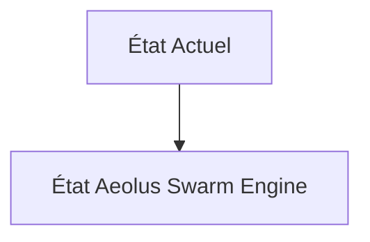
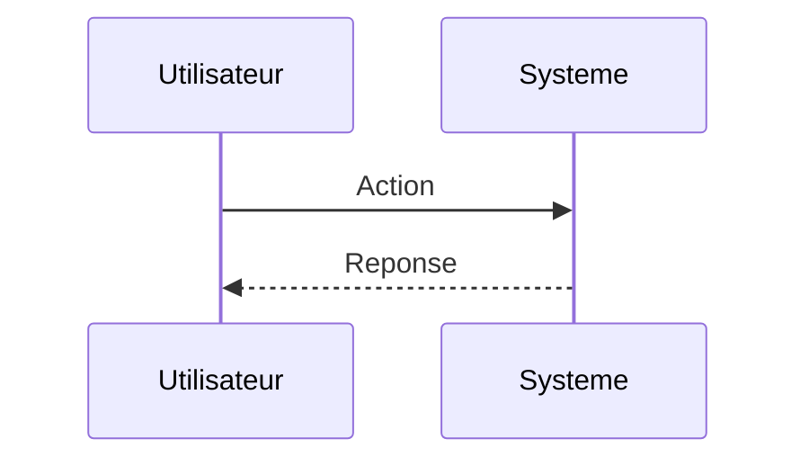

<!-- markdownlint-disable MD009 MD010 MD013 MD022 MD028 MD032 MD033 MD034 MD036 MD037 MD039 MD041 MD060 -->

[ 🇬🇧 English Version ](./README.md)

# Aeolus Swarm Engine

> **Résumé exécutif :** Un moteur de physique neuronale (Neural Physics Engine) entraîné sur des simulations CFD historiques et des données capteurs IoT temps réel. Il simule instantanément la mécanique des fluides pour des parcs entiers et orchestre l'orientation des turbines (yaw) comme un essaim unifié pour minimiser les turbulences et maximiser la capture d'énergie.

---

## 1. Aperçu visuel & Effet Wahou

## 2. La thèse contrariante (Peter Thiel Style)

**La croyance populaire :** Les solutions généralistes IA peuvent résoudre ce problème.

**La vérité cachée :** Un LLM ne comprend pas les équations de Navier-Stokes. Les SaaS d'analytics traditionnels s'appuient sur des données passées et des règles heuristiques simples, incapables de modéliser les dynamiques non-linéaires 3D de l'air en temps réel à l'échelle d'un parc de 100 turbines.

## 3. Le problème & La cible

**Modèle économique :** B2B

**Cible précise :** Opérateurs de parcs éoliens offshore et gestionnaires de réseaux électriques (Ørsted, Vestas, RWE).

**La douleur urgente :** L'effet de sillage (wake effect) réduit l'efficacité énergétique des parcs éoliens jusqu'à 20%. Les modèles aérodynamiques actuels (CFD - Computational Fluid Dynamics) prennent des semaines à tourner sur des supercalculateurs, rendant impossible l'ajustement dynamique en temps réel des turbines selon les micro-changements météorologiques.

## 4. Architecture technique & Plomberie

## 5. Modèle économique & Viabilité financière

| Métrique                    | Valeur                        |
| --------------------------- | ----------------------------- |
| Structure de prix           | Abonnement SaaS               |
| Objectif 12 mois            | 10 clients                    |
| Calcul du CA (Target 100k€) | 10 clients \* 10k€/an = 100k€ |
| Marge brute estimée         | 80%                           |

## 6. Moteur de distribution & Fossé défensif (Moat)

**Stratégie d'acquisition :** Vente directe B2B

**Moat (Barrière à l'entrée) :** Besoin massif de données CFD haute-fidélité pour l'entraînement initial (coûts compute énormes). Dépendance aux API de contrôle (souvent propriétaires) des fabricants de turbines (OEMs) pour agir sur le yaw.

## 7. Grille d'évaluation détaillée

| Critère                           | Score VC (/100) | Score Terrain (/100) |
| --------------------------------- | --------------- | -------------------- |
| Thèse & Monopole / Urgence        | -- / 25         | -- / 25              |
| Moat / Résistance aux LLM natifs  | -- / 25         | -- / 25              |
| Scalabilité / Friction d'adoption | -- / 25         | -- / 25              |
| Unit Economics / ROI direct       | -- / 25         | -- / 25              |
| **TOTAL**                         | **-- / 100**    | **-- / 100**         |

> **Verdict VC :** En attente d'évaluation.

> **Verdict Terrain :** En attente d'évaluation.
