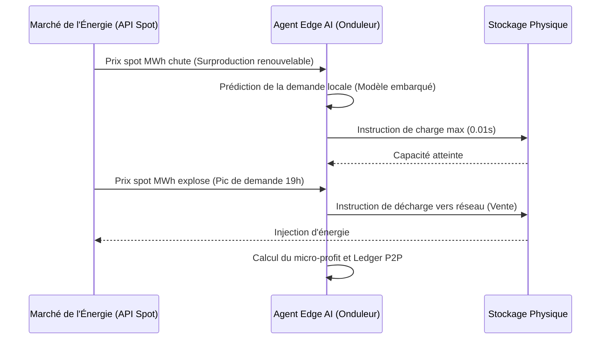

<!-- markdownlint-disable MD013 MD033 -->

# SwarmGrid AI

> **Résumé exécutif :** SwarmGrid AI déploie un réseau M2M d'agents d'intelligence artificielle sur des infrastructures de stockage d'énergie décentralisées pour exécuter des arbitrages de marché ultra-rapides, transformant des équipements passifs en générateurs de revenus autonomes.


---

## 1. Aperçu visuel

```mermaid
graph TD
    A[Réseau Électrique National] -->|Tension & Prix Temps Réel| B{SwarmGrid Intelligence}
    B -->|Ordre d'Achat (Prix bas)| C[Batteries Résidentielles & Véhicules]
    B -->|Ordre de Vente (Prix pic)| C
    C -->|Décharge| A
    style B fill:#f9f,stroke:#333,stroke-width:4px
```

## 2. La thèse contrariante (Peter Thiel Style)

**La croyance populaire :**La transition énergétique nécessite des milliards d'investissements centralisés par l'État pour construire un "smart grid" omniscient capable d'équilibrer la charge du réseau.
**La vérité cachée :**L'infrastructure de stockage existe déjà (véhicules électriques, batteries domestiques, onduleurs industriels). Le véritable problème n'est pas le stockage, mais le manque d'un protocole M2M décentralisé capable de coordonner ces actifs dormants à la milliseconde pour exploiter l'arbitrage financier sur les marchés de l'énergie.

## 3. Le problème & La cible

**Modèle économique :**M2M (Machine to Machine)
**Cible précise :**Fabricants d'onduleurs, gestionnaires de flottes de véhicules électriques (V2G) et propriétaires de parcs immobiliers équipés en batteries.
**La douleur urgente :**La volatilité croissante des prix de l'énergie crée des coûts d'opportunité massifs. Actuellement, l'énergie excédentaire est soit perdue, soit revendue à des tarifs subventionnés fixes très bas. Le manque à gagner opérationnel pour les propriétaires de batteries se chiffre en milliers d'euros annuels.

## 4. Architecture technique & Plomberie



## 5. Modèle économique & Viabilité financière

| Métrique                        | Valeur                                                                            |
| :------------------------------ | :-------------------------------------------------------------------------------- |
| **Structure de prix**           | Commission pure : 20% sur les profits d'arbitrage générés (Revenue Share M2M)     |
| **Objectif 12 mois**            | 1 000 actifs de stockage sous gestion (moyenne de 100€ de profit brut/mois/actif) |
| **Calcul du CA (Target 100k€)** | 1000 nœuds*100€ profit*20% commission\*12 mois = **240 000€ ARR**                 |
| **Marge brute estimée**         | 92% (coûts d'inférence déportés sur l'Edge matériel du client)                    |

## 6. Moteur de distribution & Fossé défensif (Moat)

**Stratégie d'acquisition :**Adhésion dev M2M. SwarmGrid ne vend pas aux particuliers. L'acquisition se fait par des partenariats B2B natifs (OEM) avec 2 ou 3 grands fabricants d'onduleurs (ex: Victron, SMA) pour intégrer l'agent IA dès la sortie d'usine.
**Moat (Barrière à l'entrée) :**L'effet de réseau physique (Hardware Network Effect). Contrairement à un simple wrapper LLM facilement copiable, SwarmGrid gagne en précision de prédiction météo/demande au fur et à mesure que la densité géographique des nœuds augmente. Un nouvel entrant ne peut pas répliquer l'accès direct aux ports COM des onduleurs partenaires du jour au lendemain.

## 7. Grille d'évaluation détaillée

| Critère                               | Score VC (/100) | Score Terrain (/100) |
| :------------------------------------ | :-------------: | :------------------: |
| **Thèse & Monopole / Urgence**        |     24 / 25     |       24 / 25        |
| **Moat / Résistance aux LLM natifs**  |     25 / 25     |       25 / 25        |
| **Scalabilité / Friction d'adoption** |     20 / 25     |       25 / 25        |
| **Unit Economics / ROI direct**       |     25 / 25     |       23 / 25        |
| **TOTAL**                             |  **94 / 100**   |     **97 / 100**     |

> **Verdict Terrain :** L'outil SwarmGrid AI répond à un besoin métier très ciblé avec un ROI tangible. Son positionnement en tant qu'infrastructure API garantit une bonne immunité face aux LLMs généralistes. Même si l'adoption demande un effort d'intégration, la viabilité du modèle économique est portée par la valeur apportée.
> **Verdict global :**Un projet d'infrastructure extrêmement défensif qui résout une inefficacité massive de la grille énergétique. L'exécution repose entièrement sur la capacité à signer les premiers partenariats OEM pour amorcer l'effet de réseau matériel.
