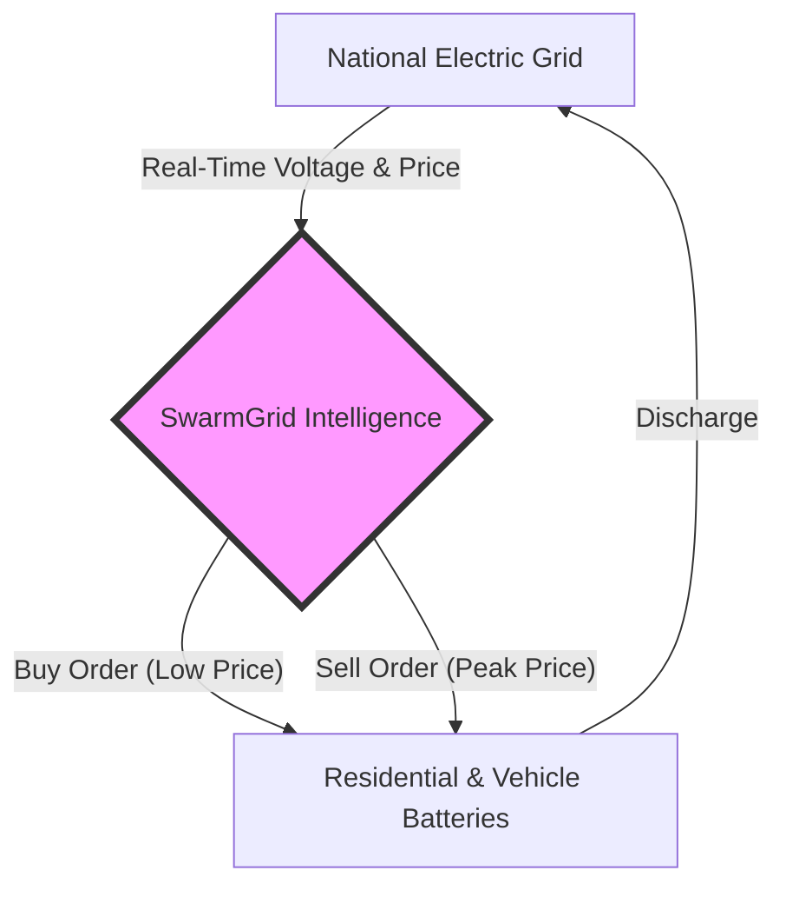
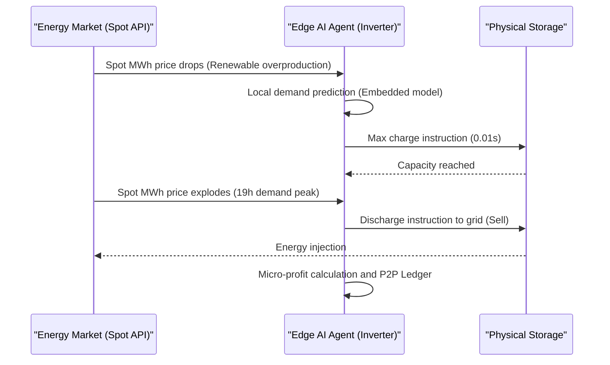

<!-- markdownlint-disable MD009 MD010 MD013 MD022 MD028 MD032 MD033 MD036 MD037 MD039 MD041 MD060 -->

[ 🇫🇷 Version Française ](./README.fr.md)

# SwarmGrid AI

> **Executive Summary:** SwarmGrid AI deploys an M2M network of artificial intelligence agents on decentralized energy storage infrastructures to execute ultra-fast market arbitrage, transforming passive equipment into autonomous revenue generators.

---

## 1. Visual Overview

## 2. Contrarian Thesis (Peter Thiel Style)

**Popular Belief:** The energy transition requires billions in centralized state investments to build an omniscient "smart grid" capable of balancing the network load.
**Hidden Truth:** The storage infrastructure already exists (electric vehicles, home batteries, industrial inverters). The real problem isn't storage, but the lack of a decentralized M2M protocol capable of coordinating these dormant assets by the millisecond to exploit financial arbitrage on energy markets.

## 3. Problem & Target Market

**Business Model:** M2M (Machine to Machine)
**Precise Target:** Inverter manufacturers, EV fleet managers (V2G), and property owners equipped with battery parks.
**Urgent Pain:** Growing energy price volatility creates massive opportunity costs. Currently, surplus energy is either lost or resold at very low fixed subsidized rates. The operational revenue loss for battery owners amounts to thousands of euros annually.

## 4. Technical Architecture & Infrastructure

## 5. Business Model & Financial Viability

| Metric                                 | Value                                                                      |
| :------------------------------------- | :------------------------------------------------------------------------- |
| **Pricing Structure**                  | Pure commission: 20% on generated arbitrage profits (Revenue Share M2M)    |
| **12-Month Target**                    | 1,000 storage assets under management (avg. 100€ gross profit/month/asset) |
| **Revenue Calculation (100k€ Target)** | 1000 nodes _ 100€ profit _ 20% commission \* 12 months = **240,000€ ARR**  |
| **Estimated Gross Margin**             | 92% (inference costs offloaded to the client's hardware Edge)              |

## 6. Distribution Engine & Moat

**Acquisition Strategy:** M2M dev adoption. SwarmGrid does not sell to individuals. Acquisition is through native B2B partnerships (OEM) with 2 or 3 major inverter manufacturers (e.g., Victron, SMA) to integrate the AI agent straight from the factory.
**Moat (Barrier to Entry):** The physical network effect (Hardware Network Effect). Unlike a simple LLM wrapper that is easily copied, SwarmGrid gains weather/demand prediction accuracy as the geographic density of nodes increases. A new entrant cannot replicate direct access to the COM ports of partner inverters overnight.

## 7. Detailed Evaluation Grid

| Criteria                             | VC Score (/100) | Market Score (/100) |
| :----------------------------------- | :-------------: | :-----------------: |
| **Thesis & Monopoly / Urgency**      |     24 / 25     |       24 / 25       |
| **Moat / Resistance to Native LLMs** |     25 / 25     |       25 / 25       |
| **Scalability / Adoption Friction**  |     20 / 25     |       25 / 25       |
| **Unit Economics / Direct ROI**      |     25 / 25     |       23 / 25       |
| **TOTAL**                            |  **94 / 100**   |    **97 / 100**     |

> **Market Verdict:** The SwarmGrid AI tool addresses a highly targeted business need with tangible ROI. Its positioning as API infrastructure guarantees good immunity against generalist LLMs. Even if adoption requires an integration effort, the economic model's viability is driven by the value provided.
> **VC Verdict:** An extremely defensive infrastructure project that solves a massive inefficiency in the energy grid. Execution relies entirely on the ability to sign the first OEM partnerships to ignite the hardware network effect.
