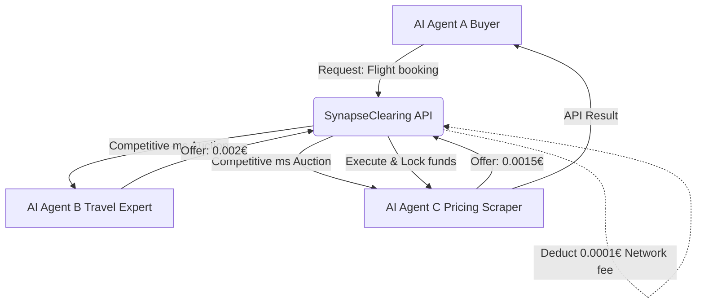
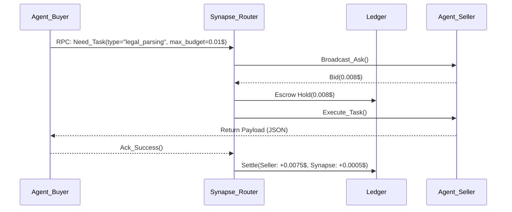

<!-- markdownlint-disable MD013 MD033 MD060 MD039 MD041 MD032 MD010 MD009 MD022 MD036 MD028 MD037 -->

[🇫🇷 Version Française](./README.fr.md)

# SynapseClearing

> **Executive Summary:** The first B2B clearinghouse dedicated exclusively to financial and resource transactions between AI agents (M2M), allowing autonomous systems to buy and sell cognitive capabilities, data, or API execution in real time.

---

## 1. Visual Overview

## 2. The Contrarian Thesis (Peter Thiel Style)

**The Popular Belief:** Companies will develop monolithic "super-agents" (AGI) capable of doing everything internally, or will use centralized plugins dictated by OpenAI/Google.
**The Hidden Truth:** The AI economy will be highly fragmented and specialized. Millions of micro-agents will need to interact, negotiate, and pay each other to the millisecond without human intervention. The big winner won't be whoever creates the best agent, but whoever owns the *financial settlement layer* (the Visa/Mastercard) between these agents.

## 3. The Problem & The Target

**Economic Model:** M2M (Machine to Machine) / B2B2M (Business to Business to Machine)
**Specific Target:** Autonomous AI agent developers, specialized LLM providers, and companies deploying multi-agent architectures (Swarms).
**The Urgent Pain:** Currently, if Agent A wants to use Agent B's capability, the developer must code a specific API integration, manage secret keys, and establish a heavy SaaS billing contract. The lack of a dynamic micropayment standard prevents the creation of a true Agentic Economy. The integration cost (temporal and financial) kills interoperability at birth.

## 4. Technical Architecture & Plumbing

The system does not store heavy inference data; it acts as a financial router and ultra-fast state ledger.

## 5. Economic Model & Financial Viability

| Metric | Value |
| :--- | :--- |
| **Pricing Structure** | 5% commission on the face value of each micro-transaction clearing + Fixed subscription fee for guaranteed liquidity (99€/month per agent cluster). |
| **12-Month Target** | 200 companies connecting "Swarms", generating 10 million micro-transactions/month at an average value of 0.05€. |
| **Revenue Calculation (100k€ Target)** | (200 clients * 99€/month) + (10M tx * 0.05€ * 5% commission) = 19,800€ + 25,000€ = 44,800€ MRR = **537,600€ ARR** (Well > 100k€). |
| **Estimated Gross Margin** | 90% (Marginal costs of an RPC transaction are near zero). |

## 6. Distribution Engine & Defensive Moat (Moat)

**Acquisition Strategy:** Open-source the `synapse-agent-connect` SDK. Native integration into dominant agent frameworks (LangChain, AutoGen, CrewAI). Developers install the SDK by default because it makes their agents instantly monetizable by others.
**Moat (Barrier to Entry):** The purest Two-sided network effect. The more buyer agents there are, the more profitable it is for seller agents to connect to it, and vice versa. OpenAI cannot easily replicate it because it requires integrating competing LLMs (Anthropic, Mistral, open-source models) into the clearinghouse. SynapseClearing is the agnostic bridge, the neutral Switzerland of AI.

## 7. Detailed Evaluation Grid

| Criteria | VC Score (/100) | Terrain Score (/100) |
| :--- | :---: | :---: |
| **Thesis & Monopoly / Urgency** | 24 / 25 | -- / 25 |
| **Moat / Resistance to Native LLMs** | 25 / 25 | -- / 25 |
| **Scalability / Adoption Friction** | 19 / 25 | -- / 25 |
| **Unit Economics / Direct ROI** | 21 / 25 | -- / 25 |
| **TOTAL** | **89 / 100** | **-- / 100** |

> **VC Verdict:** SynapseClearing provides the critical regulatory and clearing infrastructure for M2M transactions. By holding funds in escrow and ensuring compliance, it acts as a trusted middleman with a natural monopoly dynamic.

Verdict Terrain : En attente d'évaluation.
