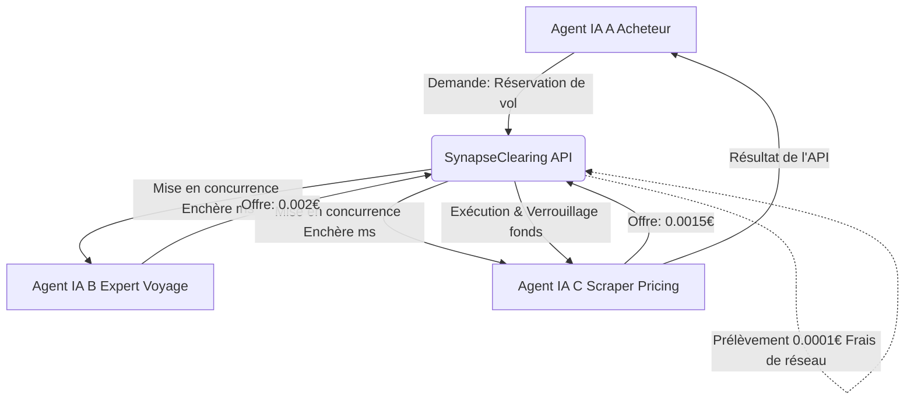
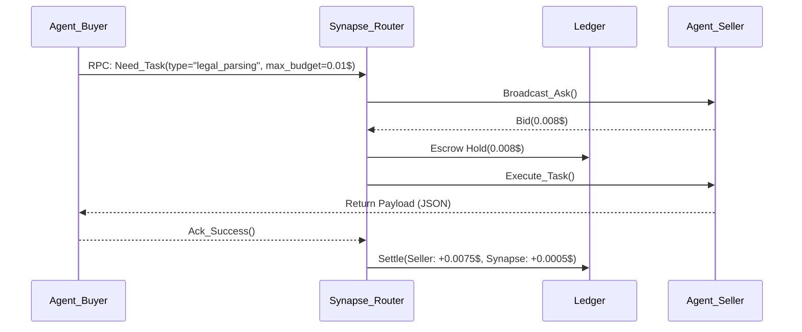

<!-- markdownlint-disable MD013 MD033 -->

# SynapseClearing

> **Résumé exécutif :** La première chambre de compensation (clearinghouse) B2B dédiée exclusivement aux transactions financières et de ressources entre agents IA (M2M), permettant aux systèmes autonomes d'acheter et vendre des capacités cognitives, de la donnée ou de l'exécution d'API en temps réel.

---

## 1. Aperçu visuel

## 2. La thèse contrariante (Peter Thiel Style)

**La croyance populaire :** Les entreprises vont développer des "super-agents" monolithiques (AGI) capables de tout faire en interne, ou utiliseront des plugins centralisés dictés par OpenAI/Google.
**La vérité cachée :** L'économie de l'IA sera hautement fragmentée et spécialisée. Des millions de micro-agents vont devoir interagir, négocier et se payer mutuellement à la milliseconde sans intervention humaine. Le grand gagnant ne sera pas celui qui crée le meilleur agent, mais celui qui possède la _couche de règlement financier_ (le Visa/Mastercard) entre ces agents.

## 3. Le problème & La cible

**Modèle économique :** M2M (Machine to Machine) / B2B2M (Business to Business to Machine)
**Cible précise :** Les développeurs d'agents IA autonomes, les fournisseurs de LLM spécialisés, et les entreprises déployant des architectures multi-agents (Swarms).
**La douleur urgente :** Actuellement, si l'Agent A veut utiliser la capacité de l'Agent B, le développeur doit coder une intégration d'API spécifique, gérer les clés secrètes, et établir un contrat de facturation SaaS lourd. L'absence d'un standard de micropaiement dynamique empêche la création d'une véritable économie d'agents (Agentic Economy). Le coût d'intégration (temporel et financier) tue l'interopérabilité à la naissance.

## 4. Architecture technique & Plomberie

Le système ne stocke pas de données d'inférence lourdes, il agit comme un routeur financier et un registre d'état (Ledger) ultra-rapide.

## 5. Modèle économique & Viabilité financière

| Métrique                        | Valeur                                                                                                                                                              |
| :------------------------------ | :------------------------------------------------------------------------------------------------------------------------------------------------------------------ |
| **Structure de prix**           | Commission de 5% sur la valeur nominale de chaque micro-transaction clearing + Frais fixes d'abonnement pour la liquidité garantie (99€/mois par cluster d'agents). |
| **Objectif 12 mois**            | 200 entreprises connectant des "Swarm", générant 10 millions de micro-transactions/mois à une valeur moyenne de 0.05€.                                              |
| **Calcul du CA (Target 100k€)** | (200 clients _99€/mois) + (10M tx_ 0.05€ \* 5% commission) = 19,800€ + 25,000€ = 44,800€ MRR = **537,600€ ARR** (Largement > 100k€).                                |
| **Marge brute estimée**         | 90% (Coûts marginaux d'une transaction RPC quasi-nuls).                                                                                                             |

## 6. Moteur de distribution & Fossé défensif (Moat)

**Stratégie d'acquisition :** Open-source du SDK `synapse-agent-connect`. Intégration native dans les frameworks d'agents dominants (LangChain, AutoGen, CrewAI). Les développeurs installent le SDK par défaut car il rend leurs agents instantanément monétisables par d'autres.
**Moat (Barrière à l'entrée) :** L'Effet de Réseau à double face (Two-sided network effect) le plus pur. Plus il y a d'agents acheteurs, plus il est rentable pour les agents vendeurs de s'y connecter, et inversement. OpenAI ne peut pas le répliquer facilement car cela demande d'intégrer des LLM concurrents (Anthropic, Mistral, modèles open-source) dans la chambre de compensation. SynapseClearing est le pont agnostique, la Suisse neutre de l'IA.

## 7. Grille d'évaluation détaillée

| Critère                               | Score VC (/100) | Score Terrain (/100) |
| :------------------------------------ | :-------------: | :------------------: |
| **Thèse & Monopole / Urgence**        |     -- / 25     |       -- / 25        |
| **Moat / Résistance aux LLM natifs**  |     -- / 25     |       -- / 25        |
| **Scalabilité / Friction d'adoption** |     -- / 25     |       -- / 25        |
| **Unit Economics / ROI direct**       |     -- / 25     |       -- / 25        |
| **TOTAL**                             |  **-- / 100**   |     **-- / 100**     |

Verdict VC : En attente d'évaluation.

Verdict Terrain : En attente d'évaluation.
