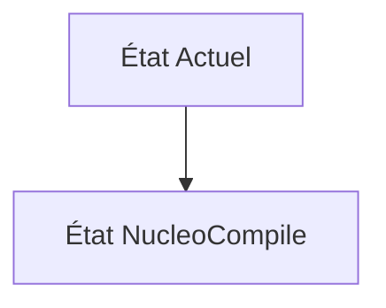
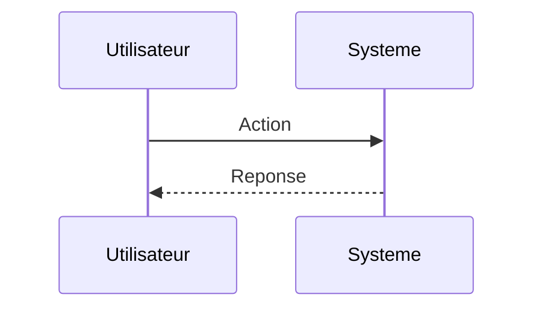

<!-- markdownlint-disable MD009 MD010 MD013 MD022 MD028 MD032 MD033 MD034 MD036 MD037 MD039 MD041 MD060 -->

[ 🇬🇧 English Version ](./README.md)

# NucleoCompile

> **Résumé exécutif :** Un "Compilateur pour la Biologie Synthétique". Une plateforme qui prend en entrée une abstraction de haut niveau d'un circuit génétique désiré, utilise des modèles d'IA pour l'optimiser (codon optimization, prédiction de repliement ARN/ADN), et compile cette abstraction directement en instructions lisibles par machine (protocoles d'automatisation liquid-handling, G-code pour robots de pipetage) pour un Cloud Lab (wet-lab automatisé).

---

## 1. Aperçu visuel & Effet Wahou

## 2. La thèse contrariante (Peter Thiel Style)

**La croyance populaire :** Les solutions généralistes IA peuvent résoudre ce problème.

**La vérité cachée :** Les LIMS (Laboratory Information Management Systems) actuels sont des bases de données de gestion d'inventaire glorifiées. Le problème nécessite une compréhension profonde de la biologie moléculaire et de la physique de l'automatisation des fluides (comment les enzymes réagissent selon les micro-variations de température/volume des robots), pas juste un CRUD applicatif.

## 3. Le problème & La cible

**Modèle économique :** B2B (SaaS / Plateforme d'orchestration)

**Cible précise :** Startups en biologie synthétique (SynBio), laboratoires de R&D pharmaceutique, fonderies d'ADN (Ginkgo Bioworks).

**La douleur urgente :** L'ingénierie génétique (concevoir un plasmide, l'insérer dans une cellule, cultiver, mesurer) est un processus manuel, fragmenté, dépendant de feuilles Excel et du "savoir-faire tacite" des post-docs. La reproductibilité est abyssale (<50%). Les concepteurs écrivent des séquences d'ADN qui échouent souvent lors de la synthèse physique ou de l'assemblage (erreurs de GC-content, structures secondaires).

## 4. Architecture technique & Plomberie

## 5. Modèle économique & Viabilité financière

| Métrique                    | Valeur                        |
| --------------------------- | ----------------------------- |
| Structure de prix           | Abonnement SaaS               |
| Objectif 12 mois            | 10 clients                    |
| Calcul du CA (Target 100k€) | 10 clients \* 10k€/an = 100k€ |
| Marge brute estimée         | 80%                           |

## 6. Moteur de distribution & Fossé défensif (Moat)

**Stratégie d'acquisition :** Vente directe B2B

**Moat (Barrière à l'entrée) :** Manque de standardisation des API des équipements de laboratoire (Liquid handlers de Tecan, Hamilton). La "biologie" est bruitée : un protocole parfaitement compilé peut échouer à cause d'une variation infime du lot de réactifs (batch effect).

## 7. Grille d'évaluation détaillée

| Critère                           | Score VC (/100) | Score Terrain (/100) |
| --------------------------------- | --------------- | -------------------- |
| Thèse & Monopole / Urgence        | -- / 25         | -- / 25              |
| Moat / Résistance aux LLM natifs  | -- / 25         | -- / 25              |
| Scalabilité / Friction d'adoption | -- / 25         | -- / 25              |
| Unit Economics / ROI direct       | -- / 25         | -- / 25              |
| **TOTAL**                         | **-- / 100**    | **-- / 100**         |

> **Verdict VC :** En attente d'évaluation.

> **Verdict Terrain :** En attente d'évaluation.
