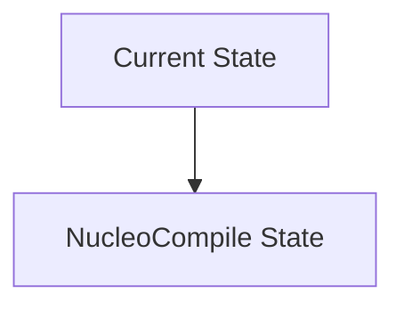
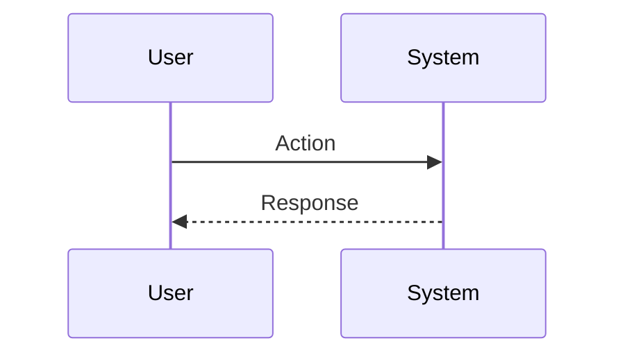

<!-- markdownlint-disable MD009 MD010 MD013 MD022 MD028 MD032 MD033 MD034 MD036 MD037 MD039 MD041 MD060 -->

[ 🇫🇷 Version Française ](./README.fr.md)

# NucleoCompile

> **Executive Summary:** A “Compiler for Synthetic Biology”. A platform that takes as input a high-level abstraction of a desired genetic circuit, uses AI models to optimize it (codon optimization, RNA/DNA folding prediction), and compiles this abstraction directly into machine-readable instructions (liquid-handling automation protocols, G-code for pipetting robots) for a Cloud Lab (automated wet-lab).

---

## 1. Visual Overview & Wow Effect

## 2. Contrarian Thesis (Peter Thiel Style)

**Popular Belief:** General AI solutions can solve this problem.

**Hidden Truth:** Today's LIMS (Laboratory Information Management Systems) are glorified inventory management databases. The problem requires a deep understanding of molecular biology and the physics of fluid automation (how enzymes react to robots' micro-temperature/volume variations), not just application CRUD.

## 3. Problem & Target Market

**Business Model:** B2B (SaaS / Plateforme d'orchestration)

**Target Audience:** Synthetic biology startups (SynBio), pharmaceutical R&D laboratories, DNA foundries (Ginkgo Bioworks).

**Urgent Pain Point:** Genetic engineering (design a plasmid, insert it into a cell, cultivate, measure) is a manual, fragmented process, dependent on Excel sheets and the “tacit know-how” of post-docs. Reproducibility is abysmal (<50%). Designers write DNA sequences that often fail during physical synthesis or assembly (GC-content errors, secondary structures).

## 4. Technical Architecture & Infrastructure

## 5. Business Model & Financial Viability

| Metric                 | Value                           |
| ---------------------- | ------------------------------- |
| Pricing Structure      | SaaS subscription               |
| 12-Month Target        | 10 customers                    |
| Revenue Formula        | 10 clients \* 10k€/year = 100k€ |
| Estimated Gross Margin | 80%                             |

## 6. Distribution Engine & Moat

**Acquisition Strategy:** B2B direct sales

**Moat (Defensibility):** Lack of standardization of laboratory equipment APIs (Liquid handlers from Tecan, Hamilton). “Biology” is noisy: a perfectly compiled protocol can fail due to a tiny variation in the batch of reagents (batch effect).

## 7. Detailed Evaluation Grid

| Criterion                   | VC Score (/100) | Market Score (/100) |
| --------------------------- | --------------- | ------------------- |
| Thesis & Monopoly / Urgency | -- / 25         | -- / 25             |
| Moat / LLM Immunity         | -- / 25         | -- / 25             |
| Scalability / UX Friction   | -- / 25         | -- / 25             |
| Unit Economics / ROI        | -- / 25         | -- / 25             |
| **TOTAL**                   | **-- / 100**    | **-- / 100**        |

> **VC Verdict:** Pending evaluation.

> **Market Verdict:** Pending evaluation.
