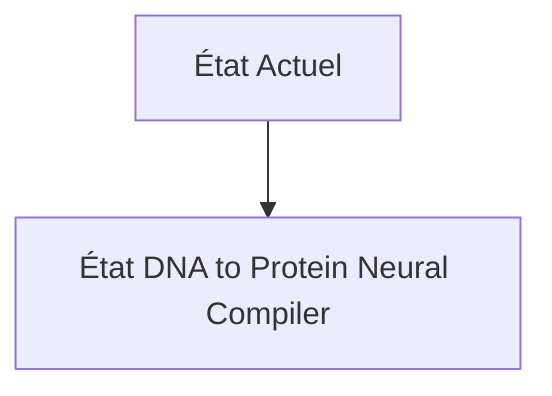
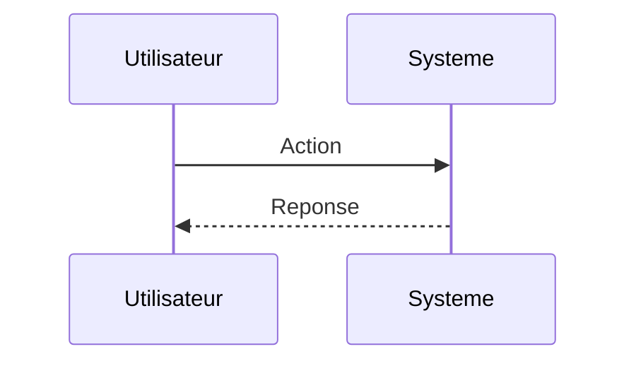

<!-- markdownlint-disable MD009 MD010 MD013 MD022 MD028 MD032 MD033 MD034 MD036 MD037 MD039 MD041 MD060 -->

[ 🇬🇧 English Version ](./README.md)

# DNA to Protein Neural Compiler

> **Résumé exécutif :** Un compilateur IA qui traduit des contraintes fonctionnelles (ex: "une enzyme stable à 80°C qui dégrade le PET") en séquences d'acides aminés, avec un modèle de diffusion 3D prédisant l'affinité de liaison et les toxicités potentielles avant la moindre synthèse. Couplé à un orchestrateur de wet-lab automatisé pour vérifier la viabilité en boucle fermée.

---

## 1. Aperçu visuel & Effet Wahou

## 2. La thèse contrariante (Peter Thiel Style)

**La croyance populaire :** Les solutions généralistes IA peuvent résoudre ce problème.

**La vérité cachée :** L'espace conformationnel des protéines est plus vaste que le nombre d'atomes dans l'univers. Les logiciels de chimie computationnelle classiques exigent des réglages manuels infinis. AlphaFold prédit la structure, mais ne génère pas de séquences _à partir d'une fonction désirée_ avec des contraintes industrielles.

## 3. Le problème & La cible

**Modèle économique :** B2B

**Cible précise :** Pharmas (Pfizer, Moderna), biotechs spécialisées dans l'oncologie ou l'agriculture (fermentation de précision), laboratoires de biologie synthétique.

**La douleur urgente :** Designer de nouvelles protéines ou enzymes de novo relève de l'alchimie. Le processus de "Fold to Function" prend des années de wet-lab et des millions de dollars pour un taux d'échec de 99%, ralentissant la création de médicaments ciblés ou de matériaux biodégradables.

## 4. Architecture technique & Plomberie

## 5. Modèle économique & Viabilité financière

| Métrique                    | Valeur                        |
| --------------------------- | ----------------------------- |
| Structure de prix           | Abonnement SaaS               |
| Objectif 12 mois            | 10 clients                    |
| Calcul du CA (Target 100k€) | 10 clients \* 10k€/an = 100k€ |
| Marge brute estimée         | 80%                           |

## 6. Moteur de distribution & Fossé défensif (Moat)

**Stratégie d'acquisition :** Vente directe B2B

**Moat (Barrière à l'entrée) :** Dépendance au coût des synthétiseurs d'ADN physiques pour les tests (wet-lab in the loop). L'acquisition de données propriétaires sur les échecs ("negative data" très rares dans la littérature scientifique) pour entraîner le modèle. Biosecurité (empêcher la création de pathogènes).

## 7. Grille d'évaluation détaillée

| Critère                           | Score VC (/100) | Score Terrain (/100) |
| --------------------------------- | --------------- | -------------------- |
| Thèse & Monopole / Urgence        | -- / 25         | -- / 25              |
| Moat / Résistance aux LLM natifs  | -- / 25         | -- / 25              |
| Scalabilité / Friction d'adoption | -- / 25         | -- / 25              |
| Unit Economics / ROI direct       | -- / 25         | -- / 25              |
| **TOTAL**                         | **-- / 100**    | **-- / 100**         |

> **Verdict VC :** En attente d'évaluation.

> **Verdict Terrain :** En attente d'évaluation.
