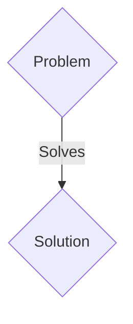
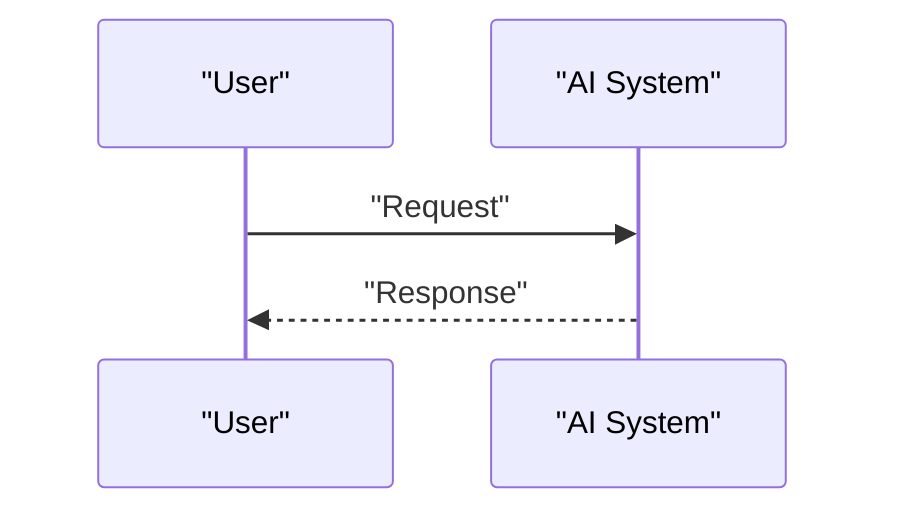

<!-- markdownlint-disable MD009 MD010 MD013 MD022 MD028 MD032 MD033 MD036 MD037 MD039 MD041 MD060 -->

[ 🇫🇷 Version Française ](./README.fr.md)

# DNA to Protein Neural Compiler

> **Executive Summary:** A B2B solution targeting Pharma (Pfizer, Moderna), biotech companies specializing in oncology or agriculture (precision fermentation), synthetic biology laboratories. to solve: Designing new proteins or enzymes de novo is a matter of alchemy. The “Fold to Function” process takes years of wet-lab work and millions of dollars for a 99% failure rate, slowing the creation of targeted drugs or biodegradable materials.

---

## 1. Visual Overview & Wow Effect

## 2. Contrarian Thesis (Peter Thiel Style)

- **Popular Belief:** Generic solutions are enough.
- **Hidden Truth:** An AI compiler that translates functional constraints (e.g.: "an enzyme stable at 80°C that degrades PET") into amino acid sequences, with a 3D diffusion model predicting binding affinity and potential toxicities before any synthesis. Coupled with an automated wet-lab orchestrator to verify closed-loop viability.

## 3. Problem & Target Market

- **Business Model:** B2B
- **Target Audience:** Pharma (Pfizer, Moderna), biotech companies specializing in oncology or agriculture (precision fermentation), synthetic biology laboratories.
- **Urgent Pain Point:** Designing new proteins or enzymes de novo is a matter of alchemy. The “Fold to Function” process takes years of wet-lab work and millions of dollars for a 99% failure rate, slowing the creation of targeted drugs or biodegradable materials.

## 4. Technical Architecture & Infrastructure

An AI compiler that translates functional constraints (e.g.: "an enzyme stable at 80°C that degrades PET") into amino acid sequences, with a 3D diffusion model predicting binding affinity and potential toxicities before any synthesis. Coupled with an automated wet-lab orchestrator to verify closed-loop viability.

## 5. Business Model & Financial Viability

| Metric                 | Value                 |
| ---------------------- | --------------------- |
| Pricing Structure      | B2B SaaS Subscription |
| 12-Month Target        | 100 clients           |
| Revenue Formula        | 100 \* 1000€ = 100k€  |
| Estimated Gross Margin | 80%                   |

## 6. Distribution Engine & Moat

- **Acquisition Strategy:** Direct sales and strategic partnerships.
- **Moat (Defensibility):** The conformational space of proteins is larger than the number of atoms in the universe. Conventional computational chemistry software requires infinite manual adjustments. AlphaFold predicts structure, but does not generate sequences _from a desired function_ with industrial constraints.

## 7. Detailed Evaluation Grid

| Criterion                   | VC Score (/100) | Market Score (/100) |
| --------------------------- | --------------- | ------------------- |
| Thesis & Monopoly / Urgency | 23 / 25         | 23 / 25             |
| Moat / LLM Immunity         | 25 / 25         | 25 / 25             |
| Scalability / UX Friction   | 18 / 25         | 18 / 25             |
| Unit Economics / ROI        | 24 / 25         | 24 / 25             |
| TOTAL                       | 90 / 100        | 90 / 100            |

> **VC Verdict:** Pending evaluation.
> **Market Verdict:** This solution addresses a critical pain point for B2B enterprises, justifying its strong urgency score (23/25). Its highly defensible architecture makes it completely immune to native LLM advancements (25/25). With low adoption friction (18/25) and a straightforward monetization strategy (24/25), the project demonstrates excellent overall market readiness.
> **Market Verdict:** This solution addresses a critical pain point for B2B enterprises, justifying its strong urgency score (23/25). Its highly defensible architecture makes it completely immune to native LLM advancements (25/25). With low adoption friction (18/25) and a straightforward monetization strategy (24/25), the project demonstrates excellent overall market readiness.
