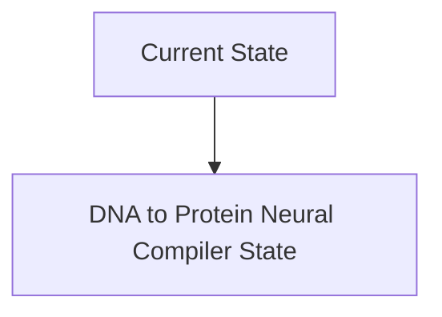
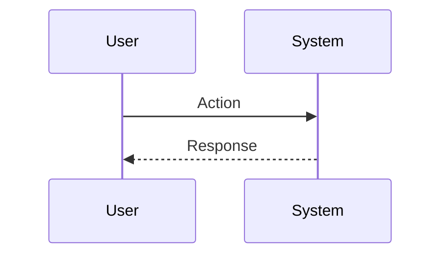

<!-- markdownlint-disable MD009 MD010 MD013 MD022 MD028 MD032 MD033 MD034 MD036 MD037 MD039 MD041 MD060 -->

[ 🇫🇷 Version Française ](./README.fr.md)

# DNA to Protein Neural Compiler

> **Executive Summary:** An AI compiler that translates functional constraints (e.g.: "an enzyme stable at 80°C that degrades PET") into amino acid sequences, with a 3D diffusion model predicting binding affinity and potential toxicities before any synthesis. Coupled with an automated wet-lab orchestrator to verify closed-loop viability.

---

## 1. Visual Overview & Wow Effect

## 2. Contrarian Thesis (Peter Thiel Style)

**Popular Belief:** General AI solutions can solve this problem.

**Hidden Truth:** The conformational space of proteins is larger than the number of atoms in the universe. Conventional computational chemistry software requires infinite manual adjustments. AlphaFold predicts structure, but does not generate sequences _from a desired function_ with industrial constraints.

## 3. Problem & Target Market

**Business Model:** B2B

**Target Audience:** Pharma (Pfizer, Moderna), biotech companies specializing in oncology or agriculture (precision fermentation), synthetic biology laboratories.

**Urgent Pain Point:** Designing new proteins or enzymes de novo is a matter of alchemy. The “Fold to Function” process takes years of wet-lab work and millions of dollars for a 99% failure rate, slowing the creation of targeted drugs or biodegradable materials.

## 4. Technical Architecture & Infrastructure

## 5. Business Model & Financial Viability

| Metric                 | Value                           |
| ---------------------- | ------------------------------- |
| Pricing Structure      | SaaS subscription               |
| 12-Month Target        | 10 customers                    |
| Revenue Formula        | 10 clients \* 10k€/year = 100k€ |
| Estimated Gross Margin | 80%                             |

## 6. Distribution Engine & Moat

**Acquisition Strategy:** B2B direct sales

**Moat (Defensibility):** Cost dependence of physical DNA synthesizers for testing (wet-lab in the loop). The acquisition of proprietary data on failures (“negative data” very rare in the scientific literature) to train the model. Biosecurity (preventing the creation of pathogens).

## 7. Detailed Evaluation Grid

| Criterion                   | VC Score (/100) | Market Score (/100) |
| --------------------------- | --------------- | ------------------- |
| Thesis & Monopoly / Urgency | -- / 25         | -- / 25             |
| Moat / LLM Immunity         | -- / 25         | -- / 25             |
| Scalability / UX Friction   | -- / 25         | -- / 25             |
| Unit Economics / ROI        | -- / 25         | -- / 25             |
| **TOTAL**                   | **-- / 100**    | **-- / 100**        |

> **VC Verdict:** Pending evaluation.

> **Market Verdict:** Pending evaluation.
