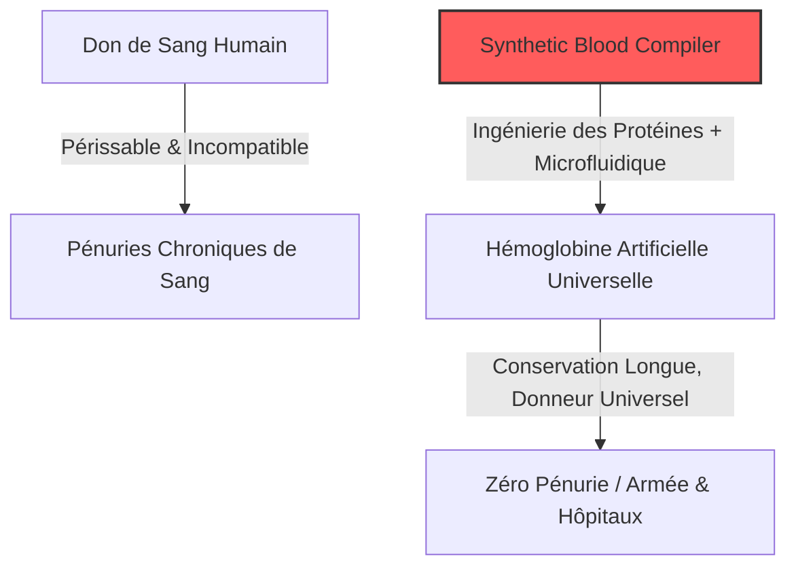
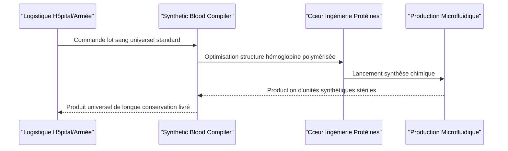

<!-- markdownlint-disable MD009 MD010 MD013 MD022 MD028 MD032 MD033 MD034 MD036 MD037 MD039 MD041 MD058 MD060 -->

[ 🇬🇧 English Version ](./README.md)

# Synthetic Blood Compiler

> **Résumé exécutif :** Une plateforme de biologie de synthèse qui conçoit et produit à la demande des transporteurs d'oxygène artificiels universels, éliminant la dépendance aux dons de sang humain.

---

## 1. Aperçu visuel & Effet Wahou

## 2. La thèse contrariante (Peter Thiel Style)

**La croyance populaire :** La solution aux pénuries mondiales de sang est un meilleur logiciel de chaîne d'approvisionnement et des campagnes marketing plus agressives pour les dons humains.
**La vérité cachée :** S'appuyer sur des donneurs humains est fondamentalement voué à l'échec car le sang biologique est très périssable, exige une chaîne du froid stricte et présente des risques immunologiques. La vraie solution est un transporteur d'oxygène entièrement synthétique et stable à température ambiante, rendant le don de sang obsolète.

## 3. Le problème & La cible

**Modèle économique :** B2B
**Cible précise :** Les systèmes de santé nationaux, l'armée (logistique de terrain), et les grands hôpitaux.
**La douleur urgente :** Le sang humain est une ressource périssable, dépendante des dons, difficile à stocker, et présentant des risques de transmission de pathogènes ou d'incompatibilité immunologique fatale. Les pénuries coûtent des vies chaque jour.

## 4. Architecture technique & Plomberie

## 5. Modèle économique & Viabilité financière

| Métrique                        | Valeur                                                            |
| :------------------------------ | :---------------------------------------------------------------- |
| **Structure de prix**           | Vente à l'unité + Contrats dédiés (Armée/Hôpitaux)                |
| **Objectif 12 mois**            | 1 contrat de test pilote (Phase pré-clinique)                     |
| **Calcul du CA (Target 100k€)** | 1 subvention pilote défense = 200k€ ARR                           |
| **Marge brute estimée**         | 40% (Initialement faible à cause des coûts de production wet-lab) |

## 6. Moteur de distribution & Fossé défensif (Moat)

**Stratégie d'acquisition :** Partenariats B2G et B2B avec des agences de recherche militaire (ex: DARPA) et de grandes banques de sang pour financer les essais cliniques.
**Moat (Barrière à l'entrée) :** Bio-ingénierie "wet-lab" profonde. Il s'agit de créer de nouvelles molécules fonctionnelles imitant les globules rouges sans provoquer de choc immunitaire—un défi hors de portée des startups SaaS classiques.

## 7. Grille d'évaluation détaillée

| Critère                               | Score VC (/100) | Score Terrain (/100) |
| :------------------------------------ | :-------------- | :------------------- |
| **Thèse & Monopole / Urgence**        | 25 / 25         | -- / 25              |
| **Moat / Résistance aux LLM natifs**  | 25 / 25         | -- / 25              |
| **Scalabilité / Friction d'adoption** | 22 / 25         | -- / 25              |
| **Unit Economics / ROI direct**       | 20 / 25         | -- / 25              |
| **TOTAL**                             | **92 / 100**    | **-- / 100**         |

> **Verdict VC :** Un changement de paradigme profond visant à éliminer une dépendance biologique mondiale. Le fossé défensif est intouchable par la tech classique, ancré dans la biologie moléculaire propriétaire. Une fois validé par la FDA, le marché adressable est infini, avec d'excellentes marges unitaires.

> **Verdict Terrain :** En attente d'évaluation.
