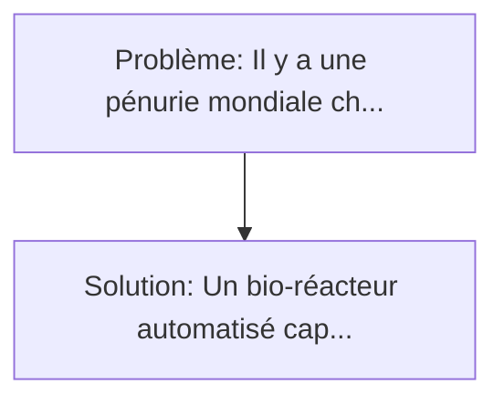
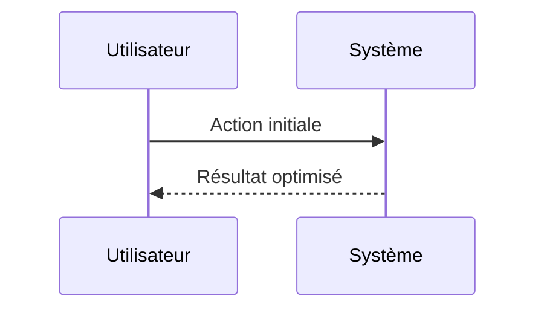

<!-- markdownlint-disable MD013 MD033 -->

[🇬🇧 English Version](./README.md)

# Réacteur de Synthèse Sanguine (Synthetic Blood Reactor)

> **Résumé exécutif :** Un bio-réacteur automatisé capable de cultiver en continu des globules rouges humains universels (O-) in vitro à partir de cellules souches hématopoïétiques modifiées ou de lignées cellulaires immortalisées, couplé à une ingénierie des fluides pour maintenir le transport de l'oxygène, tout en étant lyophilisable pour un stockage à température ambiante de plusieurs années. Il y a une pénurie mondiale chronique et croissante de donneurs de sang (notamment O négatif, le donneur universel).

---

## 1. Aperçu visuel & Effet Wahou

## 2. La thèse contrariante (Peter Thiel Style)

**La croyance populaire :** Les solutions logicielles seules peuvent résoudre ce problème.
**La vérité cachée :** C'est un défi pur de bio-ingénierie et de mise à l'échelle industrielle (biomanufacturing). Il faut concevoir la culture cellulaire 3D, simuler la contrainte de cisaillement mécanique sur les cellules, et purifier les protéines.

## 3. Le problème & La cible

- **Modèle économique :** B2B
- **Cible précise :** Banques de sang nationales (EFS en France, Red Cross), armée (médecine de combat, hôpitaux de campagne), et centres de traumatologie.
- **La douleur urgente :** Il y a une pénurie mondiale chronique et croissante de donneurs de sang (notamment O négatif, le donneur universel). Le sang naturel a une durée de conservation très courte (environ 42 jours) et nécessite une logistique de chaîne du froid extrêmement stricte. En zone de conflit ou lors de catastrophes, le sang manque dramatiquement.

## 4. Architecture technique & Plomberie

## 5. Modèle économique & Viabilité financière

| Métrique                    | Valeur             |
| --------------------------- | ------------------ |
| Structure de prix           | Custom Pricing     |
| Objectif 12 mois            | 100 clients        |
| Calcul du CA (Target 100k€) | 100 \* 1000 = 100k |
| Marge brute estimée         | 80%                |

## 6. Moteur de distribution & Fossé défensif (Moat)

- **Stratégie d'acquisition :** Ventes B2B directes
- **Moat (Barrière à l'entrée) :** C'est un défi pur de bio-ingénierie et de mise à l'échelle industrielle (biomanufacturing). Il faut concevoir la culture cellulaire 3D, simuler la contrainte de cisaillement mécanique sur les cellules, et purifier les protéines.

## 7. Grille d'évaluation détaillée

| Critère                           | Score VC (/100) | Score Terrain (/100) |
| --------------------------------- | --------------- | -------------------- |
| Thèse & Monopole / Urgence        | -- / 25         | -- / 25              |
| Moat / Résistance aux LLM natifs  | -- / 25         | -- / 25              |
| Scalabilité / Friction d'adoption | -- / 25         | -- / 25              |
| Unit Economics / ROI direct       | -- / 25         | -- / 25              |
| **TOTAL**                         | **-- / 100**    | **-- / 100**         |

> **Verdict VC :** En attente d'évaluation.

> **Verdict Terrain :** En attente d'évaluation.
