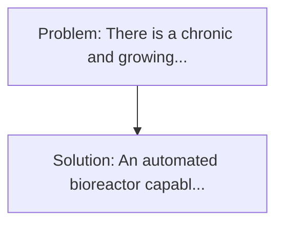
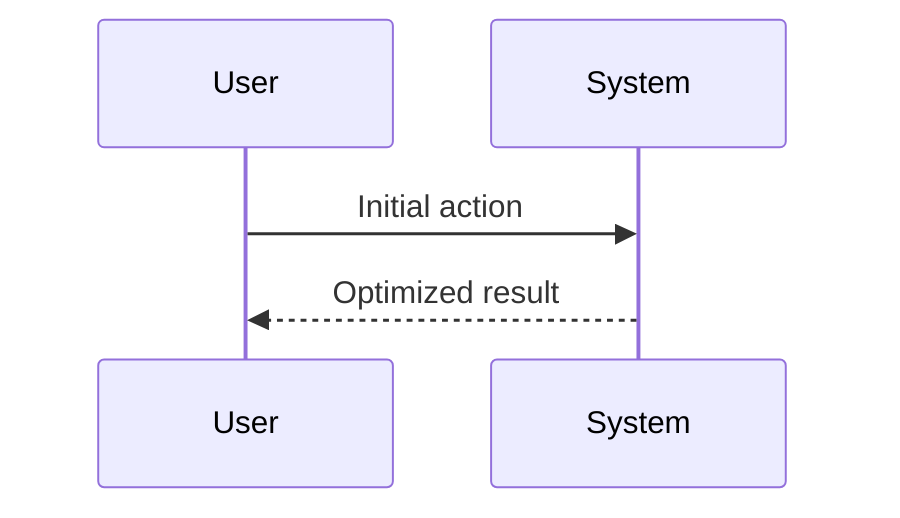

<!-- markdownlint-disable MD013 MD033 -->

[🇫🇷 Version Française](./README.fr.md)

# Reactor of Synthesis Sanguine (Synthetic Blood Reactor)

> **Executive Summary:** An automated bioreactor capable of continuously cultivating universal human red blood cells (O-) in vitro from modified haematopoietic stem cells or immortalized cell lines, coupled with fluid engineering to maintain oxygen transport, while being lyophilisable for storage at room temperature for several years. There is a chronic and growing global shortage of blood donors (including O-negative, the universal donor).

---

## 1. Visual Overview & Wow Effect

## 2. Contrarian Thesis (Peter Thiel Style)

**Popular Belief:** Generic software solutions can solve this.
**Hidden Truth:** It is a pure challenge of bioengineering and industrial scaling (biomanufacturing). 3D cell culture must be designed, mechanical shear stress simulated on cells, and protein purification must be done.

## 3. Problem & Target Market

- **Business Model:** B2B
- **Target Audience:** National blood banks (EFS in France, Red Cross), army (combat medicine, field hospitals), and trauma centres.
- **Urgent Pain Point:** There is a chronic and growing global shortage of blood donors (including O-negative, the universal donor). Natural blood has a very short shelf life (about 42 days) and requires extremely strict cold chain logistics. In areas of conflict or disasters, there is a dramatic lack of blood.

## 4. Technical Architecture & Infrastructure

## 5. Business Model & Financial Viability

| Metric                 | Value              |
| ---------------------- | ------------------ |
| Pricing Structure      | Custom Pricing     |
| 12-Month Target        | 100 customers      |
| Revenue Formula        | 100 \* 1000 = 100k |
| Estimated Gross Margin | 80%                |

## 6. Distribution Engine & Moat

- **Acquisition Strategy:** Direct B2B Sales
- **Moat (Defensibility):** It is a pure challenge of bioengineering and industrial scaling (biomanufacturing). 3D cell culture must be designed, mechanical shear stress simulated on cells, and protein purification must be done.

## 7. Detailed Evaluation Grid

| Criterion                   | VC Score (/100) | Market Score (/100) |
| --------------------------- | --------------- | ------------------- |
| Thesis & Monopoly / Urgency | -- / 25         | -- / 25             |
| Moat / LLM Immunity         | -- / 25         | -- / 25             |
| Scalability / UX Friction   | -- / 25         | -- / 25             |
| Unit Economics / ROI        | -- / 25         | -- / 25             |
| **TOTAL**                   | **-- / 100**    | **-- / 100**        |

> **VC Verdict:** Pending evaluation.

> **Market Verdict:** Pending evaluation.
