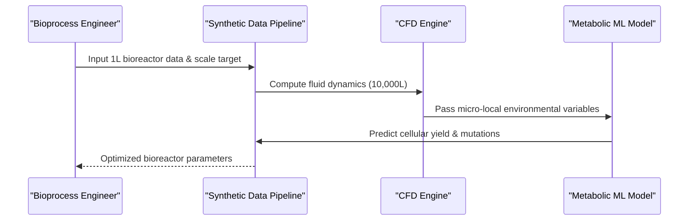

<!-- markdownlint-disable MD009 MD010 MD013 MD022 MD028 MD032 MD033 MD034 MD036 MD037 MD039 MD041 MD058 MD060 -->

[🇫🇷 Version Française](./README.fr.md)

# Synthetic Data Pipeline for Biomanufacturing

> **Executive Summary:** A synthetic data pipeline coupling computational fluid dynamics (CFD) and deep learning metabolic models to solve biomanufacturing scale-up failures.


---

## 1. Visual Overview & Wow Effect

```mermaid
graph TD
    %% Problem vs Solution or Architecture Diagram
    A[Benchtop Bioreactor (1L)] -->|Scale-up| B[Industrial Bioreactor (10,000L)]
    B -->|Nutrient gradients & mechanical shear| C[Millions lost in failed batches]
    A -->|Synthetic Data Pipeline| D{Coupled CFD & Metabolic Deep Learning}
    D -->|Simulated micro-local environment| E[Predictive yield & optimized scale-up]
```

## 2. Contrarian Thesis (Peter Thiel Style)

Popular Belief: Scaling up biomanufacturing is an engineering problem solved by empirical trial and error or standard data analytics.
Hidden Truth: The intersection of biology (dynamic cellular behavior) and multiphase fluid physics requires hyper-specialized mathematical solvers. Standard LLMs or classical data analysis cannot simulate the laws of mass and energy conservation governing a bioreactor.

## 3. Problem & Target Market

Business Model: B2B
Target Audience: Pharmas (CDMOs), synthetic biology companies, alternative protein producers.
Urgent Pain Point: Scaling up the production of bioproducts (antibodies, enzymes, proteins) from a 1L benchtop bioreactor to a 10,000L industrial tank frequently fails due to nutrient and mechanical shear gradients, resulting in millions of dollars of discarded batches and months of delay.

## 4. Technical Architecture & Infrastructure



## 5. Business Model & Financial Viability

| Metric                 | Value                                        |
| ---------------------- | -------------------------------------------- |
| Pricing Structure      | Enterprise SaaS license / Pay-per-simulation |
| 12-Month Target        | 2 to 3 major CDMOs or SynBio startups        |
| Revenue Formula        | 2 \* 50k = 100k                              |
| Estimated Gross Margin | 80%                                          |

## 6. Distribution Engine & Moat

Acquisition Strategy: Direct B2B sales to pharmaceutical manufacturers and strategic partnerships with bioreactor hardware vendors.
Moat (Defensibility): The deep integration of highly specialized computational fluid dynamics (CFD) with deep learning metabolic models requires multidisciplinary expertise that is nearly impossible for generic software companies to replicate. The high cost of acquiring quality multiscalar experimental data for initial model calibration acts as a significant barrier.

## 7. Detailed Evaluation Grid

| Criterion                   | VC Score (/100) | Market Score (/100) |
| --------------------------- | --------------- | ------------------- |
| Thesis & Monopoly / Urgency | -- / 25         | -- / 25             |
| Moat / LLM Immunity         | -- / 25         | -- / 25             |
| Scalability / UX Friction   | -- / 25         | -- / 25             |
| Unit Economics / ROI        | -- / 25         | -- / 25             |
| **TOTAL**                   | **-- / 100**    | **-- / 100**        |

> **VC Verdict:** Pending evaluation.

> **Market Verdict:** Pending evaluation.
