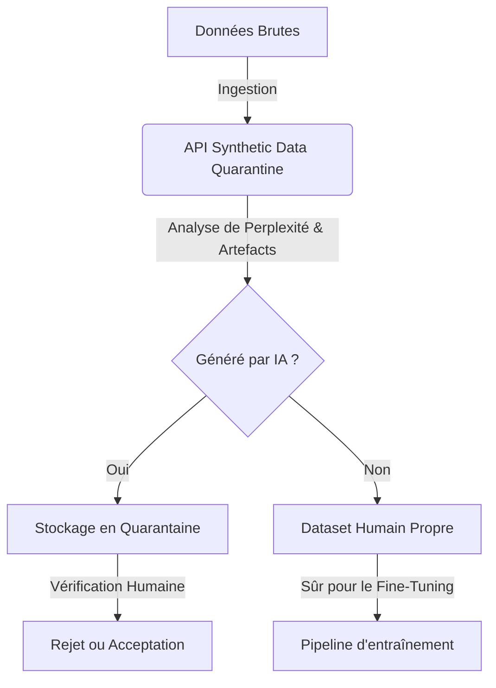

<!-- markdownlint-disable MD013 MD033 MD060 MD039 MD041 MD032 MD010 MD009 MD022 MD036 MD028 MD037 -->

[🇬🇧 English Version](./README.md)

# Synthetic Data Quarantine

> **Executive Summary:** Une gateway de pipeline de données qui détecte et met en quarantaine les données générées par l'IA avant qu'elles n'intègrent les datasets d'entraînement, prévenant le "Model Collapse" et protégeant l'intégrité des modèles d'entreprise.

---

## 1. Aperçu visuel & Effet Wahou

## 2. La thèse contrariante

> **La croyance populaire :** Plus il y a de données pour entraîner les modèles d'IA, mieux c'est, peu importe leur source.
> **La vérité cachée :** Alors qu'Internet se remplit de contenus générés par l'IA, l'ingestion de ces données synthétiques provoque un "Model Collapse" (effondrement du modèle), détruisant la fiabilité et la diversité de ce dernier. L'actif le plus précieux dans la prochaine décennie de l'IA n'est pas le compute, mais des données vierges, vérifiables et d'origine humaine.

## 3. Le problème & La cible

**Modèle économique :** Infrastructure Data B2B / MLOps.
**Cible précise :** Ingénieurs ML, Data Scientists et équipes Data des entreprises développant ou affinant des modèles d'IA (Fine-tuning, RAG, LLM sur mesure).
**La douleur urgente :** Le "Model Collapse". Internet est inondé de données générées par l'IA. Si une entreprise entraîne ou fine-tune ses modèles sur ces données synthétiques non filtrées, la qualité du modèle se dégrade rapidement (perte de diversité, amplification des biais, hallucinations). Cela coûte des millions en compute (GPU) gâché et ruine la fiabilité des modèles de production.

## 4. Architecture technique & Plomberie

Un système de pipeline de données (API/Gateway) qui analyse les flux de données d'entraînement en temps réel. Il utilise des modèles de détection d'artefacts génératifs (watermarks invisibles, scoring de perplexité, anomalies statistiques, analyse de distribution des tokens) pour identifier, scorer et mettre en quarantaine les données probables d'être générées par l'IA avant qu'elles n'intègrent le dataset final.

## 5. Modèle économique & Viabilité financière

| Métrique                        | Valeur                                                                                     |
| :------------------------------ | :----------------------------------------------------------------------------------------- |
| **Structure de prix**           | Tarification au volume (0,05$ par Go de texte traité) + Abonnement Enterprise (500$/mois). |
| **Objectif 12 mois**            | 20 laboratoires d'IA d'entreprise traitant de vastes datasets.                             |
| **Calcul du CA (Target 100k€)** | 20 labos _ ~500$/mois _ 12 mois = 120 000$ ARR.                                            |
| **Marge brute estimée**         | 75% (Les coûts de calcul pour les algorithmes de détection doivent être optimisés).        |

## 6. Moteur de distribution & Fossé défensif

**Stratégie d'acquisition :** Ventes directes aux leaders MLOps et intégrations avec les principales plateformes de curation de données (Snorkel, Scale AI) et les bases de données vectorielles. Niveau gratuit pour les petits datasets afin de prouver le taux de contamination.
**Moat (Barrière à l'entrée) :** Les modèles de détection s'améliorent à mesure qu'ils analysent plus de données, créant un effet de réseau sur les données. À mesure que les modèles génératifs évoluent, le système de quarantaine met constamment à jour ses heuristiques de détection. Un LLM standard ne peut pas s'auto-évaluer sur des pétaoctets de données ; cela nécessite une plomberie Big Data à haut débit et des algorithmes d'analyse probabiliste dédiés.

## 7. Grille d'évaluation détaillée

| Critère                               | Score VC (/100) | Score Terrain (/100) |
| :------------------------------------ | :-------------: | :------------------: |
| **Thèse & Monopole / Urgence**        |     -- / 25     |       -- / 25        |
| **Moat / Résistance aux LLM natifs**  |     -- / 25     |       -- / 25        |
| **Scalabilité / Friction d'adoption** |     -- / 25     |       -- / 25        |
| **Unit Economics / ROI direct**       |     -- / 25     |       -- / 25        |
| **TOTAL**                             |  **-- / 100**   |     **-- / 100**     |

> **Verdict VC :** En attente d'évaluation.
> **Verdict Terrain :** En attente d'évaluation.
