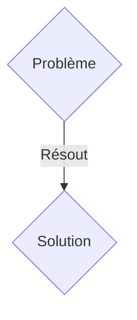
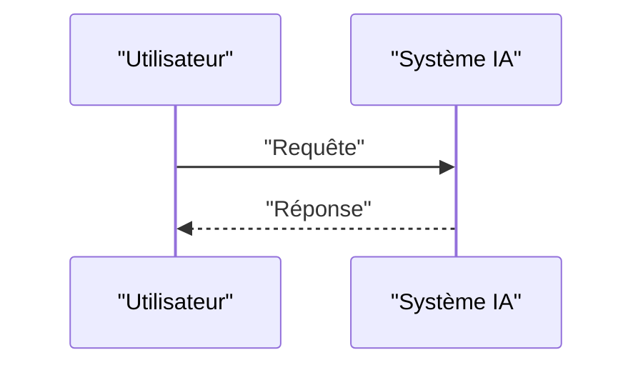

<!-- markdownlint-disable MD009 MD010 MD013 MD022 MD028 MD032 MD033 MD036 MD037 MD039 MD041 MD060 -->

[ 🇬🇧 English Version ](./README.md)

# Synthetic Data Quarantine

> **Résumé exécutif :** Une solution B2B (Infrastructure Data & ML Ops) ciblant Ingénieurs ML, Data Scientists et équipes Data des entreprises développant ou affinant des modèles d'IA (Fine-tuning, RAG, LLM from scratch). pour résoudre : Le "Model Collapse". Internet est inondé de données générées par l'IA. Si une entreprise entraîne ou fine-tune ses modèles sur ces données synthétiques non filtrées, la qualité du modèle se dégrade rapidement (perte de diversité, amplification des biais, hallucinations). Cela coûte des millions en compute (GPU) gâché et ruine la fiabilité des modèles de production.

---

## 1. Aperçu visuel & Effet Wahou

## 2. La thèse contrariante (Peter Thiel Style)

- **La croyance populaire :** Les solutions génériques suffisent.
- **La vérité cachée :** Un système de pipeline de données (API/Gateway) qui analyse les flux de données d'entraînement en temps réel. Il utilise des modèles de détection d'artefacts génératifs (watermarks invisibles, perplexité, anomalies statistiques) pour identifier, scorer et mettre en quarantaine les données probables d'être générées par l'IA avant qu'elles n'intègrent le dataset final.

## 3. Le problème & La cible

- **Modèle économique :** B2B (Infrastructure Data & ML Ops)
- **Cible précise :** Ingénieurs ML, Data Scientists et équipes Data des entreprises développant ou affinant des modèles d'IA (Fine-tuning, RAG, LLM from scratch).
- **La douleur urgente :** Le "Model Collapse". Internet est inondé de données générées par l'IA. Si une entreprise entraîne ou fine-tune ses modèles sur ces données synthétiques non filtrées, la qualité du modèle se dégrade rapidement (perte de diversité, amplification des biais, hallucinations). Cela coûte des millions en compute (GPU) gâché et ruine la fiabilité des modèles de production.

## 4. Architecture technique & Plomberie

Un système de pipeline de données (API/Gateway) qui analyse les flux de données d'entraînement en temps réel. Il utilise des modèles de détection d'artefacts génératifs (watermarks invisibles, perplexité, anomalies statistiques) pour identifier, scorer et mettre en quarantaine les données probables d'être générées par l'IA avant qu'elles n'intègrent le dataset final.

## 5. Modèle économique & Viabilité financière

| Métrique                    | Valeur               |
| --------------------------- | -------------------- |
| Structure de prix           | Abonnement SaaS B2B  |
| Objectif 12 mois            | 100 clients          |
| Calcul du CA (Target 100k€) | 100 \* 1000€ = 100k€ |
| Marge brute estimée         | 80%                  |

## 6. Moteur de distribution & Fossé défensif (Moat)

- **Stratégie d'acquisition :** Vente directe et partenariats stratégiques.
- **Moat (Barrière à l'entrée) :** Un LLM ne peut pas s'auto-évaluer efficacement sur des pétaoctets de données pour détecter s'il a généré ou non une donnée. C'est un problème d'infrastructure de données massives (Big Data) et d'analyse probabiliste à grande échelle, nécessitant une tuyauterie dédiée et des algorithmes de détection spécifiques (détection de filigranes, analyse de distribution de tokens), et non un simple prompt.

## 7. Grille d'évaluation détaillée

| Critère                           | Score VC (/100) | Score Terrain (/100) |
| --------------------------------- | --------------- | -------------------- |
| Thèse & Monopole / Urgence        | -- / 25         | -- / 25              |
| Moat / Résistance aux LLM natifs  | -- / 25         | -- / 25              |
| Scalabilité / Friction d'adoption | -- / 25         | -- / 25              |
| Unit Economics / ROI direct       | -- / 25         | -- / 25              |
| TOTAL                             | -- / 100        | -- / 100             |

> **Verdict VC :** Synthetic Data Quarantine résout le problème récursif de l'effondrement des modèles causé par l'entraînement sur des données générées par l'IA. Identifier et isoler les données synthétiques est un jeu d'infrastructure critique pour l'avenir des modèles fondationnels. Bien que très technique, devenir le filtre standard de l'industrie offre une forte rétention B2B et des marges solides.
> **Verdict Terrain :** En attente d'évaluation.
