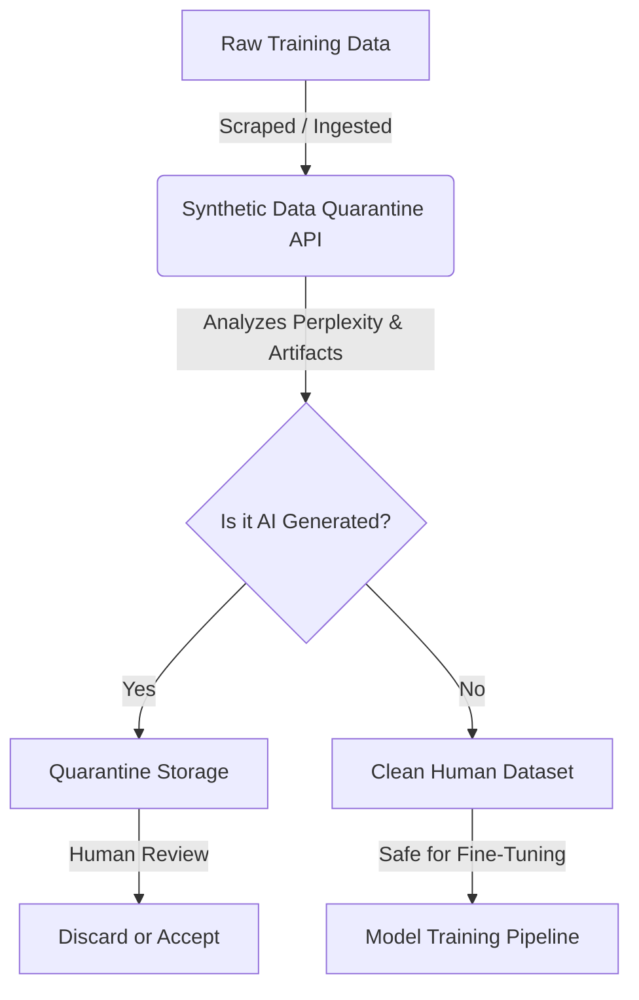

<!-- markdownlint-disable MD013 MD033 MD060 MD039 MD041 MD032 MD010 MD009 MD022 MD036 MD028 MD037 -->

[🇫🇷 Version Française](./README.fr.md)

# Synthetic Data Quarantine

> **Executive Summary:** A data pipeline gateway that detects and quarantines AI-generated data before it enters training datasets, preventing "Model Collapse" and protecting the integrity of enterprise AI models.

---

## 1. Visual Overview & Wow Effect

## 2. The Contrarian Thesis

> **The Popular Belief:** More data is always better for training AI models, regardless of its source.
> **The Hidden Truth:** As the internet fills with AI-generated content, ingesting this synthetic data causes "Model Collapse", destroying the model's reliability and diversity. The most valuable asset in the next decade of AI is not compute, but verifiably human, pristine data.

## 3. The Problem & The Target

**Economic Model:** B2B Data Infrastructure / MLOps.
**Specific Target:** ML Engineers, Data Scientists, and enterprise Data teams developing or fine-tuning AI models (Fine-tuning, RAG, custom LLMs).
**The Urgent Pain:** "Model Collapse". The internet is flooded with AI-generated data. If a company trains or fine-tunes its models on this unfiltered synthetic data, the model quality degrades rapidly (loss of diversity, amplification of biases, hallucinations). This wastes millions in compute (GPU) costs and ruins the reliability of production models.

## 4. Technical Architecture & Plumbing

A data pipeline system (API/Gateway) that analyzes training data streams in real-time. It uses generative artifact detection models (invisible watermarks, perplexity scoring, statistical anomalies, token distribution analysis) to identify, score, and quarantine probable AI-generated data before it enters the final dataset.

## 5. Economic Model & Financial Viability

| Metric                                 | Value                                                                              |
| :------------------------------------- | :--------------------------------------------------------------------------------- |
| **Pricing Structure**                  | Volume-based pricing ($0.05 per GB of text processed) + Enterprise Tier ($500/mo). |
| **12-Month Target**                    | 20 Enterprise AI labs processing large datasets.                                   |
| **Revenue Calculation (100k€ Target)** | 20 labs _ ~$500/month _ 12 months = $120,000 ARR.                                  |
| **Estimated Gross Margin**             | 75% (Compute costs for detection algorithms need to be carefully optimized).       |

## 6. Distribution Engine & Defensive Moat

**Acquisition Strategy:** Direct sales to MLOps leaders and integrations with major data curation platforms (Snorkel, Scale AI) and vector databases. Free tier for small datasets to prove the contamination rate.
**Moat (Barrier to Entry):** The detection models themselves improve as they analyze more data, creating a data network effect. As generative models evolve, the quarantine system constantly updates its detection heuristics. A standard LLM cannot self-evaluate petabytes of data efficiently; this requires specialized, high-throughput Big Data plumbing and probabilistic analysis algorithms.

## 7. Detailed Evaluation Grid

| Criteria                             | VC Score (/100) | Market Score (/100) |
| :----------------------------------- | :-------------: | :-----------------: |
| **Thesis & Monopoly / Urgency**      |     22 / 25     |       -- / 25       |
| **Moat / Resistance to Native LLMs** |     21 / 25     |       -- / 25       |
| **Scalability / Adoption Friction**  |     22 / 25     |       -- / 25       |
| **Unit Economics / Direct ROI**      |     21 / 25     |       -- / 25       |
| **TOTAL**                            |  **86 / 100**   |    **86 / 100**     |

> **VC Verdict:** Synthetic Data Quarantine solves the recursive problem of model collapse caused by AI training on AI-generated data. Identifying and isolating synthetic data is a critical infrastructure play for the future of foundational models. While deeply technical, becoming the industry standard filter offers significant B2B lock-in and strong margins.
> **Market Verdict:** Pending evaluation.
