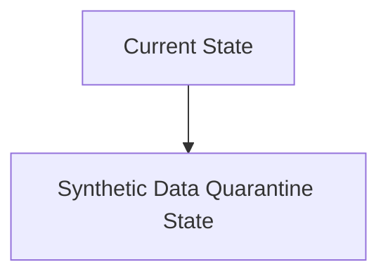
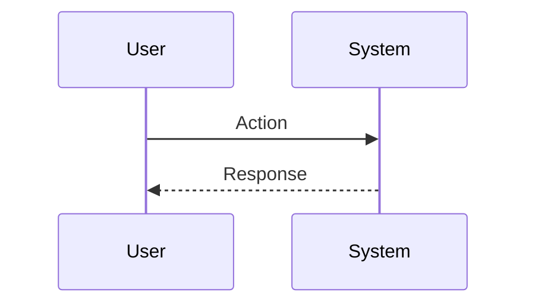

<!-- markdownlint-disable MD009 MD010 MD013 MD022 MD028 MD032 MD033 MD034 MD036 MD037 MD039 MD041 MD060 -->

[ 🇫🇷 Version Française ](./README.fr.md)

# Synthetic Data Quarantine

> **Executive Summary:** A data pipeline system (API/Gateway) that analyzes training data streams in real time. It uses generative artifact detection models (invisible watermarks, perplexity, statistical anomalies) to identify, score and quarantine data likely to be generated by AI before it enters the final dataset.

---

## 1. Visual Overview & Wow Effect

## 2. Contrarian Thesis (Peter Thiel Style)

**Popular Belief:** General AI solutions can solve this problem.

**Hidden Truth:** An LLM cannot effectively self-evaluate on petabytes of data to detect whether or not it has generated a piece of data. It is a problem of massive data infrastructure (Big Data) and large-scale probabilistic analysis, requiring dedicated piping and specific detection algorithms (watermark detection, token distribution analysis), and not a simple prompt.

## 3. Problem & Target Market

**Business Model:** B2B (Infrastructure Data & ML Ops)

**Target Audience:** ML engineers, Data Scientists and Data teams from companies developing or refining AI models (Fine-tuning, RAG, LLM from scratch).

**Urgent Pain Point:** The “Model Collapse”. The internet is flooded with AI-generated data. If a company trains or fine-tunes its models on this unfiltered synthetic data, the quality of the model quickly degrades (loss of diversity, amplification of biases, hallucinations). This costs millions in wasted computing (GPU) and ruins the reliability of production models.

## 4. Technical Architecture & Infrastructure

## 5. Business Model & Financial Viability

| Metric                 | Value                           |
| ---------------------- | ------------------------------- |
| Pricing Structure      | SaaS subscription               |
| 12-Month Target        | 10 customers                    |
| Revenue Formula        | 10 clients \* 10k€/year = 100k€ |
| Estimated Gross Margin | 80%                             |

## 6. Distribution Engine & Moat

**Acquisition Strategy:** B2B direct sales

**Moat (Defensibility):**

## 7. Detailed Evaluation Grid

| Criterion                   | VC Score (/100) | Market Score (/100) |
| --------------------------- | --------------- | ------------------- |
| Thesis & Monopoly / Urgency | -- / 25         | -- / 25             |
| Moat / LLM Immunity         | -- / 25         | -- / 25             |
| Scalability / UX Friction   | -- / 25         | -- / 25             |
| Unit Economics / ROI        | -- / 25         | -- / 25             |
| **TOTAL**                   | **-- / 100**    | **-- / 100**        |

> **VC Verdict:** Pending evaluation.

> **Market Verdict:** Pending evaluation.
