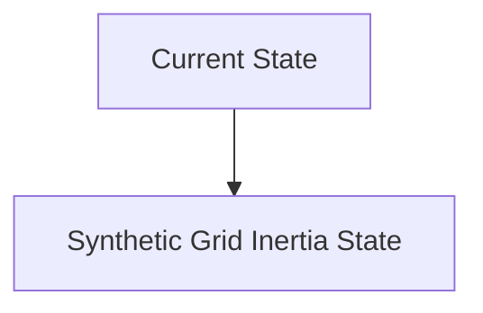
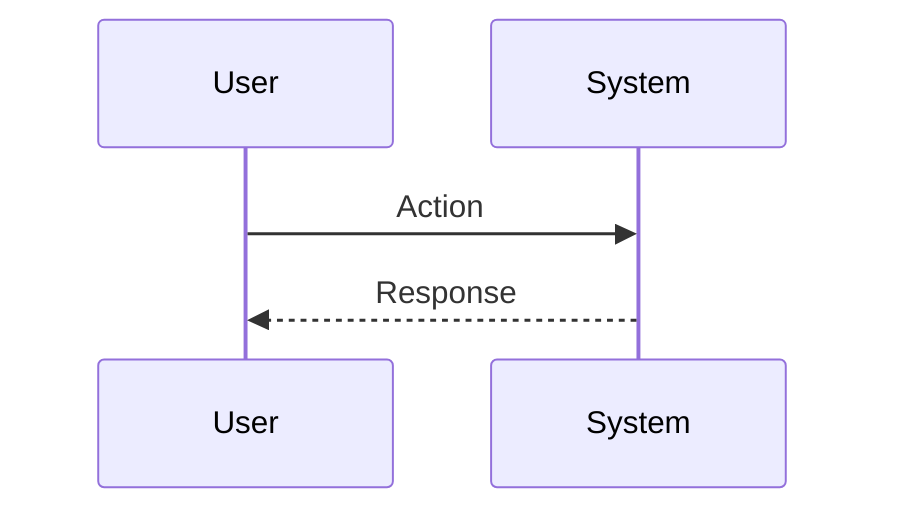

<!-- markdownlint-disable MD009 MD010 MD013 MD022 MD028 MD032 MD033 MD034 MD036 MD037 MD039 MD041 MD060 -->

[ 🇫🇷 Version Française ](./README.fr.md)

# Synthetic Grid Inertia

> **Executive Summary:** A system of intelligent inverters (grid-forming inverters) coupled with a very low latency real-time software layer. This system measures frequency derivatives and instantly injects or absorbs power (via batteries or supercapacitors) to synthetically emulate inertial mass, thereby stabilizing the network in a decentralized manner.

---

## 1. Visual Overview & Wow Effect

## 2. Contrarian Thesis (Peter Thiel Style)

**Popular Belief:** General AI solutions can solve this problem.

**Hidden Truth:** This requires hardware/software coupling (hardware-in-the-loop) operating at microseconds, obeying the differential equations of the dynamics of electrical networks (swing equations). A simple predictive dashboard or asynchronous algorithm is far too slow and cannot physically act on AC power.

## 3. Problem & Target Market

**Business Model:** B2B / M2M

**Target Audience:** Electric transmission network operators (TSOs), renewable energy suppliers, microgrid managers.

**Urgent Pain Point:** The transition to renewable energy (solar, wind) eliminates heavy rotating generators (coal, gas) that provided natural physical inertia to the grid. Without this inertia, slight frequency fluctuations can cause devastating chain blackouts within milliseconds, making the mass integration of renewables unstable and dangerous.

## 4. Technical Architecture & Infrastructure

## 5. Business Model & Financial Viability

| Metric                 | Value                           |
| ---------------------- | ------------------------------- |
| Pricing Structure      | SaaS subscription               |
| 12-Month Target        | 10 customers                    |
| Revenue Formula        | 10 clients \* 10k€/year = 100k€ |
| Estimated Gross Margin | 80%                             |

## 6. Distribution Engine & Moat

**Acquisition Strategy:** B2B direct sales

**Moat (Defensibility):** Strict hardware certification by national grid operators, cost of deploying power infrastructure (batteries/inverters), complex and conservative energy sector regulations.

## 7. Detailed Evaluation Grid

| Criterion                   | VC Score (/100) | Market Score (/100) |
| --------------------------- | --------------- | ------------------- |
| Thesis & Monopoly / Urgency | -- / 25         | -- / 25             |
| Moat / LLM Immunity         | -- / 25         | -- / 25             |
| Scalability / UX Friction   | -- / 25         | -- / 25             |
| Unit Economics / ROI        | -- / 25         | -- / 25             |
| **TOTAL**                   | **-- / 100**    | **-- / 100**        |

> **VC Verdict:** Pending evaluation.

> **Market Verdict:** Pending evaluation.
