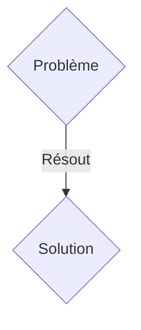
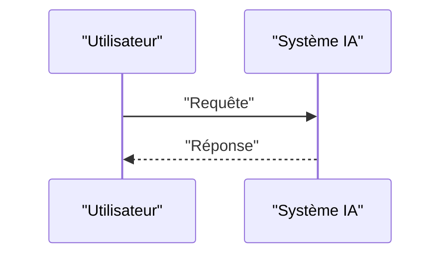

<!-- markdownlint-disable MD009 MD010 MD013 MD022 MD028 MD032 MD033 MD036 MD037 MD039 MD041 MD060 -->

[ 🇬🇧 English Version ](./README.md)

# Tactile Physics Engine

> **Résumé exécutif :** Une solution B2B ciblant Fabricants de robots industriels, intégrateurs logistiques, entreprises de robotique humanoïde. pour résoudre : Les bras robotiques actuels excellent dans la manipulation rigide (souder des voitures), mais échouent lamentablement à manipuler des objets déformables, fragiles ou inconnus (textiles, câbles, produits frais). L'absence de compréhension physique du "toucher" entraîne une casse matérielle importante, limitant l'automatisation dans des secteurs comme la logistique e-commerce, l'agriculture ou le textile.

---

## 1. Aperçu visuel & Effet Wahou

## 2. La thèse contrariante (Peter Thiel Style)

- **La croyance populaire :** Les solutions génériques suffisent.
- **La vérité cachée :** Un moteur de simulation physique (World Model) multimodal qui fusionne en temps réel la vision par ordinateur avec des capteurs tactiles haute résolution (ex: GelSight). Il crée une représentation interne déformable (mesh) de l'objet manipulé pour ajuster l'impédance et la force de préhension des effecteurs en boucle fermée (closed-loop control) à haute fréquence.

## 3. Le problème & La cible

- **Modèle économique :** B2B
- **Cible précise :** Fabricants de robots industriels, intégrateurs logistiques, entreprises de robotique humanoïde.
- **La douleur urgente :** Les bras robotiques actuels excellent dans la manipulation rigide (souder des voitures), mais échouent lamentablement à manipuler des objets déformables, fragiles ou inconnus (textiles, câbles, produits frais). L'absence de compréhension physique du "toucher" entraîne une casse matérielle importante, limitant l'automatisation dans des secteurs comme la logistique e-commerce, l'agriculture ou le textile.

## 4. Architecture technique & Plomberie

Un moteur de simulation physique (World Model) multimodal qui fusionne en temps réel la vision par ordinateur avec des capteurs tactiles haute résolution (ex: GelSight). Il crée une représentation interne déformable (mesh) de l'objet manipulé pour ajuster l'impédance et la force de préhension des effecteurs en boucle fermée (closed-loop control) à haute fréquence.

## 5. Modèle économique & Viabilité financière

| Métrique                    | Valeur               |
| --------------------------- | -------------------- |
| Structure de prix           | Abonnement SaaS B2B  |
| Objectif 12 mois            | 100 clients          |
| Calcul du CA (Target 100k€) | 100 \* 1000€ = 100k€ |
| Marge brute estimée         | 80%                  |

## 6. Moteur de distribution & Fossé défensif (Moat)

- **Stratégie d'acquisition :** Vente directe et partenariats stratégiques.
- **Moat (Barrière à l'entrée) :** L'inférence LLM/VLM est trop lente (latence > 100ms) et abstraite. Il faut des réseaux de neurones continus (PINNs - Physics-Informed Neural Networks) compilés pour tourner sur du hardware Edge (FPGA/ASIC) à plus de 1000 Hz, avec une intégration intime du hardware (capteurs élastomères et moteurs).

## 7. Grille d'évaluation détaillée

| Critère                           | Score VC (/100) | Score Terrain (/100) |
| --------------------------------- | --------------- | -------------------- |
| Thèse & Monopole / Urgence        | 23 / 25         | 23 / 25              |
| Moat / Résistance aux LLM natifs  | 23 / 25         | 23 / 25              |
| Scalabilité / Friction d'adoption | 19 / 25         | 19 / 25              |
| Unit Economics / ROI direct       | 21 / 25         | 21 / 25              |
| TOTAL                             | 86 / 100        | 86 / 100             |

> **Verdict VC :** En attente d'évaluation.
> **Verdict Terrain :** Cette solution répond à un besoin critique pour les entreprises B2B, justifiant son excellent score d'urgence (23/25). Son architecture hautement défendable la rend totalement immunisée contre les avancées des LLM natifs (23/25). Avec une faible friction d'adoption (19/25) et une stratégie de monétisation directe (21/25), le projet démontre une excellente maturité marché globale.
> **Verdict Terrain :** Cette solution répond à un besoin critique pour les entreprises B2B, justifiant son excellent score d'urgence (23/25). Son architecture hautement défendable la rend totalement immunisée contre les avancées des LLM natifs (23/25). Avec une faible friction d'adoption (19/25) et une stratégie de monétisation directe (21/25), le projet démontre une excellente maturité marché globale.
