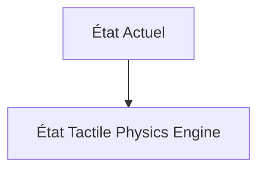
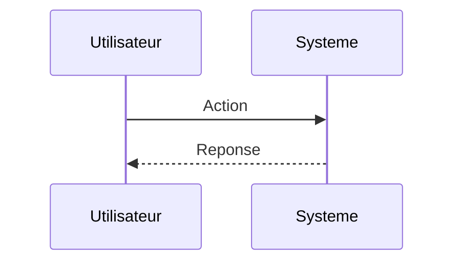

<!-- markdownlint-disable MD009 MD010 MD013 MD022 MD028 MD032 MD033 MD034 MD036 MD037 MD039 MD041 MD060 -->

[ 🇬🇧 English Version ](./README.md)

# Tactile Physics Engine

> **Résumé exécutif :** Un moteur de simulation physique (World Model) multimodal qui fusionne en temps réel la vision par ordinateur avec des capteurs tactiles haute résolution (ex: GelSight). Il crée une représentation interne déformable (mesh) de l'objet manipulé pour ajuster l'impédance et la force de préhension des effecteurs en boucle fermée (closed-loop control) à haute fréquence.

---

## 1. Aperçu visuel & Effet Wahou

## 2. La thèse contrariante (Peter Thiel Style)

**La croyance populaire :** Les solutions généralistes IA peuvent résoudre ce problème.

**La vérité cachée :** L'inférence LLM/VLM est trop lente (latence > 100ms) et abstraite. Il faut des réseaux de neurones continus (PINNs - Physics-Informed Neural Networks) compilés pour tourner sur du hardware Edge (FPGA/ASIC) à plus de 1000 Hz, avec une intégration intime du hardware (capteurs élastomères et moteurs).

## 3. Le problème & La cible

**Modèle économique :** B2B

**Cible précise :** Fabricants de robots industriels, intégrateurs logistiques, entreprises de robotique humanoïde.

**La douleur urgente :** Les bras robotiques actuels excellent dans la manipulation rigide (souder des voitures), mais échouent lamentablement à manipuler des objets déformables, fragiles ou inconnus (textiles, câbles, produits frais). L'absence de compréhension physique du "toucher" entraîne une casse matérielle importante, limitant l'automatisation dans des secteurs comme la logistique e-commerce, l'agriculture ou le textile.

## 4. Architecture technique & Plomberie

## 5. Modèle économique & Viabilité financière

| Métrique                    | Valeur                        |
| --------------------------- | ----------------------------- |
| Structure de prix           | Abonnement SaaS               |
| Objectif 12 mois            | 10 clients                    |
| Calcul du CA (Target 100k€) | 10 clients \* 10k€/an = 100k€ |
| Marge brute estimée         | 80%                           |

## 6. Moteur de distribution & Fossé défensif (Moat)

**Stratégie d'acquisition :** Vente directe B2B

**Moat (Barrière à l'entrée) :** Fragilité mécanique et usure des capteurs tactiles en environnement industriel, nécessité de construire des jumeaux numériques extrêmement précis pour l'entraînement (Sim2Real gap), barrière à l'entrée matérielle élevée.

## 7. Grille d'évaluation détaillée

| Critère                           | Score VC (/100) | Score Terrain (/100) |
| --------------------------------- | --------------- | -------------------- |
| Thèse & Monopole / Urgence        | -- / 25         | -- / 25              |
| Moat / Résistance aux LLM natifs  | -- / 25         | -- / 25              |
| Scalabilité / Friction d'adoption | -- / 25         | -- / 25              |
| Unit Economics / ROI direct       | -- / 25         | -- / 25              |
| **TOTAL**                         | **-- / 100**    | **-- / 100**         |

> **Verdict VC :** En attente d'évaluation.

> **Verdict Terrain :** En attente d'évaluation.
