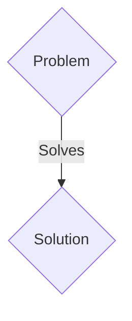
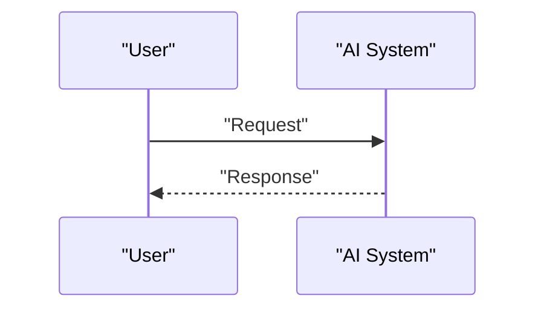

<!-- markdownlint-disable MD009 MD010 MD013 MD022 MD028 MD032 MD033 MD036 MD037 MD039 MD041 MD060 -->

[ 🇫🇷 Version Française ](./README.fr.md)

# Touch Physics Engine

> **Executive Summary:** A B2B solution targeting Manufacturers of industrial robots, logistics integrators, humanoid robotics companies. to solve: Current robotic arms excel at rigid manipulation (welding cars), but fail miserably at handling deformable, fragile or unknown objects (textiles, cables, fresh produce). The lack of physical understanding of "touch" leads to significant hardware damage, limiting automation in sectors such as e-commerce logistics, agriculture or textiles.

---

## 1. Visual Overview & Wow Effect

## 2. Contrarian Thesis (Peter Thiel Style)

- **Popular Belief:** Generic solutions are enough.
- **Hidden Truth:** A multimodal physical simulation engine (World Model) that merges computer vision in real time with high-resolution tactile sensors (e.g. GelSight). It creates an internal deformable representation (mesh) of the manipulated object to adjust the impedance and grip force of the high-frequency closed-loop control effectors.

## 3. Problem & Target Market

- **Business Model:** B2B
- **Target Audience:** Manufacturers of industrial robots, logistics integrators, humanoid robotics companies.
- **Urgent Pain Point:** Current robotic arms excel at rigid manipulation (welding cars), but fail miserably at handling deformable, fragile or unknown objects (textiles, cables, fresh produce). The lack of physical understanding of "touch" leads to significant hardware damage, limiting automation in sectors such as e-commerce logistics, agriculture or textiles.

## 4. Technical Architecture & Infrastructure

A multimodal physical simulation engine (World Model) that merges computer vision in real time with high-resolution tactile sensors (e.g. GelSight). It creates an internal deformable representation (mesh) of the manipulated object to adjust the impedance and grip force of the high-frequency closed-loop control effectors.

## 5. Business Model & Financial Viability

| Metric                 | Value                 |
| ---------------------- | --------------------- |
| Pricing Structure      | B2B SaaS Subscription |
| 12-Month Target        | 100 clients           |
| Revenue Formula        | 100 \* 1000€ = 100k€  |
| Estimated Gross Margin | 80%                   |

## 6. Distribution Engine & Moat

- **Acquisition Strategy:** Direct sales and strategic partnerships.
- **Moat (Defensibility):** LLM/VLM inference is too slow (latency > 100ms) and abstract. You need continuous neural networks (PINNs - Physics-Informed Neural Networks) compiled to run on Edge hardware (FPGA/ASIC) at more than 1000 Hz, with intimate integration of the hardware (elastomeric sensors and motors).

## 7. Detailed Evaluation Grid

| Criterion                   | VC Score (/100) | Market Score (/100) |
| --------------------------- | --------------- | ------------------- |
| Thesis & Monopoly / Urgency | -- / 25         | -- / 25             |
| Moat / LLM Immunity         | -- / 25         | -- / 25             |
| Scalability / UX Friction   | -- / 25         | -- / 25             |
| Unit Economics / ROI        | -- / 25         | -- / 25             |
| TOTAL                       | -- / 100        | -- / 100            |

> **VC Verdict:** Pending evaluation.
> **Market Verdict:** Pending evaluation.
