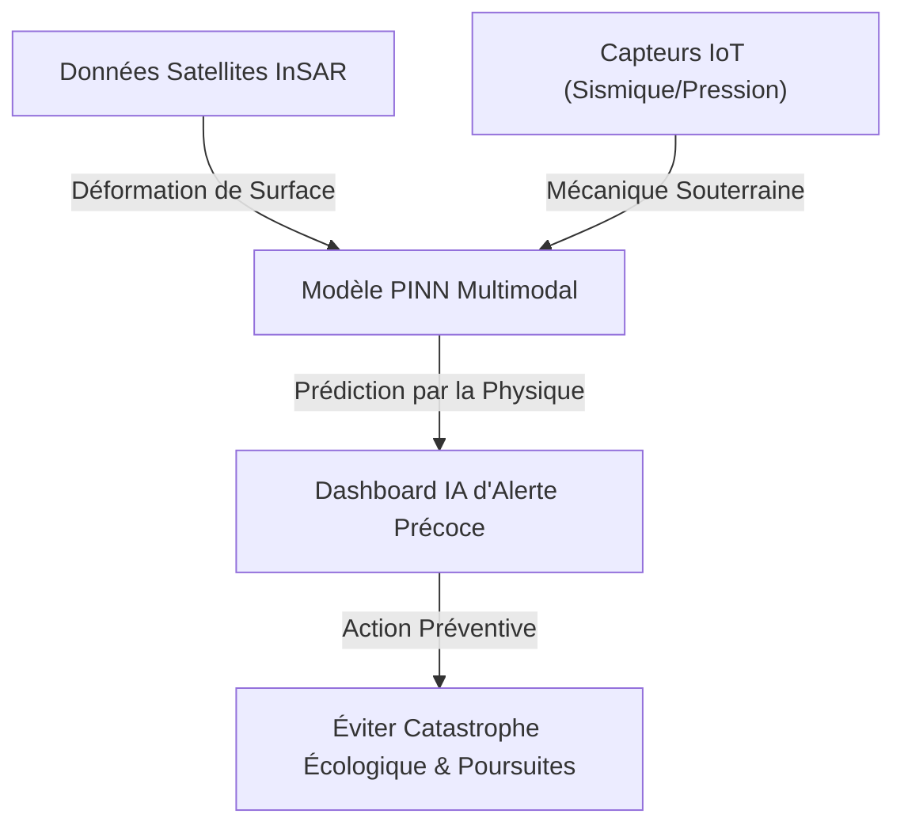
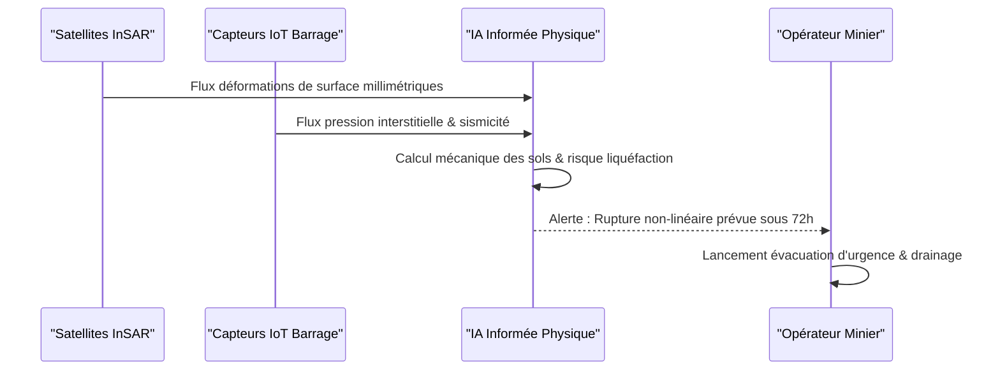

<!-- markdownlint-disable MD009 MD010 MD013 MD022 MD028 MD032 MD033 MD034 MD036 MD037 MD039 MD041 MD060 -->

[ 🇬🇧 English Version ](./README.md)

# Tailings Dam Failure Predictor

> **Résumé exécutif :** Un modèle prédictif spatio-temporel multimodal utilisant des réseaux de neurones informés par la physique (PINN) pour ingérer les données satellites et IoT en temps réel afin de prédire et prévenir les ruptures catastrophiques de barrages miniers.

---

## 1. Aperçu visuel & Effet Wahou

## 2. La thèse contrariante (Peter Thiel Style)

- **La croyance populaire :** Prévenir la rupture des barrages nécessite simplement de construire des murs physiques plus solides et de faire des inspections visuelles humaines plus fréquentes.
- **La vérité cachée :** Le mécanisme de rupture (liquéfaction des sols) se produit profondément à l'intérieur du barrage et est hautement non-linéaire. Au moment où les signes visuels apparaissent en surface, il est mathématiquement trop tard. Seul un modèle d'IA en temps réel contraint par la mécanique des fluides et la géomécanique peut repérer les précurseurs microscopiques à temps.

## 3. Le problème & La cible

- **Modèle économique :** B2B
- **Cible précise :** Sociétés minières globales (Rio Tinto, Vale, BHP), assureurs industriels, agences environnementales.
- **La douleur urgente :** Les ruptures de barrages de résidus miniers (tailings dams) provoquent des catastrophes écologiques et humaines majeures (ex: Brumadinho) et des responsabilités financières se chiffrant en milliards. La surveillance actuelle est fragmentée, réactive, et rate systématiquement les signaux faibles précurseurs de liquéfaction des sols.

## 4. Architecture technique & Plomberie

## 5. Modèle économique & Viabilité financière

| Métrique                        | Valeur                                                 |
| ------------------------------- | ------------------------------------------------------ |
| **Structure de prix**           | SaaS Annuel Haut de Gamme (Par barrage surveillé)      |
| **Objectif 12 mois**            | 2 à 3 barrages pilotes avec une grande société minière |
| **Calcul du CA (Target 100k€)** | 3 Barrages \* 35k€/an                                  |
| **Marge brute estimée**         | ~80%                                                   |

## 6. Moteur de distribution & Fossé défensif (Moat)

- **Stratégie d'acquisition :** Ventes directes B2B ciblant les VP Risque et Développement Durable des grandes entreprises minières, en s'appuyant sur la peur massive des poursuites judiciaires et les exigences des assureurs.
- **Moat (Barrière à l'entrée) :** C'est un problème de physique complexe et de fusion de données multi-échelles. Un tableau de bord SaaS standard ne comprend pas la mécanique des fluides et la géotechnique nécessaires pour anticiper un effondrement non-linéaire. L'architecture propriétaire de réseaux de neurones informés par la physique (PINN) forme un fossé technologique profond.

## 7. Grille d'évaluation détaillée

| Critère                           | Score VC (/100) | Score Terrain (/100) |
| --------------------------------- | --------------- | -------------------- |
| Thèse & Monopole / Urgence        | -- / 25         | 22 / 25              |
| Moat / Résistance aux LLM natifs  | -- / 25         | 23 / 25              |
| Scalabilité / Friction d'adoption | -- / 25         | 15 / 25              |
| Unit Economics / ROI direct       | -- / 25         | 20 / 25              |
| **TOTAL**                         | **-- / 100**    | **80 / 100**         |

> **Verdict VC :** En attente d'évaluation.

> **Verdict Terrain :** Urgence modérée mais valeur stratégique à long terme. L'immunité aux LLM est bonne, reposant sur des modèles spécifiques. L'adoption présente des frictions notables qui pourraient ralentir la monétisation initiale.
