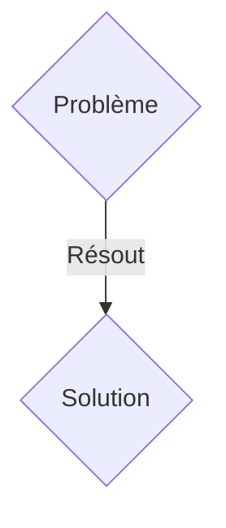
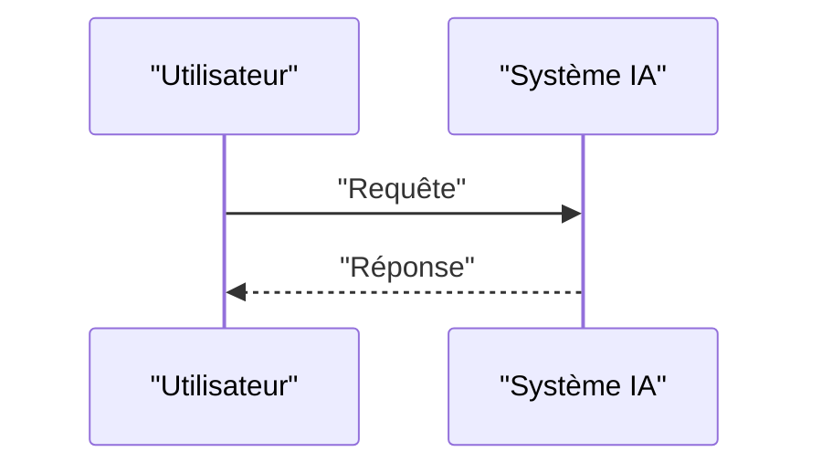

<!-- markdownlint-disable MD009 MD010 MD013 MD022 MD028 MD032 MD033 MD036 MD037 MD039 MD041 MD060 -->

[ 🇬🇧 English Version ](./README.md)

# Neural TeleOp Engine

> **Résumé exécutif :** Une solution B2B (Licensing logiciel / API Edge) ciblant Entreprises de chirurgie robotique, opérateurs de drones sous-marins (ROV), exploitation minière à distance, logistique intercontinentale. pour résoudre : La téléopération de robots à grande distance souffre de la latence du réseau (ping de 200ms à 2s). Cette latence provoque le mal de mer cognitif chez l'opérateur et rend les manipulations de précision dangereuses ou impossibles, bloquant l'adoption de l'industrie.

---

## 1. Aperçu visuel & Effet Wahou

## 2. La thèse contrariante (Peter Thiel Style)

- **La croyance populaire :** Les solutions génériques suffisent.
- **La vérité cachée :** Un modèle génératif de prédiction d'état (World Model) embarqué en périphérie (Edge) du côté de l'opérateur. Il synthétise un flux vidéo et haptique artificiel sans latence en prédisant l'état futur immédiat de l'environnement physique et du robot (Next-Frame Prediction).

## 3. Le problème & La cible

- **Modèle économique :** B2B (Licensing logiciel / API Edge)
- **Cible précise :** Entreprises de chirurgie robotique, opérateurs de drones sous-marins (ROV), exploitation minière à distance, logistique intercontinentale.
- **La douleur urgente :** La téléopération de robots à grande distance souffre de la latence du réseau (ping de 200ms à 2s). Cette latence provoque le mal de mer cognitif chez l'opérateur et rend les manipulations de précision dangereuses ou impossibles, bloquant l'adoption de l'industrie.

## 4. Architecture technique & Plomberie

Un modèle génératif de prédiction d'état (World Model) embarqué en périphérie (Edge) du côté de l'opérateur. Il synthétise un flux vidéo et haptique artificiel sans latence en prédisant l'état futur immédiat de l'environnement physique et du robot (Next-Frame Prediction).

## 5. Modèle économique & Viabilité financière

| Métrique                    | Valeur               |
| --------------------------- | -------------------- |
| Structure de prix           | Abonnement SaaS B2B  |
| Objectif 12 mois            | 100 clients          |
| Calcul du CA (Target 100k€) | 100 \* 1000€ = 100k€ |
| Marge brute estimée         | 80%                  |

## 6. Moteur de distribution & Fossé défensif (Moat)

- **Stratégie d'acquisition :** Vente directe et partenariats stratégiques.
- **Moat (Barrière à l'entrée) :** Il faut une prédiction vidéo cohérente avec les lois de la physique en moins de 10ms, ce que les API LLM/Vision actuelles ou les algos de compression vidéo ne peuvent pas faire.

## 7. Grille d'évaluation détaillée

| Critère                           | Score VC (/100) | Score Terrain (/100) |
| --------------------------------- | --------------- | -------------------- |
| Thèse & Monopole / Urgence        | -- / 25         | -- / 25              |
| Moat / Résistance aux LLM natifs  | -- / 25         | -- / 25              |
| Scalabilité / Friction d'adoption | -- / 25         | -- / 25              |
| Unit Economics / ROI direct       | -- / 25         | -- / 25              |
| TOTAL                             | -- / 100        | -- / 100             |

> **Verdict VC :** En attente d'évaluation.
> **Verdict Terrain :** En attente d'évaluation.
