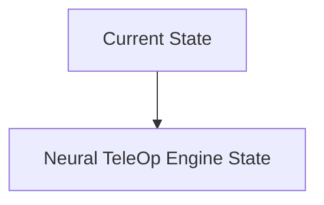
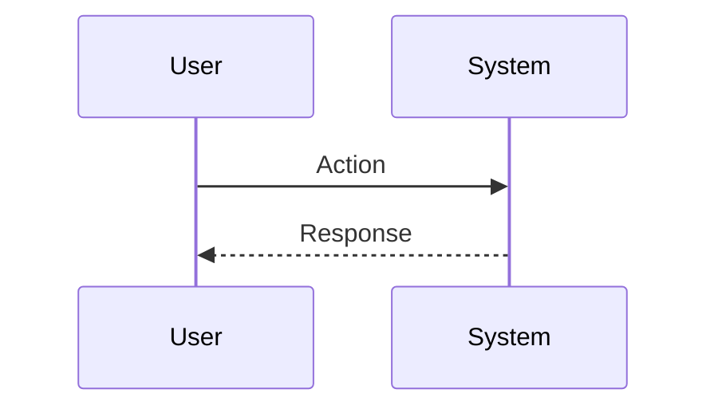

<!-- markdownlint-disable MD009 MD010 MD013 MD022 MD028 MD032 MD033 MD034 MD036 MD037 MD039 MD041 MD060 -->

[ 🇫🇷 Version Française ](./README.fr.md)

# Neural TeleOp Engine

> **Executive Summary:** A generative state prediction model (World Model) embedded at the edge on the operator side. It synthesizes an artificial video and haptic stream without latency by predicting the immediate future state of the physical environment and the robot (Next-Frame Prediction).

---

## 1. Visual Overview & Wow Effect

## 2. Contrarian Thesis (Peter Thiel Style)

**Popular Belief:** General AI solutions can solve this problem.

**Hidden Truth:** We need video prediction consistent with the laws of physics in less than 10ms, which current LLM/Vision APIs or video compression algorithms cannot do.

## 3. Problem & Target Market

**Business Model:** B2B (Licensing logiciel / API Edge)

**Target Audience:** Robotic surgery companies, underwater drone (ROV) operators, remote mining, intercontinental logistics.

**Urgent Pain Point:** Long-distance robot teleoperation suffers from network latency (ping from 200ms to 2s). This latency causes cognitive seasickness in the operator and makes precision manipulation dangerous or impossible, blocking industry adoption.

## 4. Technical Architecture & Infrastructure

## 5. Business Model & Financial Viability

| Metric                 | Value                           |
| ---------------------- | ------------------------------- |
| Pricing Structure      | SaaS subscription               |
| 12-Month Target        | 10 customers                    |
| Revenue Formula        | 10 clients \* 10k€/year = 100k€ |
| Estimated Gross Margin | 80%                             |

## 6. Distribution Engine & Moat

**Acquisition Strategy:** B2B direct sales

**Moat (Defensibility):** Critical risk of AI hallucination (e.g. masking a sudden obstacle in prediction), which could lead to crashes or, in the case of surgery, fatal accidents. Hardware requirement (powerful local GPUs).

## 7. Detailed Evaluation Grid

| Criterion                   | VC Score (/100) | Market Score (/100) |
| --------------------------- | --------------- | ------------------- |
| Thesis & Monopoly / Urgency | -- / 25         | -- / 25             |
| Moat / LLM Immunity         | -- / 25         | -- / 25             |
| Scalability / UX Friction   | -- / 25         | -- / 25             |
| Unit Economics / ROI        | -- / 25         | -- / 25             |
| **TOTAL**                   | **-- / 100**    | **-- / 100**        |

> **VC Verdict:** Pending evaluation.

> **Market Verdict:** Pending evaluation.
