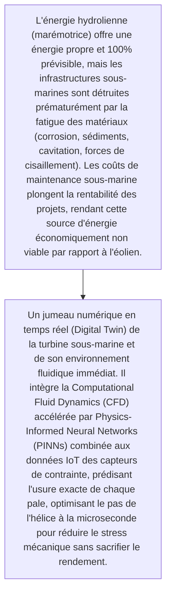
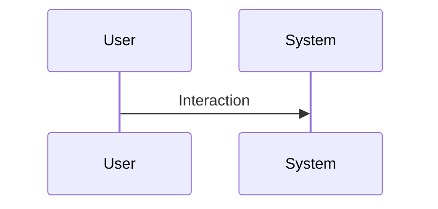

<!-- markdownlint-disable MD009 MD010 MD013 MD022 MD028 MD032 MD033 MD034 MD036 MD037 MD039 MD041 MD060 -->

[ 🇬🇧 English Version ](./README.md)

# Tidal Energy Digital Twin

> **Résumé exécutif :** Un jumeau numérique en temps réel (Digital Twin) de la turbine sous-marine et de son environnement fluidique immédiat. Il intègre la Computational Fluid Dynamics (CFD) accélérée par Physics-Informed Neural Networks (PINNs) combinée aux données IoT des capteurs de contrainte, prédisant l'usure exacte de chaque pale, optimisant le pas de l'hélice à la microseconde pour réduire le stress mécanique sans sacrifier le rendement.

---

## 1. Aperçu visuel & Effet Wahou

## 2. La thèse contrariante (Peter Thiel Style)

- **La croyance populaire :** La résolution des équations de dynamique des fluides visqueux et des modèles d'usure en temps réel ne peut pas se faire sur une base de données temporelle standard (comme InfluxDB + un tableau de bord Grafana). Il faut un moteur d'inférence capable d'estimer les contraintes physiques non directement mesurables.
- **La vérité cachée :** Un jumeau numérique en temps réel (Digital Twin) de la turbine sous-marine et de son environnement fluidique immédiat. Il intègre la Computational Fluid Dynamics (CFD) accélérée par Physics-Informed Neural Networks (PINNs) combinée aux données IoT des capteurs de contrainte, prédisant l'usure exacte de chaque pale, optimisant le pas de l'hélice à la microseconde pour réduire le stress mécanique sans sacrifier le rendement.

## 3. Le problème & La cible

- **Modèle économique :** B2B
- **Cible précise :** Exploitants d'infrastructures énergétiques, gouvernements locaux côtiers, développeurs de parcs d'énergie hydrolienne.
- **La douleur urgente :** L'énergie hydrolienne (marémotrice) offre une énergie propre et 100% prévisible, mais les infrastructures sous-marines sont détruites prématurément par la fatigue des matériaux (corrosion, sédiments, cavitation, forces de cisaillement). Les coûts de maintenance sous-marine plongent la rentabilité des projets, rendant cette source d'énergie économiquement non viable par rapport à l'éolien.

## 4. Architecture technique & Plomberie

## 5. Modèle économique & Viabilité financière

| Métrique                    | Valeur                                                          |
| --------------------------- | --------------------------------------------------------------- |
| Structure de prix           | [Prix / Modèle d'abonnement / Commission]                       |
| Objectif 12 mois            | [Nombre exact de clients/utilisateurs/transactions nécessaires] |
| Calcul du CA (Target 100k€) | [Formule mathématique exacte]                                   |
| Marge brute estimée         | [Marge en %]                                                    |

## 6. Moteur de distribution & Fossé défensif (Moat)

- **Stratégie d'acquisition :** [Viralité B2C, réseau C2C, acquisition B2B directe, adhésion dev M2M]
- **Moat (Barrière à l'entrée) :** Besoin d'installer des capteurs fiables en environnement sous-marin extrême, adoption lente de la technologie marémotrice, nécessité de convaincre des industriels conservateurs d'intégrer des modèles IA non standard dans leurs boucles de contrôle.

## 7. Grille d'évaluation détaillée

| Critère                           | Score VC (/100) | Score Terrain (/100) |
| --------------------------------- | --------------- | -------------------- |
| Thèse & Monopole / Urgence        | -- / 25         | 24 / 25              |
| Moat / Résistance aux LLM natifs  | -- / 25         | 23 / 25              |
| Scalabilité / Friction d'adoption | -- / 25         | 16 / 25              |
| Unit Economics / ROI direct       | -- / 25         | 21 / 25              |
| **TOTAL**                         | -- / 100        | **84 / 100**         |

> **Verdict VC :** En attente d'évaluation.
> **Verdict Terrain :** Forte urgence et valeur évidente pour la cible. La résistance aux LLM est élevée grâce à une intégration matérielle ou physique forte. Malgré quelques frictions d'adoption, la monétisation B2B est très claire.
