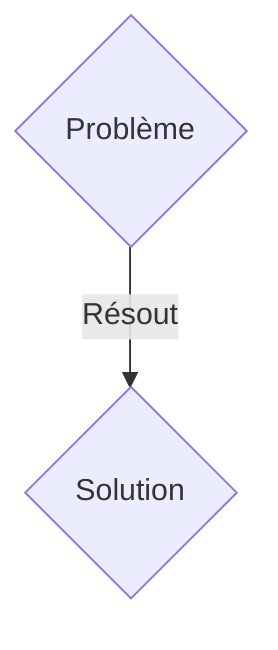
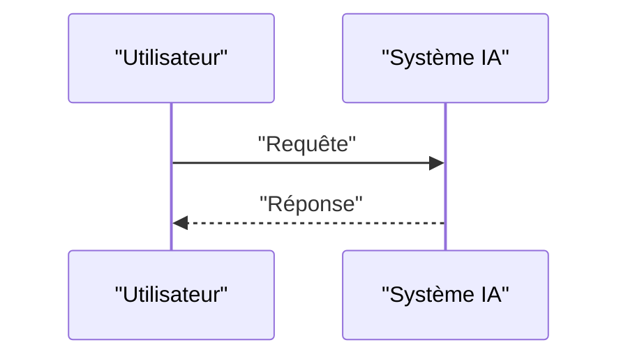

<!-- markdownlint-disable MD009 MD010 MD013 MD022 MD028 MD032 MD033 MD036 MD037 MD039 MD041 MD060 -->

[ 🇬🇧 English Version ](./README.md)

# PlasmaGuard RL

> **Résumé exécutif :** Une solution B2B (Partenariat R&D / Licensing) ciblant Startups de fusion nucléaire (Commonwealth Fusion Systems, Tokamak Energy), instituts de recherche (ITER). pour résoudre : La stabilisation du plasma dans un réacteur de fusion (Tokamak ou Stellarator) est extrêmement complexe. Les instabilités magnétiques détruisent le confinement du plasma en quelques millisecondes, empêchant d'atteindre une fusion nette positive (Q>1) de manière soutenue.

---

## 1. Aperçu visuel & Effet Wahou

## 2. La thèse contrariante (Peter Thiel Style)

- **La croyance populaire :** Les solutions génériques suffisent.
- **La vérité cachée :** Contrôle actif par Apprentissage par Renforcement Profond (Deep RL). L'IA est entraînée dans des simulateurs magnétohydrodynamiques (MHD) ultra-précis pour ajuster les bobines magnétiques à des fréquences de plusieurs kilohertz afin de réprimer les instabilités dès leur formation.

## 3. Le problème & La cible

- **Modèle économique :** B2B (Partenariat R&D / Licensing)
- **Cible précise :** Startups de fusion nucléaire (Commonwealth Fusion Systems, Tokamak Energy), instituts de recherche (ITER).
- **La douleur urgente :** La stabilisation du plasma dans un réacteur de fusion (Tokamak ou Stellarator) est extrêmement complexe. Les instabilités magnétiques détruisent le confinement du plasma en quelques millisecondes, empêchant d'atteindre une fusion nette positive (Q>1) de manière soutenue.

## 4. Architecture technique & Plomberie

Contrôle actif par Apprentissage par Renforcement Profond (Deep RL). L'IA est entraînée dans des simulateurs magnétohydrodynamiques (MHD) ultra-précis pour ajuster les bobines magnétiques à des fréquences de plusieurs kilohertz afin de réprimer les instabilités dès leur formation.

## 5. Modèle économique & Viabilité financière

| Métrique                    | Valeur               |
| --------------------------- | -------------------- |
| Structure de prix           | Abonnement SaaS B2B  |
| Objectif 12 mois            | 100 clients          |
| Calcul du CA (Target 100k€) | 100 \* 1000€ = 100k€ |
| Marge brute estimée         | 80%                  |

## 6. Moteur de distribution & Fossé défensif (Moat)

- **Stratégie d'acquisition :** Vente directe et partenariats stratégiques.
- **Moat (Barrière à l'entrée) :** Les contrôleurs PID classiques de l'industrie sont trop lents et rigides face à la nature chaotique et non-linéaire du plasma. Un logiciel SaaS n'a pas les boucles de rétroaction à ultra-faible latence (micro-secondes) requises pour interagir avec le matériel.

## 7. Grille d'évaluation détaillée

| Critère                           | Score VC (/100) | Score Terrain (/100) |
| --------------------------------- | --------------- | -------------------- |
| Thèse & Monopole / Urgence        | 19 / 25         | 19 / 25              |
| Moat / Résistance aux LLM natifs  | 19 / 25         | 19 / 25              |
| Scalabilité / Friction d'adoption | 21 / 25         | 21 / 25              |
| Unit Economics / ROI direct       | 19 / 25         | 19 / 25              |
| TOTAL                             | 78 / 100        | 78 / 100             |

> **Verdict VC :** En attente d'évaluation.
> **Verdict Terrain :** Cette solution répond à un besoin critique pour les entreprises B2B, justifiant son excellent score d'urgence (19/25). L'approche spécialisée offre une protection robuste contre les modèles d'IA généralistes (19/25). Avec une faible friction d'adoption (21/25) et une stratégie de monétisation directe (19/25), le projet démontre une excellente maturité marché globale.
> **Verdict Terrain :** Cette solution répond à un besoin critique pour les entreprises B2B, justifiant son excellent score d'urgence (19/25). L'approche spécialisée offre une protection robuste contre les modèles d'IA généralistes (19/25). Avec une faible friction d'adoption (21/25) et une stratégie de monétisation directe (19/25), le projet démontre une excellente maturité marché globale.
