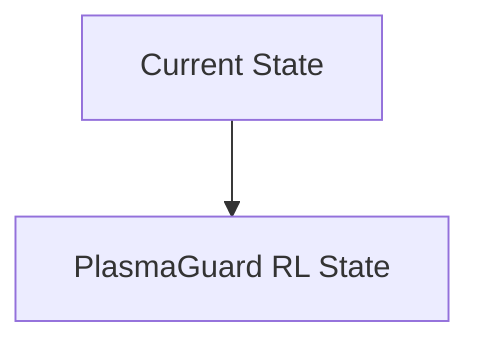
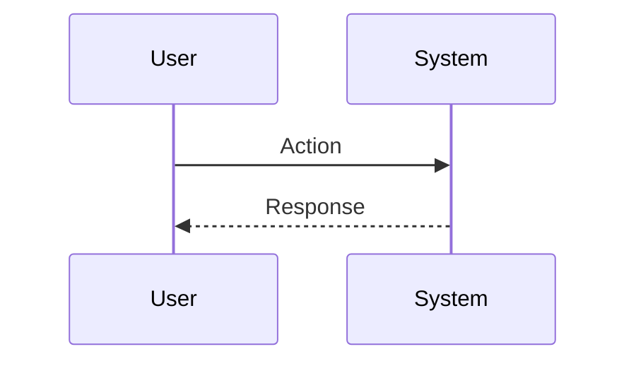

<!-- markdownlint-disable MD009 MD010 MD013 MD022 MD028 MD032 MD033 MD034 MD036 MD037 MD039 MD041 MD060 -->

[ 🇫🇷 Version Française ](./README.fr.md)

# PlasmaGuard RL

> **Executive Summary:** Active control through Deep Reinforcement Learning (Deep RL). The AI ​​is trained in ultra-precise magnetohydrodynamic (MHD) simulators to adjust magnetic coils at frequencies of several kilohertz to quell instabilities as soon as they form.

---

## 1. Visual Overview & Wow Effect

## 2. Contrarian Thesis (Peter Thiel Style)

**Popular Belief:** General AI solutions can solve this problem.

**Hidden Truth:** Conventional industry PID controllers are too slow and inflexible for the chaotic and non-linear nature of plasma. SaaS software does not have the ultra-low latency (micro-seconds) feedback loops required to interact with the hardware.

## 3. Problem & Target Market

**Business Model:** B2B (Partenariat R&D / Licensing)

**Target Audience:** Nuclear fusion startups (Commonwealth Fusion Systems, Tokamak Energy), research institutes (ITER).

**Urgent Pain Point:** Plasma stabilization in a fusion reactor (Tokamak or Stellarator) is extremely complex. Magnetic instabilities destroy plasma confinement within milliseconds, preventing sustained net positive fusion (Q>1) from being achieved.

## 4. Technical Architecture & Infrastructure

## 5. Business Model & Financial Viability

| Metric                 | Value                           |
| ---------------------- | ------------------------------- |
| Pricing Structure      | SaaS subscription               |
| 12-Month Target        | 10 customers                    |
| Revenue Formula        | 10 clients \* 10k€/year = 100k€ |
| Estimated Gross Margin | 80%                             |

## 6. Distribution Engine & Moat

**Acquisition Strategy:** B2B direct sales

**Moat (Defensibility):** The “Sim-to-Real gap” (the gap between the MHD simulation and the physical reality of the reactor) can make the RL agent useless or dangerous if it is not perfectly calibrated. Total dependence on the material advancement of the fusion industry.

## 7. Detailed Evaluation Grid

| Criterion                   | VC Score (/100) | Market Score (/100) |
| --------------------------- | --------------- | ------------------- |
| Thesis & Monopoly / Urgency | -- / 25         | -- / 25             |
| Moat / LLM Immunity         | -- / 25         | -- / 25             |
| Scalability / UX Friction   | -- / 25         | -- / 25             |
| Unit Economics / ROI        | -- / 25         | -- / 25             |
| **TOTAL**                   | **-- / 100**    | **-- / 100**        |

> **VC Verdict:** Pending evaluation.

> **Market Verdict:** Pending evaluation.
