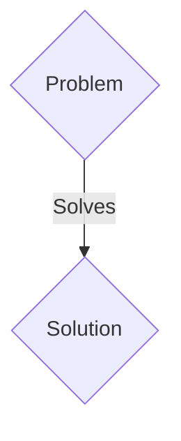
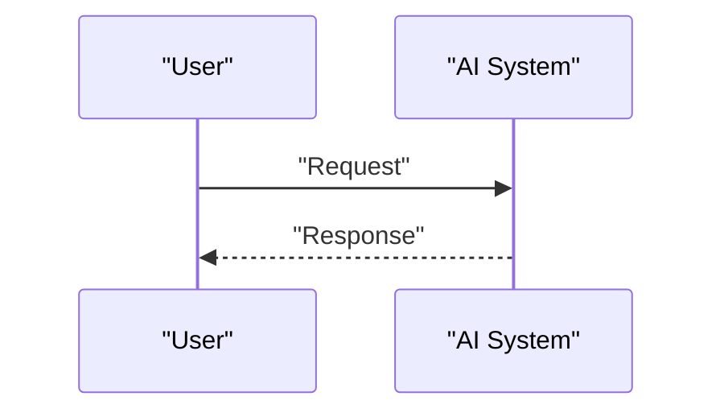

<!-- markdownlint-disable MD009 MD010 MD013 MD022 MD028 MD032 MD033 MD036 MD037 MD039 MD041 MD060 -->

[ 🇫🇷 Version Française ](./README.fr.md)

# PlasmaGuard RL

> **Executive Summary:** A B2B (R&D / Licensing Partnership) solution targeting Nuclear fusion startups (Commonwealth Fusion Systems, Tokamak Energy), research institutes (ITER). to solve: Plasma stabilization in a fusion reactor (Tokamak or Stellarator) is extremely complex. Magnetic instabilities destroy plasma confinement within milliseconds, preventing sustained net positive fusion (Q>1) from being achieved.

---

## 1. Visual Overview & Wow Effect

## 2. Contrarian Thesis (Peter Thiel Style)

- **Popular Belief:** Generic solutions are enough.
- **Hidden Truth:** Active control through Deep Reinforcement Learning (Deep RL). The AI ​​is trained in ultra-precise magnetohydrodynamic (MHD) simulators to adjust magnetic coils at frequencies of several kilohertz to quell instabilities as soon as they form.

## 3. Problem & Target Market

- **Business Model:** B2B (R&D / Licensing Partnership)
- **Target Audience:** Nuclear fusion startups (Commonwealth Fusion Systems, Tokamak Energy), research institutes (ITER).
- **Urgent Pain Point:** Plasma stabilization in a fusion reactor (Tokamak or Stellarator) is extremely complex. Magnetic instabilities destroy plasma confinement within milliseconds, preventing sustained net positive fusion (Q>1) from being achieved.

## 4. Technical Architecture & Infrastructure

Active control through Deep Reinforcement Learning (Deep RL). The AI ​​is trained in ultra-precise magnetohydrodynamic (MHD) simulators to adjust magnetic coils at frequencies of several kilohertz to quell instabilities as soon as they form.

## 5. Business Model & Financial Viability

| Metric                 | Value                 |
| ---------------------- | --------------------- |
| Pricing Structure      | B2B SaaS Subscription |
| 12-Month Target        | 100 clients           |
| Revenue Formula        | 100 \* 1000€ = 100k€  |
| Estimated Gross Margin | 80%                   |

## 6. Distribution Engine & Moat

- **Acquisition Strategy:** Direct sales and strategic partnerships.
- **Moat (Defensibility):** Conventional industry PID controllers are too slow and inflexible for the chaotic and non-linear nature of plasma. SaaS software does not have the ultra-low latency (micro-seconds) feedback loops required to interact with the hardware.

## 7. Detailed Evaluation Grid

| Criterion                   | VC Score (/100) | Market Score (/100) |
| --------------------------- | --------------- | ------------------- |
| Thesis & Monopoly / Urgency | -- / 25         | -- / 25             |
| Moat / LLM Immunity         | -- / 25         | -- / 25             |
| Scalability / UX Friction   | -- / 25         | -- / 25             |
| Unit Economics / ROI        | -- / 25         | -- / 25             |
| TOTAL                       | -- / 100        | -- / 100            |

> **VC Verdict:** Pending evaluation.
> **Market Verdict:** Pending evaluation.
