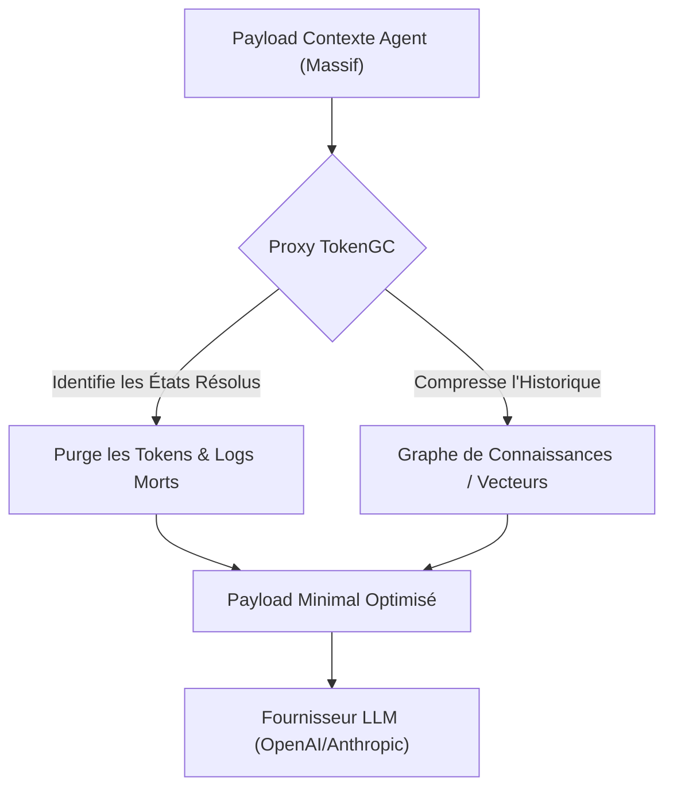
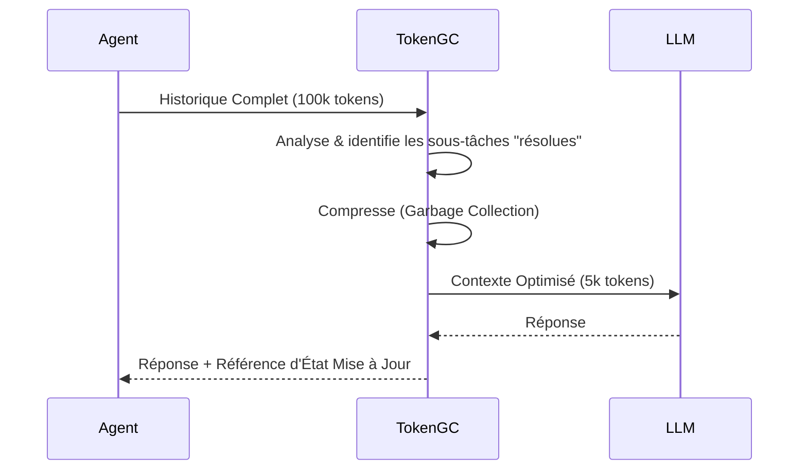

<!-- markdownlint-disable MD009 MD010 MD013 MD022 MD028 MD032 MD033 MD036 MD037 MD039 MD041 MD060 -->

[ 🇬🇧 English Version ](./README.md)

# TokenGC (Context Garbage Collector)

> **Résumé exécutif :** Un proxy middleware qui agit comme un Garbage Collector en temps réel pour le contexte des LLMs, purgeant les "tokens morts" et compressant l'historique pour réduire drastiquement les coûts et la latence.

---

## 1. Aperçu visuel

## 2. La thèse contrariante (Peter Thiel Style)

- **La croyance populaire :** Avec des fenêtres de contexte atteignant des millions de tokens, nous pouvons simplement déverser tout l'historique dans le modèle et le laisser se débrouiller.
- **La vérité cachée :** Les fenêtres de contexte infinies sont un piège financier. Payer pour des "tokens morts" (réflexions résolues, logs intermédiaires) à chaque appel API fait exploser les coûts et dilue l'attention du modèle. Le contexte doit être agressivement purgé au niveau de l'infrastructure avant l'inférence.

## 3. Le problème & La cible

- **Modèle économique :** M2M / B2B
- **Cible précise :** Entreprises développant des agents autonomes ou des systèmes multi-agents (DevTools, RPA IA, Customer Support) qui interagissent en continu.
- **La douleur urgente :** Les agents sur des tâches longues accumulent un contexte massif. Renvoyer l'historique complet à chaque appel API fait exploser la facturation (tokens entrants), provoque des hallucinations (dilution d'attention) et augmente la latence.

## 4. Architecture technique & Plomberie

## 5. Modèle économique & Viabilité financière

| Métrique                    | Valeur                                      |
| --------------------------- | ------------------------------------------- |
| Structure de prix           | Basé sur l'usage : % des économies générées |
| Objectif 12 mois            | 20 Milliards de tokens traités/mois         |
| Calcul du CA (Target 100k€) | 20B \* 0.05€ de comm / 1k = 1.0M€           |
| Marge brute estimée         | 85%                                         |

## 6. Moteur de distribution & Fossé défensif (Moat)

- **Stratégie d'acquisition :** Marketing orienté développeurs. Fournir un SDK léger qui agit comme un remplacement transparent (drop-in) pour les clients OpenAI/Anthropic, routant le trafic via le proxy TokenGC.
- **Moat (Barrière à l'entrée) :** Les LLMs sont "stateless". Ils n'ont pas la capacité de modifier le payload réseau entrant avant qu'il ne leur coûte du calcul. Le garbage collection nécessite une gestion d'état externe et une logique de purge que les modèles ne peuvent auto-exécuter sans gaspiller des tokens.

## 7. Grille d'évaluation détaillée

| Critère                           | Score VC (/100) | Score Terrain (/100) |
| --------------------------------- | --------------- | -------------------- |
| Thèse & Monopole / Urgence        | 21 / 25         | -- / 25              |
| Moat / Résistance aux LLM natifs  | 19 / 25         | -- / 25              |
| Scalabilité / Friction d'adoption | 24 / 25         | -- / 25              |
| Unit Economics / ROI direct       | 23 / 25         | -- / 25              |
| **TOTAL**                         | **87 / 100**    | **-- / 100**         |

> **Verdict VC :** Token GC offre une solution intelligente et immédiate à la surcharge des fenêtres de contexte, se traduisant directement par des économies massives pour les déploiements à fort volume. Le risque principal pour sa défendabilité est la banalisation rapide de la longueur de contexte et la baisse des coûts d'inférence par les grands fournisseurs. Sa survie exige une stratégie d'acquisition agressive pour capturer les flux d'entreprise avant que les modèles sous-jacents ne rendent le problème obsolète.

> **Verdict Terrain :** En attente d'évaluation.
