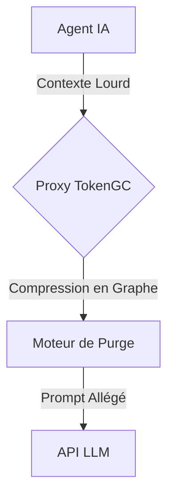
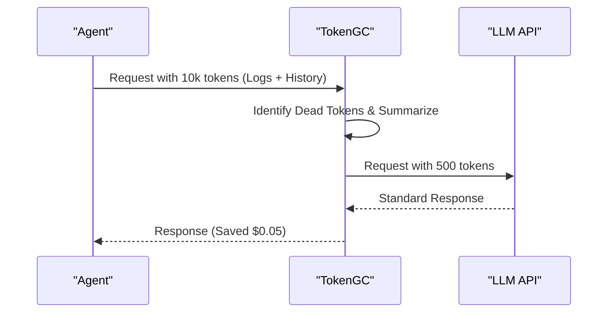

<!-- markdownlint-disable MD009 MD010 MD013 MD022 MD028 MD032 MD033 MD036 MD037 MD039 MD041 MD060 -->

[ 🇬🇧 English Version ](./README.md)

# TokenGC (Context Garbage Collector)

> **Résumé exécutif :** Un middleware agissant comme un garbage collector pour compresser les historiques de conversation en graphes de connaissances et purger les tokens morts, réduisant les coûts d'API.

---

## 1. Aperçu visuel

```mermaid
graph TD
    %% Architecture
    A["Agent IA"] -->|Contexte Lourd| B{"Proxy TokenGC"}
    B -->|Compression en Graphe| C["Moteur de Purge"]
    C -->|Prompt Allégé| D["API LLM"]
```

## 2. La thèse contrariante (Peter Thiel Style)

**La croyance populaire :** Il suffit de demander au LLM de résumer son propre contexte pour économiser des tokens.

**La vérité cachée :** Demander un résumé au LLM consomme précisément les tokens qu'on cherche à économiser ; l'optimisation doit se faire au niveau réseau avant l'inférence.

## 3. Le problème & La cible

**Modèle économique :** M2M / B2B
**Cible précise :** Entreprises développant des agents autonomes ou systèmes multi-agents interagissant en continu.
**La douleur urgente :** Les agents accumulent un contexte massif, faisant exploser les coûts (facturation au token) et augmentant la latence à chaque appel.

## 4. Architecture technique & Plomberie

**L'approche technique :** Proxy middleware agissant comme Garbage Collector. Identifie les états résolus, compresse l'historique et purge les tokens morts avant transmission au LLM.

```mermaid
sequenceDiagram
    participant Ag as "Agent"
    participant GC as "TokenGC"
    participant API as "LLM API"
    Ag->>GC: Request with 10k tokens (Logs + History)
    GC->>GC: Identify Dead Tokens & Summarize
    GC->>API: Request with 500 tokens
    API-->>GC: Standard Response
    GC-->>Ag: Response (Saved $0.05)
```

## 5. Modèle économique & Viabilité financière

| Métrique                        | Valeur                                         |
| :------------------------------ | :--------------------------------------------- |
| **Structure de prix**           | Percentage of tokens saved or Flat Volume Tier |
| **Objectif 12 mois**            | 200 Dev Teams                                  |
| **Calcul du CA (Target 100k€)** | 200 teams \* $500/mo = $100k/mo                |
| **Marge brute estimée**         | 90%                                            |

## 6. Moteur de distribution & Fossé défensif (Moat)

**Stratégie d'acquisition :** Intégration comme plugin middleware dans les frameworks (LangChain, LlamaIndex).

**Moat (Barrière à l'entrée) :** Les LLMs sont stateless. L'optimisation doit se faire au niveau de l'infrastructure réseau/API avant l'appel coûteux, pas par un prompt.

## 7. Grille d'évaluation détaillée

| Critère                           | Score VC (/100) | Score Terrain (/100) |
| --------------------------------- | --------------- | -------------------- |
| Thèse & Monopole / Urgence        | 21 / 25         | 23 / 25              |
| Moat / Résistance aux LLM natifs  | 19 / 25         | 17 / 25              |
| Scalabilité / Friction d'adoption | 24 / 25         | 21 / 25              |
| Unit Economics / ROI direct       | 23 / 25         | 23 / 25              |
| **TOTAL**                         | **87 / 100**    | **84 / 100**         |

> **Verdict VC :** Token GC offre une solution intelligente et immédiate à la surcharge des fenêtres de contexte, se traduisant directement par des économies massives pour les déploiements à fort volume. Le risque principal pour sa défendabilité est la banalisation rapide de la longueur de contexte et la baisse des coûts d'inférence par les grands fournisseurs. Sa survie exige une stratégie d'acquisition agressive pour capturer les flux d'entreprise avant que les modèles sous-jacents ne rendent le problème obsolète.

> **Verdict Terrain :** Optimise les fenêtres de contexte en purgeant les tokens inutiles. Excellente valeur immédiate, mais à risque si les fournisseurs de LLM intègrent une gestion native et peu coûteuse de contextes infinis.
