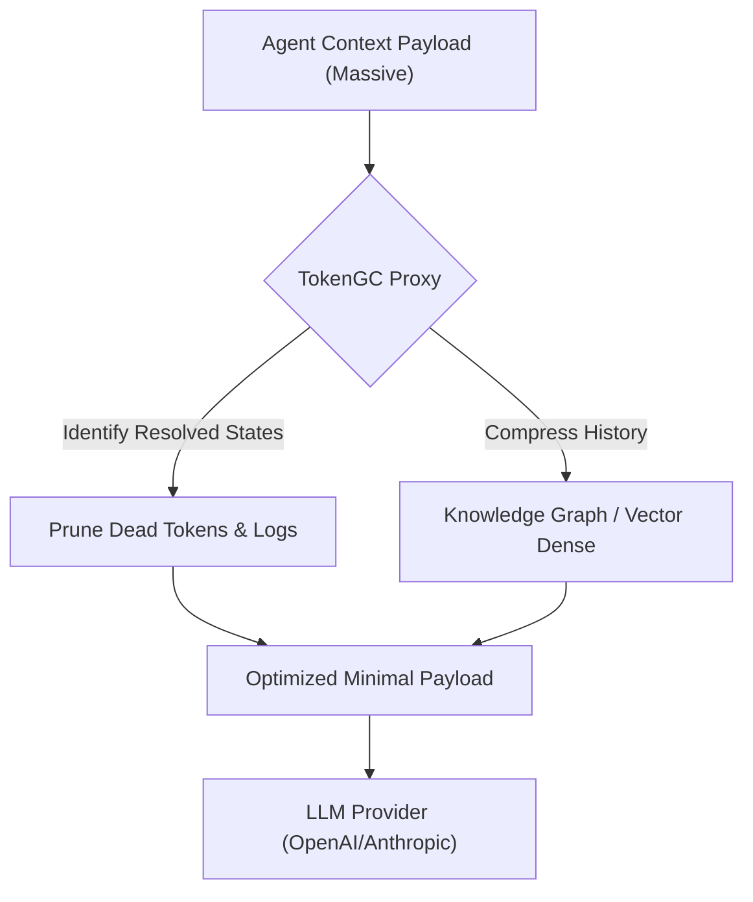
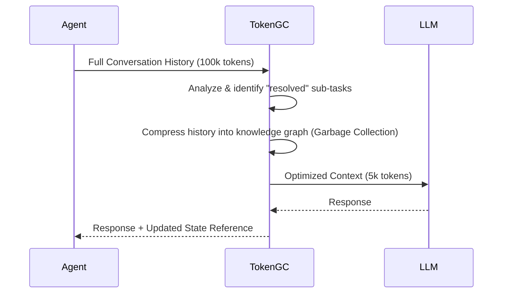

<!-- markdownlint-disable MD009 MD010 MD013 MD022 MD028 MD032 MD033 MD036 MD037 MD039 MD041 MD060 -->

[ 🇫🇷 Version Française ](./README.fr.md)

# TokenGC (Context Garbage Collector)

> **Executive Summary:** A middleware proxy that acts as a real-time Garbage Collector for LLM contexts, identifying resolved states and compressing conversational histories to drastically reduce token costs and API latency.

---

## 1. Visual Overview

## 2. Contrarian Thesis (Peter Thiel Style)

- **Popular Belief:** As context windows reach millions of tokens (like Gemini 1.5), we can just dump the entire conversation history into the model and let it figure everything out.
- **Hidden Truth:** Infinite context windows are a financial trap. Paying for "dead tokens" (resolved thoughts, useless intermediate logs) on every single API call scales costs exponentially and dilutes the model's attention. Context must be aggressively collected and purged at the infrastructure layer before inference.

## 3. Problem & Target Market

- **Business Model:** M2M / B2B
- **Target Audience:** Enterprises developing autonomous agents or multi-agent systems (DevTools, RPA IA, Customer Support) that interact continuously.
- **Urgent Pain Point:** Long-running agents accumulate massive context. Resending the entire history on every API call explodes token costs, increases latency, and degrades model performance due to attention dilution.

## 4. Technical Architecture & Infrastructure

## 5. Business Model & Financial Viability

| Metric                 | Value                                 |
| ---------------------- | ------------------------------------- |
| Pricing Structure      | Usage-based: % of tokens saved        |
| 12-Month Target        | 20 Billion tokens processed/month     |
| Revenue Formula        | 20B \* €0.05 savings fee / 1k = 1.0M€ |
| Estimated Gross Margin | 85%                                   |

## 6. Distribution Engine & Moat

- **Acquisition Strategy:** Developer-focused marketing. Provide a lightweight SDK that acts as a drop-in replacement for OpenAI/Anthropic clients, routing traffic through the TokenGC optimization proxy.
- **Moat (Defensibility):** LLMs are stateless by design. They cannot optimize their own incoming network payload before it costs compute. Infrastructure-level token garbage collection requires external state management and semantic pruning logic that models cannot self-execute.

## 7. Detailed Evaluation Grid

| Criterion                   | VC Score (/100) | Market Score (/100) |
| --------------------------- | --------------- | ------------------- |
| Thesis & Monopoly / Urgency | 21 / 25         | -- / 25             |
| Moat / LLM Immunity         | 19 / 25         | -- / 25             |
| Scalability / UX Friction   | 24 / 25         | -- / 25             |
| Unit Economics / ROI        | 23 / 25         | -- / 25             |
| **TOTAL**                   | **87 / 100**    | **-- / 100**        |

> **VC Verdict:** Token GC provides a clever, immediate solution to the bloat of context windows, directly translating into massive cost savings for high-volume deployments. The primary risk to its defensibility is the rapid commoditization of context length and falling inference costs by major LLM providers. Its survival dictates an aggressive go-to-market strategy to capture enterprise workflows before the underlying models render the problem obsolete.

> **Market Verdict:** Pending evaluation.
