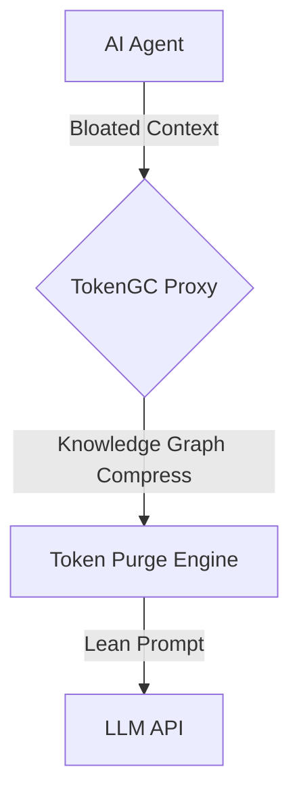
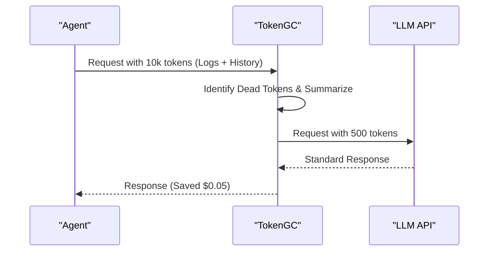

<!-- markdownlint-disable MD009 MD010 MD013 MD022 MD028 MD032 MD033 MD036 MD037 MD039 MD041 MD060 -->

[ 🇫🇷 Version Française ](./README.fr.md)

# TokenGC (Context Garbage Collector)

> **Executive Summary:** A middleware proxy acting as a garbage collector that compresses conversation histories into dense knowledge graphs and purges dead tokens to slash API costs.

---

## 1. Visual Overview & Wow Effect

```mermaid
graph TD
    %% Architecture
    A["AI Agent"] -->|Bloated Context| B{"TokenGC Proxy"}
    B -->|Knowledge Graph Compress| C["Token Purge Engine"]
    C -->|Lean Prompt| D["LLM API"]
```

## 2. Contrarian Thesis (Peter Thiel Style)

**Popular Belief:** LLMs can simply be prompted to summarize their own context to save tokens.

**Hidden Truth:** Asking an LLM to summarize context consumes the very tokens you are trying to save; optimization must happen at the network layer before the prompt is sent.

## 3. Problem & Target Market

**Business Model:** M2M / B2B
**Target Audience:** Enterprises developing autonomous agents or multi-agent systems with continuous interactions.
**Urgent Pain Point:** Agents accumulate massive context over time. Sending the full history on every API call explodes token costs, causes hallucinations, and increases latency.

## 4. Technical Architecture & Infrastructure

**Technical Approach:** A proxy middleware between the agent and LLM provider. Identifies resolved states, compresses histories, and purges 'dead tokens' (useless logs) before inference.

```mermaid
sequenceDiagram
    participant Ag as "Agent"
    participant GC as "TokenGC"
    participant API as "LLM API"
    Ag->>GC: Request with 10k tokens (Logs + History)
    GC->>GC: Identify Dead Tokens & Summarize
    GC->>API: Request with 500 tokens
    API-->>GC: Standard Response
    GC-->>Ag: Response (Saved $0.05)
```

## 5. Business Model & Financial Viability

| Metric                     | Value                                          |
| :------------------------- | :--------------------------------------------- |
| **Pricing Structure**      | Percentage of tokens saved or Flat Volume Tier |
| **12-Month Target**        | 200 Dev Teams                                  |
| **Revenue Formula**        | 200 teams \* $500/mo = $100k/mo                |
| **Estimated Gross Margin** | 90%                                            |

## 6. Distribution Engine & Moat

**Acquisition Strategy:** Integration as a middleware plugin in popular agent frameworks (LangChain, LlamaIndex).

**Moat (Defensibility):** LLMs are stateless and cannot optimize the network payload before it costs compute. Infrastructure-level token optimization is required.

## 7. Detailed Evaluation Grid

| Criterion                       | VC Score (/100) | Market Score (/100) |
| :------------------------------ | :-------------- | :------------------ |
| **Thesis & Monopoly / Urgency** | -- / 25         | -- / 25             |
| **Moat / LLM Immunity**         | -- / 25         | -- / 25             |
| **Scalability / UX Friction**   | -- / 25         | -- / 25             |
| **Unit Economics / ROI**        | -- / 25         | -- / 25             |
| **TOTAL**                       | -- / 100        | -- / 100            |

> **VC Verdict:** Pending evaluation.
> **Market Verdict:** Pending evaluation.
